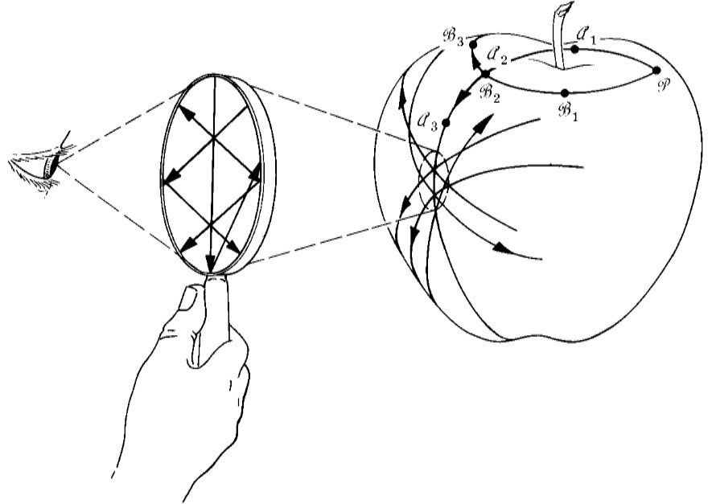
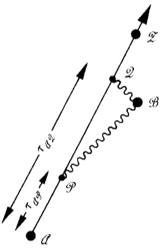
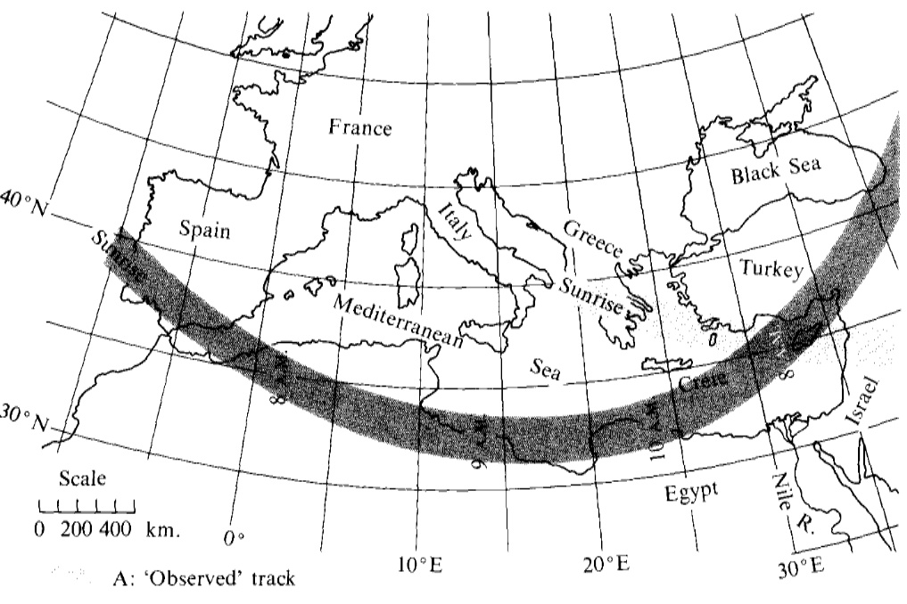
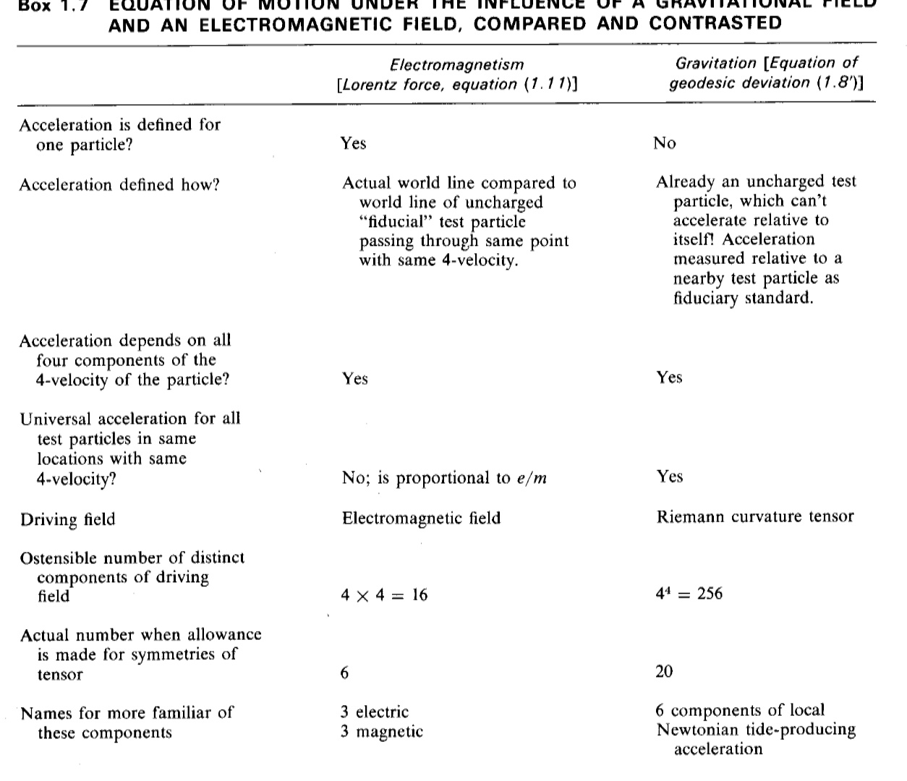
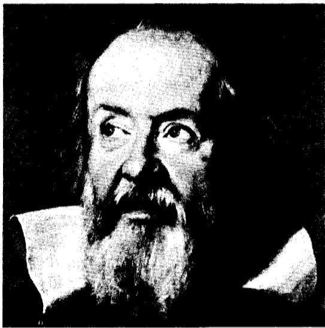
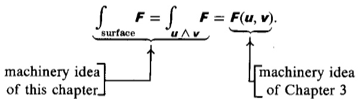

# GEO METRO DYNAMICS IN BRIEF  

# S1.1. THE PARABLE OF THE APPLE  

One day in the year 1666 Newton had gone to the country, and seeing the fall of an apple,as his niece told me, let himself be led intoa deep meditationon thecausewhich thus draws every object along a line whose extension would pass almost through the center of the Earth.  

Once upon a time a student lay in a garden under an apple tree reflecting on the difference between Einstein's and Newton's views about gravity. He was startled by the fall of an apple nearby. As he looked at the apple, he noticed ants beginning to run along its surface (Figure 1.1). His curiosity aroused, he thought to investigate the principles of navigation followed by an ant. With his magnifying glass, he noted one track carefully, and, taking his knife, made a cut in the apple skin one mm above the track and another cut one mm below it. He peeled off the resulting little highway of skin and laid it out on the face of his book. The track ran as straight as a laser beam along this highway. No more economical path could the ant have found to cover the ten cm from start to end of that strip of skin. Any zigs and zags or even any smooth bend in the path on its way along the apple peel from starting point to end point would have increased its length.  

""What a beautiful geodesic, the student commented.  

His eye fell on two ants starting off from a common point $P$ in slightly different directions. Their routes happened to carry them through the region of the dimple at the top of the apple, one on each side of it. Each ant conscientiously pursued  

  

# Figure 1.1.  

The Riemannian geometry of the spacetime of general relativity is here symbolized by the two-dimen- sional geometry of the surface of an apple. The geodesic tracks followed by the ants on the apple's surface symbolize the world line followed through spacetime by a free particle. In any sufficiently localized region of spacetime, the geometry can be idealized as flat, as symbolized on the apple's two-dimensional surface by the straight-line course of the tracks viewed in the magnifying glass ("local Lorentz character"  of geometry of spacetime). In a region of greater extension, the curvature of the manifold (four-dimen- sional spacetime in the case of the real physical world; curved two-dimensional geometry in the case  of the apple) makes itself felt. Two tracks $\mathcal{A}$ and $\mathcal{\Theta}$ , originally diverging from a common point $\mathcal{P}$ ,later approach, cross, and go off in very different directions. In Newtonian theory this effect is ascribed 1o  gravitation acting at a distance from a center of attraction, symbolized here by the stem of the apple. According to Einstein a particle gets its moving orders locally, from the geometry of spacetime right where it is. Its instructions are simple: to follow the straightest possible track (geodesic). Physics is as simple as it could be locally. Only because spacetime is curved in the large do the tracks cross. Geome-

  trodynamics, in brief, is a double story of the effect of geometry on matter (causing originally divergent

  geodesics to cross) and the effect of matter on geometry (bending of spacetime initiated by concentration of mass, symbolized by effect of stem on nearby surface of apple).  

his geodesic. Each went as straight on his strip of appleskin as he possibly could. Yet because of the curvature of the dimple itself, the two tracks not only crossed but emerged invery different directions.  

Einstein's local view of physics contrasted with Newton's ''action at a distance'  

Physics is simple only when analyzed locally  

"What happier illustration of Einstein's geometric theory of gravity could one possibly ask?" murmured the student. “The ants move as if they were attracted by the apple stem. One might have believed in a Newtonian force at a distance Yet from nowhere does an ant get his moving orders except from the local geometry along his track. This is surely Einstein's concept that all physics takes place by "local action.' What a difference from Newton's ^action at a distance' view of physics! Now I understand better what this book means.""  

And so saying, he opened his book and read, “Don't try to describe motion relative to faraway objects. Physics is simple only when analyzed locally. And locally the world line that a satellite follows [in spacetime, around the Earth] is already as straight as any world line can be. Forget all this talk about “deflection’ and force of gravitation.' I'm inside a spaceship. Or I'm floating outside and near it. Do I feel any force of gravitation"? Not at all. Does the spaceship feel’ such a force? No. Then why talk about it? Recognize that the spaceship and I traverse a region of spacetime free of all force. Acknowledge that the motion through that region is already ideally straight."  

The dinner bell was ringing, but still the student sat, musing to himself. “"Let me see if I can summarize Einstein's geometric theory of gravity in three ideas: (1) locally, geodesics appear straight; (2) over more extended regions of space and time, geodesics originally receding from each other begin to approach at a rate governed by the curvature of spacetime, and this effect of geometry on matter is what we mean today by that old word 'gravitation'; (3) matter in turn warps geometry. The dimple arises in the apple because the stem is there. I think I see how to put the whole story even more briefly: Space acts on matter, telling it how to move. In turn, matter reacts back on space, telling it how to curve. In other words, matter here," he said, rising and picking up the apple by its stem, “"curves space here. To produce a curvature in space here is to force a curvature in space there,” he went on, as he watched a lingering ant busily following its geodesic a finger's breadth away from the apple's stem. “Thus matter here influences matter there. That is Einstein's explanationfor‘gravitation.'  

Space tells matter how to move  

Matter tells space how to curve  

Then the dinner bell was quiet, and he was gone, with book, magnifying glass-—-and apple.  

# $\pmb{\S}^{1.2}$ . SPACETIME WITh AND WIThOUT COOrDINATeS  

Now it came to me:...the independence of the gravitational acceleration from the nature of the falling substance, may be expressed as follows: ln a gravitational field (of small spatial extension) things behave as they do in a space free of gravitation. . . . This happened in 1908. Why were another seven years required for the construction of the general theory of relativity? The main reason lies in the fact that it is not so easy to free oneself from the idea thatcoordinates must have an immediate metrical meaning.  

ALBERT EINSTEIN [in Schilpp (1949), pp. 65-67.]  

Nothing is more distressing on first contact with the idea of “"curved spacetime than the fear that every simple means of measurement has lost its power in this unfamiliar context. One thinks of oneself as confronted with the task of measuring the shape of a gigantic and fantastically sculptured iceberg as one stands with a meter stick in a tossing rowboat on the surface of a heaving ocean. Were it the rowboat itself whose shape were to be measured, the procedure would be simple enough. One would draw it up on shore, turn it upside down, and drive tacks in lightly at strategic points here and there on the surface. The measurement of distances from tack to  

  
Figure 1.2. The crossing of straws in a barn full of hay is a symbol for the world lines that fll up spacetime. By their crossings and bends, these world lines mark events with a uniqueness beyond all need of coordinate systems or coordinates. Typical events symbolized in the diagram, from left to right (black dots), are: absorption of a photon; reemission of a photon; collsion between a particle and a particle; colision between a photon and a particle; another collision between a photon and a particle; explosion of a firecracker; and collision of a particle from outside with one of the fragments of that firecracker.  

Resolution: characterize events by what happens there  

tack would record and reveal the shape of the surface. The precision could be made  arbitrarily great by making the number of tacks arbitrarily large. It takes more daring to think of driving several score pitons into the towering iceberg. But with all the daring in the world, how is one to drive a nail into spacetime to mark a point? Happily, nature provides its own way to localize a point in spacetime, as Einstein was the first to emphasize. Characterize the point by what happens there! Give a point in spacetime the name “event." Where the event lies is defined as clearly and sharply as where two straws cross each other in a barn full of hay (Figure 1.2). To say that the event marks a collision of such and such a photon with such and such

  a particle is identification enough. The world lines of that photon and that particle

  are rooted in the past and stretch out into the future. They have a rich texture of connections with nearby world lines. These nearby world lines in turn are linked in a hundred ways with world lines more remote. How then does one tell the location  of an event? Tell first what world lines participate in the event. Next follow each  

  
Figure 1.3.  

Above: Assigning "telephone numbers" to events by way of a system of coordinates. To say that the coordinate system is “smooth" is to say that events which are almost in the same place have almost the same coordinates. Below: Putting the same set of events into equally good order by way of a different s stem of coordinates. Picked out specially here are two neighboring events: an event named \* $\cdot_{\mathcal{L}}$ ”with cwordinates $(x^{0},x^{1})=(77.2,22.6)$ and $(x^{\vec{0}},x^{\vec{1}})=(18.5,51.4)$ and an event named° ${\mathfrak{*}}{\mathfrak{P}}$  with coordinates

 $\mathfrak{r}^{\prime\prime}.x^{1}\mathfrak{)}=(79.9,20.1)$ and $(x^{\bar{0}},x^{\bar{1}})=(18.4,47.1)$ .Events $\mathcal{Q}$ and $\mathcal{P}$ are connected by the separation"vector"

 $\pmb{\xi}.$ (Precise definition of a vector in a curved spacetime demands going to the mathematical limit in w hich the two points have an indefinitely small separation $\mathit{.N}$ fold reduction of the separation $\mathcal{P}\mathrm{~-~}\mathcal{Q}]$ and. in the resultant locally fat space, multiplying the separation up again by the factor $N$ [lim $,\,N\rightarrow\infty$ "langent space'"; "tangent vector']. Forego here that proper way of stating matters, and forego complete accuracy: hence the quote around the word “vector".) In each coordinate system the separation vector $\pmb\xi$ Is characterized’by “components”(differences in coordinate values between $\mathcal{P}$ and $\mathcal{Q}$  

$$
\begin{array}{l}{{(\xi^{0},\xi^{1})\ =(79.9\,-\,77.2,\,20.1\,-\,22.6)=(2.7,\,-\,2.5),}}\\ {{(\xi^{\vec{0}},\xi^{\vec{1}})\ =(18.4\,-\,18.5,\,47.1\,-\,51.4)=(-0.1,\,-4.3).}}\end{array}
$$  

See Box 1.1 for further discussion of events, coordinates, and vectors.  

of these world lines. Name the additional events that they encounter. These events pick out further world lines. Eventually the whole barn of hay is catalogued. Each event is named. One can find one's way as surely to a given intersection as the city dweller can pick his path to the meeting of St. James Street and Piccadilly. No numbers. No coordinate system. No coordinates.  

The name of an event can even be arbitrary  

Coordinates provide a convenient naming system  

That most streets in Japan have no names, and most houses no numbers, illustrates one's ability to do without coordinates. One can abandon the names of two world lines as a means to identify the event where they intersect. Just as one could name  a Japanese house after its senior occupant, so one can and often does attach arbitrary names to specific events in spacetime, as in Box 1.1.  

Coordinates, however, are convenient. How else from the great thick catalog of events, randomly listed, can one easily discover that along a certain world line one will first encounter event Trinity, then Baker, then Mike, then Argus--but not the same events in some permuted order?  

To order events, introduce coordinates! (See Figure 1.3.) Coordinates are four indexed numbers per event in spacetime; on a sheet of paper, only two. Trinity acquires coordinates  

$$
(x^{0},x^{1},x^{2},x^{3})=(77,23,64,11).
$$  

Coordinates generally do not measure length  

Several coordinate systems can be used at once  

In christening events with coordinates, one demands smoothness but foregoes every thought of mensuration. The four numbers for an event are nothing but an elaborate kind of telephone number. Compare their "telephone” numbers to discover whether two events are neighbors. But do not expect to learn how many meters separate them from the difference in their telephone numbers!  

Nothing prevents a subscriber from being served by competing telephone systems, nor an event from being catalogued by alternative coordinate systems (Figure 1.3). Box 1.1 ilustrates the relationships between one coordinate system and another, as  well as the notation used to denote coordinates and their transformations.  

Choose two events, known to be neighbors by the nearness of their coordinate values in a smooth coordinate system. Draw a little arrow from one event to the

  other. Such an arrow is called a vector. (It is a well-defined concept in flat spacetime,

  or in curved spacetime in the limit of vanishingly small length; for finite lengths in curved spacetime, it must be refined and made precise, under the new name "tangent vector,” on which see Chapter 9.) This vector, like events, can be given a name. But whether named “John" or "Charles" or "Kip," it is a unique, well-  defined geometrical object. The name is a convenience, but the vector exists even withoutit.  

Just as a quadruple of coordinates  

$$
(x^{0},x^{1},x^{2},x^{3})=(77,23,64,11)
$$  

is a particularly useful name for the event "Trinity” (it can be used to identify what other events are nearby), so a quadruple of “components"  

$$
(\xi^{0},\xi^{1},\xi^{2},\xi^{3})=(1.2,\,-0.9,0,2.1)
$$  

Box 1.1 maThemAtiCal NotatIon for EVentS, CoordinaTes, And veCTorS 
  
is not spelled out here (see Chapter 9), but flat-geometry ideas apply with good approximation even in a curved geometry, when the two points are sufficiently close. $^\dagger$ These formulas are precisely accurate only when the region of spacetime under consideration is flat and when in addition the coordinates are Lorentzian. Otherwise they are approximate—though they become arbitrarily good when the separation between points and the length of the vector become arbitrarily small.  

is a convenient name for the vector “John" that reaches from  

$$
(x^{0},x^{1},x^{2},x^{3})=(77,23,64,11)
$$  

$$
(x^{0},x^{1},x^{2},x^{3})=(78.2,22.1,64.0,13.1).
$$  

How to work with the components of a vector is explored in Box 1.1.  

Coordinate singularities normally unavoidable  

Continuity of spacetime  

The mathematics of manifolds applied to the physics of spacetime  

Dimensionality of spacetime  

There are many ways in which a coordinate system can be imperfect. Figure 1.4 illustrates a coordinate singularity. For another example of a coordinate singularity, run the eye over the surface of a globe to the North Pole. Note the many meridians that meet there ("collapse of cells of egg crates to zero content'"'). Can't one do better? Find a single coordinate system that will cover the globe without singularity? A theorem says no. Two is the minimum number of “coordinate patches" required to cover the two-sphere without singularity (Figure 1.5). This circumstance empha- sizes anew that points and events are primary, whereas coordinates are a mere bookkeeping device.  

Figures 1.2 and 1.3 show only a few world lines and events. A more detailed diagram would show a maze of world lines and of light rays and the intersections between them. From such a picture, one can in imagination step to the idealized limit: an infinitely dense collection of light rays and of world lines of infinitesimal test particles. With this idealized physical limit, the mathematical concept of a continuous four-dimensional “manifold" (four-dimensional space with certain smoothness properties) has a one-to-one correspondence; and in this limit continu-  ous, differentiable (i.e., smooth) coordinate systems operate. The mathematics then supplies a tool to reason about the physics.  

A simple countdown reveals the dimensionality of the manifold. Take a point $\mathcal{P}$ in an $n$ -dimensional manifold. Its neighborhood is an $n$ -dimensional ball (i.e., the interior of a sphere whose surface has $n-1$  dimensions). Choose this ball so that its boundary is a smooth manifold. The dimensionality of this manifold is  $(n-1)$ In this $(n-1)$ -dimensional manifold, pick a point  $\mathcal{Q}$ . Its neighborhood is an $(n-1)$ -dimensional ball. Choose this ball so that ... , and so on. Eventually one comes by this construction to a manifold that is two-dimensional but is not yet known to be two-dimensional (two-sphere). In this two-dimensional manifold, pick a point $\mathcal{R}$ . Its neighborhood is a two-dimensional ball ("disc"). Choose this disc so that its boundary is a smooth manifold (circle). In this manifold, pick a point $\mathcal{X}$ . Its neighborhood is a one-dimensional ball, but is not yet known to be one-dimensional ("line segment'). The boundaries of this object are two points. This circumstance tells that the intervening manifold is one-dimensional; therefore the previous mani- fold was two-dimensional; and so on. The dimensionality of the original manifold is equal to the number of points employed in the construction. For spacetime, the dimensionality is 4.  

This kind of mathematical reasoning about dimensionality makes good sense at the everyday scale of distances, at atomic distances $(10^{-8}\,\mathrm{cm})$ , at nuclear dimensions $(10^{-13}\,\mathrm{cm})$ , and even at lengths smaller by several powers of ten, if one judges by the concord between prediction and observation in quantum electrodynamics at high  

  

# Figure 1.4.  

How a mere coordinate singularity arises. Above: A coordinate system becomes singular when the “"cells in the egg crate” are squashed to zero volume. Below: An example showing such a singularity in the Schwarzschild coordinates $r$ $t$ often used to describe the geometry around a black hole (Chapter 31).  For simplicity the angular coordinates $\theta$ $\phi$ have been suppressed. The singularity shows itself in two ways. First, all the points along the dotted line, while quite distinct one from another, are designated by the same pair of $(r,\,t\,)$ values; namely, $r=2m$ $\iota=\infty$ . The coordinates provide no way to distinguish these points. Second, the “cells in the egg crate,” of which one is shown grey in the diagram, collapse to zero content at the dotted line. In summary, there is nothing strange about the geometry at the dotted line; all the singularity lies in the coordinate system ("poor system of telephone numbers"'). No confusion should be permitted to arise from the accidental circumstance that the $t$ coordinate attains an infinite value on the dotted line.No such infinity would occur if $t$ were replaced by the new coordinate $\bar{t}$ defined by  

$$
(t/2m)=\tan(\overline{{t}}/2m).
$$  

When $t=\infty$ , the new coordinate $\overline{{t}}$ $\bar{\boldsymbol{\prime}}=\pi m$ . The $r,\,\bar{{\mathbf\xi}^{\prime}}$ coordinates still provide no way to distinguish the points along the dotted line. They still give "cells in the egg crate” collapsed to zero content along the dotted line.  

  

# Figure 1.5.  

Singularities in familiar coordinates on the two-sphere can be eliminated by covering the sphere with two overlapping coordinate patches. A. Spherical polar coordinates, singular at the North and South Poles, and discontinuous at the international date line. B. Projection of the Euclidean coordinates of  the Euclidean two-plane, tangent at the North Pole, onto the sphere via a line running to the South Pole; coordinate singularity at the South Pole. C. Coverage of two-sphere by two overlapping coordinate patches. One, constructed as in B, covers without singularity the northern hemisphere and also the southern tropics down to the Tropic of Capricorn. The other (grey) also covers without singularity all of the tropics and the southern hemisphere besides.  

Breakdown in smoothness of spacetime at Planck length  

energies (corresponding de Broglie wavelength $10^{-16}\,\mathrm{cm})$ 0. Moreover, classical general relativity thinks of the spacetime manifold as a deterministic structure, completely well-defined down to arbitrarily smal distances. Not so quantum general relativity or “quantum geo metro dynamics." It predicts violent fuctuations in the geometry  at distances on the order of the Planck length,  

#  

No one has found any way to escape this prediction. As nearly as one can estimate, these fluctuations give space at small distances a “multiply connected" or "foamlike" character. This lack of smoothness may well deprive even the concept of dimension-

  ality itself of any meaning at the Planck scale of distances. The further exploration

  of this issue takes one to the frontiers of Einstein's theory (Chapter 44).  

If spacetime at small distances is far from the mathematical model of a continuous manifold, is there not also at larger distances a wide gap between the mathematical idealization and the physical reality? The infinitely dense collection of light rays and of world lines of infinitesimal test particles that are to define all the points of the manifold: they surely are beyond practical realization. Nobody has ever found  a particle that moves on timelike world lines (finite rest mass) lighter than an electron. A collection of electrons, even if endowed with zero density of charge  $(\mathsf{e}^{+}$ and ${\tt e}^{-}$ world lines present in equal numbers) will have a density of mass. This density will curve the very manifold under study. Investigation in infinite detail means unlimited density, and unlimited disturbance of the geometry.  

However, to demand invest ig at ability in infinite detail in the sense just described is as out of place in general relativity as it would be in electrodynamics or gas dynamics. Electrodynamics speaks of the strength of the electric and magnetic field at each point in space and at each moment of time. To measure those fields, it is willing to contemplate infinitesimal test particles scattered everywhere as densely as one pleases. However, the test particles do not have to be there at all to give the field reality. The field has everywhere a clear-cut value and goes about its deterministic dynamic evolution willy-nilly and continuously, infinitesimal test particles or no infinitesimal test particles. Similarly with the geometry of space.  

Difficulty in defining

  geometry even at classical distances?  

No; one must accept geometry at classical distances as meaningful  

In conclusion, when one deals with spacetime in the context of classical physics, one accepts (l) the notion of “infinitesimal test particle" and (2) the idealization that the totality of identifiable events forms a four-dimensional continuous manifold. Only at the end of this book will a look be taken at some of the limitations placed by the quantum principle on one's way of speaking about and analyzing spacetime.  

# \$1.3. WEIGHTLESSNESS  

"Gravity is a great mystery. Drop a stone. See it fall. Hear it hit. No one understands why." What a misleading statement! Mystery about fall? What else should the stone do except fall? To fall is normal. The abnormality is an object standing in the way of the stone. If one wishes to pursue a “mystery," do not follow the track of the falling stone. Look instead at the impact, and ask what was the force that pushed the stone away from its natural “world line,’ (i.e., its natural track through space- time). That could lead to an interesting issue of solid-state physics, but that is not the topic of concern here. Fall is. Free fall is synonymous with weightlessness: absence of any force to drive the object away from its normal track through space- time. Travel aboard a freely falling elevator to experience weightlessness. Or travel aboard a spaceship also falling straight toward the Earth. Or, more happily, travel aboard a spaceship in that state of steady fall toward the Earth that marks a circular orbit. In each case one is following a natural track through spacetime.  

Free fall is the natural state of motion  

The traveler has one chemical composition, the spaceship another; yet they travel together, the traveler weightless in his moving home. Objects of such different nuclear constitution as aluminum and gold fall with accelerations that agree to better than one part in $10^{11}$ , according to Roll, Krotkov, and Dicke (1964), one of the most important null experiments in all physics (see Figure 1.6). Individual molecules fall in step, too, with macroscopic objects [Estermann, Simpson, and Stern (1938)]; and  so do individual neutrons [Dabbs, Harvey, Paya, and Horstmann (1965)], individual  

# Figure 1.6.  

Principle of the Roll-Krotkov-Dicke experiment, which showed that the gravitational accelerations of  gold and aluminum are equal to 1 part in $10^{11}$  or better (Princeton, 1964). In the upper lefthand corner, equal masses of gold and aluminum hang from a supporting bar. This bar in turn is supported at its midpoint. If both objects fall toward the sun with the same acceleration of $g=0.59~\mathrm{cm/sec^{2}}$ ,the bar does not turn. If the Au mass receives a higher acceleration, $g\,+\,\delta g$ , then the gold end of the bar starts to turn toward the sun in the Earth-fixed frame. Twelve hours later the sun is on the other side, pulling the other way. The alternating torque lends itself to recognition against a background of noise because of its precise 24-hour period. Unhappily, any substantial mass nearby, such as an experimenter, located at $M$ .will produce a torque that swamps the effect sought. Therefore the actual arrangement was as shown in the body of the figure. One gold weight and two aluminum weights were supported at the three corners of a horizontal equilateral triangle, $6~\mathrm{{cm}}$  on a side (three-fold axis of symmetry, giving zero response to all the simplest nonuniformities in the gravitational field). Also, the observers performed all operations remotely to eliminate their own gravitational effects\*. To detect a rotation of the torsion balance as small as $\sim\!10^{-9}$ rad without disturbing the balance, Roll, Krotkov, and Dicke refected a very weak light beam from the optically flat back face of the quartz triangle. The image of the source slit fell on a wire of about the same size as the slit image. The light transmitted past the wire fell on a photomultiplier. A separate oscillator circuit drove the wire back and forth across the image at 3,000 hertz. When the image was centered perfectly, only even harmonics of the oscillation frequency appeared  in the light intensity. However, when the image was displaced slightly to one side, the fundamental frequency appeared in the light intensity. The electrical output of the photomultiplier then contained a 3,0o0-hertz component. The magnitude and sign of this component were determined automatically. Equally automatically a proportional D.c. voltage was applied to the electrodes shown in the diagram. It restored the torsion balance to its zero position. The D.c. voltage required to restore the balance to its zero position was recorded as a measure of the torque acting on the pendulum. This torque was Fourier-analyzed over a period of many days. The magnitude of the Fourier component of 24-hour  period indicated a ratio $\delta g/g=(0.96\pm1.04)\times10^{-11}$ . Aluminum and gold thus fall with the same acceleration, despite their important differences summarized in the table.  

  

The theoretical implications of this experiment will be discussed in greater detail in Chapters 16 and 38. Braginsky and Panov (197l) at Moscow University performed an experiment identical in principle to that of Dicke-Roll-Krotkov, but with a modified experimental set-up. Comparing the accelerations of platinum and aluminum rather than of gold and aluminum, they say that  

$$
\delta g/g\lesssim1\times10^{-12}.
$$  

\* Other perturbations had to be, and were, guarded against. (l) A bit of iron on the torsion balance asbigas $10^{-3}$  cm on a side would have contributed, in the Earth's magnetic field, a torque a hundred times greater than the measured torque. (2) The unequal pressure of radiation on the two sides of a  mass would have produced an unacceptably large perturbation if the temperature difference between these two sides had exceeded $10^{-4}\,\mathrm{~}^{\circ}\,\mathbf{K}$ . (3) Gas evolution from one side of a mass would have propelled it like a rocket. If the rate of evolution were as great as $10^{-8}\,\mathrm{g/day}$ , the calculated force would have been $\sim10^{-7}~\mathrm{g~cm/sec^{2}}$ , enough to affect the measurements. (4) The rotation was measured with respect to the pier that supported the equipment. As a guarantee that this pier did not itself rotate,it was anchored to bed rock. (5) Electrostatic forces were eliminated; otherwise they would have perturbed the balance.  

  

electrons [Witteborn and Fairbank (1967)] and individual mu mesons [Beall (1970)]. What is more, not one of these objects has to see out into space to know how to move.  

Contemplate the interior of a spaceship, and a key, penny, nut, and pea by accident or design set free inside. Shielded from all view of the world outside by the walls of the vessel, each object stays at rest relative to the vessel. Or it moves through the room in a straight line with uniform velocity. That is the lesson which experience shoutsout.  

Forego talk of acceleration! That, paradoxically, is the lesson of the circumstance that "all objects fall with the same acceleration." Whose fault were those accelera- tions, after all? They came from allowing a groundbased observer into the act. The  

# Box1.2 MATERIALS OF THE MOST DIVERSE COMPOSITION FALL WITH THE SAME ACCELERATION ('STANDARD WORLD LINE')  

Aristotle: "the downward movement of a mass of gold or lead, or of any other body endowed with weight, is quicker in proportion to its size."  

Pre-Galilean literature: metal and wood weights fall at the same rate.  

Galileo: (l) "the variation of speed in air between balls of gold, lead, copper, porphyry, and other heavy materials is so slight that in a fall of 100  cubits [about 46 meters] a ball of gold would surely not outstrip one of copper by as much as four fingers. Having observed this, I came to the con-  clusion that in a medium totally void of resistance all bodies would fall with the same speed." (2) later experiments of greater precision “diluting gravity” and finding same time of descent for different objects along an inclined plane.  

Newton: inclined plane replaced by arc of pendu- lum bob; "time of fall" for bodies of different composition determined by comparing time of oscillation of pendulum bobs of the two materials. Ultimate limit of precision in such experiments limited by problem of determining effective length of each pendulum:  (acceleration) $\mathfrak{o}=(2\pi/\bar{\mathfrak{p}}\mathrm{e}-$ riod)?(length).  

Lorand von Eotvos, Budapest, 1889 and 1922:  compared on the rotating earth the vertical defined by a plumb bob of one material with the vertical defined by a plumb bob of other material. The two hanging masses, by the two unbroken threads that support them, were drawn along identical world lines through spacetime (middle of the labo- ratory of Eotvos!). If cut free, would they also follow identical tracks through spacetime (\*"normal world line of test mass")? If so, the acceleration that draws the actual world line from the normal free-fall world line will have a standard value, $\pmb{a}$ ， The experiment of Eotvos did not try to test agree- ment on the magnitude of $\pmb{a}$ between the two  masses. Doing so would have required (l) cutting the threads and (2) following the fall of the two masses. Eotvos renounced this approach in favor of a static observation that he could make with greater precision, comparing the direction of $\pmb{a}$ for the two masses. The direction of the supporting thread, so his argument ran, reveals the direction in which the mass is being dragged away from its normal world line of "free fall" or "weightless- ness. This acceleration is the vectorial resultant of (l) an acceleration of magnitude $\pmb{g}$ ,directed outward against so-called gravity, and (2) an ac- celeration directed toward the axis of rotation of the earth, of magnitude $\omega^{2}\,R\,\sin\theta$ (w, angular ve- push of the ground under his feet was driving him away from a natural world line. Through that flaw in his arrangements, he became responsible for all those accelera- tions. Put him in space and strap rockets to his legs. No difference!\* Again the responsibility for what he sees is his. Once more he notes that “all objects fall with locity; $R$ , radius of earth; $\theta$ , polar angle measured from North Pole to location of experiment). This centripetal acceleration has a vertical component $-\,\omega^{2}\,\bar{R}\,\sin^{2}\theta$  too small to come into discussion: The important component is $\omega^{2}\,R\sin\theta\cos\theta$ di- rected northward and parallel to the surface of the earth. It deflects the thread by the angle  

horizontal acceleration vertical acceleration  

$$
{\begin{array}{r l}&{={\frac{\omega^{2}\,R\,\sin\theta\,\cos\theta}{g}}}\\ &{={\frac{3.4\;\mathrm{cm/sec^{2}}}{980\;\mathrm{cm/sec^{2}}}}\sin\theta\cos\theta}\\ &{=1.7\times10^{-3}\,{\mathrm{radian}}\,{\mathrm{at}}\,\theta=4}\end{array}}
$$  

from the straight line connecting the center of the earth to the point of support. A difference, $\delta g$ of  one part in $10^{8}$ between $g$ for the two hanging substances would produce a difference in angle of hang of plumb bobs equal to $1.7\times10^{-11}$ radian at Budapest $(\theta=42.5\,^{\circ}$ ). Eotvos reported $\delta g/g$ less than a few parts in $10^{9}$  

Roll, Krotkov, and Dicke, Princeton, 1964: em- ployed as fiducial acceleration, not the $1.7~\mathrm{{cm/sec^{2}}}$ steady horizontal acceleration, produced by the earth's rotation at $\theta=45^{\circ}$ ,but the daily alternat- ing $0.59~\mathrm{{cm/sec^{2}}}$  produced by the sun's attraction. Reported $|g(\mathbf{A}\mathbf{u})-g(\mathbf{A}\mathbf{l})|/g$ less than $1\times10^{-11}$ See Figure 1.6.  

Braginsky and Panov, Moscow, 1971: like Roll, Krotkov, and Dicke, employed Sun's attraction as fiducial acceleration. Reported $|g(\mathbf{Pt})-g(\mathbf{Al})|/g$ less than $1\times10^{-12}$  

Beall, 1970: particles that are deffected less by the Earth's or the sun's gravitational feld than a pho- ton would be, effectively travel faster than light.  If they are charged or have other electromagnetic structure, they would then emit Cerenkov radia- tion, and reduce their velocity below threshold in less than a micron of travel. The threshold is at energies around $10^{3}~\mathrm{mc^{2}}$ . Ultrarelativistic particles in cosmic-ray showers are not easily identified, but observations of $10^{13}\ \mathrm{eV}$  muons show that muons are not "too light" by as much as $5\times10^{-5}$ . Con- versely, a particle $\mathbf{P}$  bound more strongly than photons by gravity will transfer the momentum needed to make pair production $\upgamma\rightarrow\overline{{\mathbf{P}}}+\,\overline{{\mathbf{P}}}$ occur within a submicron decay length. The existence of photons with energies above $10^{13}\,\mathrm{\textbf{eV}}$ shows that ${\mathfrak{e}}^{\pm}$ are not "too heavy” by 5 parts in $10^{9}$ $\upmu^{\pm}$ not by 2 in $10^{4}$ ，4, $\Xi^{-}$ ， $\varOmega^{-}$ not by a few per cent.  

  
"Weightlessness" as test for a local inertial frame of reference (\*Lorentz frame'). Each spring-driven cannon succeeds in driving its projectile, a steel ball bearing, through the aligned holes in the sheets  of lucite, and into the woven-mesh pocket, when the frame of reference is free of rotation and in free fall ("normal world line through spacetime"). A cannon would fail (curved and ricocheting trajectory away by pull of rope from its normal world line through spacetime"). Harold Waage at Princeton has constructed such a model for an inertial reference frame with lucite sheets about 1 m square. The “"fuses" symbolizing time delay were replaced by electric relays. Penetration fails if the frame (1) rotates, (2) that more fully illustrates the meaning of the term “local Lorentz frame."  

the same acceleration." Physics looks as complicated to the jet-driven observer as it does to the man on the ground. Rule out both observers to make physics look simple. Instead, travel aboard the freely moving spaceship. Nothing could be more natural than what one sees: every free object moves in a straight line with uniform velocity. This is the way to do physics! Work in a very special coordinate system: a coordinate frame in which one is weightless; a local inertial frame of reference.  Or calculate how things look in such a frame. Or---if one is constrained to a ground- based frame of reference--use a particle moving so fast, and a path length so limited, that the ideal, freely falling frame of reference and the actual ground-based frame get out of alignment by an amount negligible on the scale of the experiment. [Given $^{1,500,\mathrm{m}}$ linear accelerator, and a 1 GeV electron, time of flight $\simeq(1.5\times10^{5}\,\mathrm{cm})/$ $(3\times10^{10}~\mathrm{cm/sec})=0.5\times10^{-5}$ sec; fall in this time $\sim\!\!{}_{2}^{1}g t^{2}=(490~\mathrm{cm}/\mathrm{sec^{2}})(0.5~\times$ $10^{-5}~\mathsf{s e c})^{2}\simeq10^{-8}$ cm.]  

In analyzing physics in a local inertial frame of reference, or following an ant  on his little section of apple skin, one wins simplicity by foregoing every reference to what is far away. Physics is simple only when viewed locally: that is Einstein's great lesson.  

Newton spoke differently: “Absolute space, in its own nature, without relation to anything external, remains always similar and immovable." But how does one give meaning to Newton's absolute space, find its cornerstones, mark out its straight lines? In the real world of gravitation, no particle ever follows one of Newton's straight lines. His ideal geometry is beyond observation. “"A comet going past the sun is deviated from an ideal straight line.” No. There is no pavement on which to mark out that line. The “ideal straight line” is a myth. It never happened, and it never will.  

Newton's absolute space is unobservable, nonexistent  

"It required a severe struggle [for Newton] to arrive at the concept of independent

  and absolute space, indispensible for the development of theory. . . . Newton's decision  was, in the contemporary state of science, the only possible one, and particularly the  only fruitful one. But the subsequent development of the problems, proceeding in a roundabout way which no one could then possibly foresee, has shown that the resistance   of Leibniz and Huygens, intuitively well-founded but supported by inadequate argu- ments, was actually justified. . . . It has required no less strenuous exertions subsequently to overcome this concept [of absolute space]"  

[A. EINSTEIN (1954)].  

What is direct and simple and meaningful, according to Einstein, is the geometry in every local inertial reference frame. There every particle moves in a straight line with uniform velocity. Define the local inertial frame so that this simplicity occurs for the first few particles (Figure 1.7). In the frame thus defined, every other free particle is observed also to move in a straight line with uniform velocity. Collision and disintegration processes follow the laws of conservation of momentum and energy of special relativity. That all these miracles come about, as attested by tens  of thousands of observations in elementary particle physics, is witness to the inner workings of the machinery of the world. The message is easy to summarize: (1) physics is always and everywhere locally Lorentzian; i.e., locally the laws of special relativity are valid; (2) this simplicity shows most clearly in a local Lorentz frame of reference ("inertial frame of reference"; Figure 1.7); and (3) to test for a local Lorentz frame, test for weightlessness!  

# S1.4. LOCAL LORENTZ GEOMETRY, WITH AND WITHOUT COORDINATES  

On the surface of an apple within the space of a thumbprint, the geometry is Euclidean (Figure 1.1; the view in the magnifying glass). In spacetime, within a limited region, the geometry is Lorentzian. On the apple the distances between point and point accord with the theorems of Euclid. In spacetime the intervals (\*"proper distance," “"proper time'") between event and event satisfy the corresponding theo- rems of Lorentz-Minkowski geometry (Box 1.3). These theorems lend themselves But Einstein's local inertial frames exist, are simple  

In local inertial frames, physics is Lorentzian  

Local Lorentz geometry is the spacetime analog of local  Euclidean geometry.  

# BoX 1.3 LOCAL LORENTZ GEOMETRY AND LOCAL EUCLIDEAN GEOMETRY: WITHANDWITHOUTCOORDINATES  

# I. Local Euclidean Geometry  

What does it mean to say that the geometry of a tiny thumbprint on the apple is Euclidean? A. Coordinate-free language (Euclid): Given a line $\mathcal{A C}$ . Extend it by an equal distance $\mathcal{C Z}$ . Let $\mathcal{Q}$  be a point not on $\mathcal{A X}$ but equidistant from $\mathcal{A}$ and $\mathcal{Z}$ . Then  

$$
{s_{\ell\backslash\!\mathscr{G}}}^{2}={s_{\ell\backslash\!\mathscr{G}}}^{2}\,+\,{s_{\ell\backslash\!\mathscr{G}}}^{2}.
$$  

(Theorem of Pythagoras; also other theo- rems of Euclidean geometry.) B Language of coordinates (Descartes): From any point $\mathcal{A}$ to any other point $\mathcal{Q}$ there is a distance $s$ given in suitable (Eucli- dean) coordinates by ${s_{\ell}}_{\ell}{}^{2}=[x^{1}(\mathcal{B})-x^{1}(\mathcal{d})]^{2}+[x^{2}(\mathcal{B})-x^{2}(\mathcal{d})]^{2}.$ If one succeeds in finding any coordinate system where this is true for all points $\mathcal{\ell}$ and $\mathcal{B}$ in the thumbprint, then one is guar-  anteed that (i) this coordinate system is locally Euclidean, and (ii) the geometry of the apple's surface is locally Euclidean.  

# Il. Local Lorentz Geometry  

What does it mean to say that the geometry of a suficiently limited region of spacetime in the real physical world is Lorentzian?  

Coordinate-free language (Robb 1936): Let $\mathcal{A}\mathcal{Z}$  be the world line of a free particle. Let $\mathcal{Q}$  be an event not on this world line. Let a light ray from $\mathcal{\bar{B}}$ strike $\mathcal{A}\mathcal{Z}$ at the event $\mathcal{Q}$ . Let a light ray take off from such an earlier event $\mathcal{P}$ along $\mathcal{\vec{A}}\mathcal{Z}$ that it reaches $\mathcal{Q}$ . Then the proper distance (spacelike $S_{\ell^{\prime}\eta\dagger}$ separation) or proper time $\tau_{\ell^{\prime}:\ell}$ (timelike separation) is given by  

  

  

  

$$
{s_{\partial\varphi\!\:\!\beta}}^{2}\equiv-\,{\tau_{\partial\!\:\!\mathscr{A}\!\:\!\varphi}}^{2}=\,-\,{\tau_{\partial\!\:\!\mathscr{A}\!\:\!\mathscr{A}\!\:\!\mathscr{A}\!\:\!\mathscr{A}\!\:\!\mathscr{A}\!\:\!\mathscr{A}\!\:\!\mathscr{A}\!\:\!\mathscr{A}\!\:\!\mathscr{A}\!\!\:\!\mathscr{A}\!\!\:\!\mathscr{A}\!\!\:\!\mathscr{A}\!\!\:\!\mathscr{A}\!\!\:\!\mathscr{A}\!\!\:\!\mathscr{A}\!\!\:\!\mathscr{A}\!\!\:\!\mathscr{A}\!\!\:\!\mathscr{A}\!\!\:\!\mathscr{A}\!\!\:\mathscr{A}\!\!\!\:\mathscr{A}\!\!\,\!\mathscr{A}\!\!\:\!\mathscr{A}\!\!\:\mathscr{A}\!\!\,\!\mathscr{A}\!\!\:\mathscr{A}\!\!\,\!\mathscr{A}\!\!\:\mathscr{A}\!\!\,\!\mathscr{A}\!\!\:\mathscr{A}\!\!\,\mathscr{A}\!\!\,\!\mathscr{A}\!\!\,\mathscr{A}\!\!\,\!\mathscr{A}\!\,\!\mathscr{A}\!\!\,\mathscr{A}\!\!\,\mathscr{A}\!\!\,\mathscr{A}\!\!\,\mathscr{A}\!\!\,\mathscr{A}\!\,\!\mathscr{A}\!\,\!\mathscr{A}\!\,\!\mathscr{A}\!\,\!\mathscr{A}\!\,\!\mathscr{A}\!\,\mathscr{A}\!\,\!\mathscr{A}\!\,\mathscr{A}\!\!\,\mathscr{A}\!\,\!\mathscr{A}\!\,\!\mathscr{A}\!\,\mathscr{A}\!\!\,\mathscr{A}\!\,\!\mathscr{A}\!\,\!\mathscr{A}\!\,\mathscr{A}\!\!\,\mathscr{A}\!\,\!\mathscr{A}\!\,\!\mathscr{A}\!\,\!\mathscr{A}\!\,\!\
$$  

Proof of above criterion for local Lorentz

  geometry, using coordinate methods in the

  local Lorentz frame where particle remains at rest:  

$$
\begin{array}{l}{\displaystyle\tau_{d\llap/s}{}^{2}=\,t^{2}\,-\,x^{2}=\,(t\,-\,x)(t\,+\,x)\,}\\ {\displaystyle\,=\,\tau_{d\llap/s}\tau_{d\llap/s}.}\end{array}
$$  

  

Language of coordinates (Lorentz, Poincare, Minkowski, Einstein):  

From any event $\mathcal{\ell}$ to any other nearby event $\mathcal{B}$ , there is a proper distance $S_{\mathcal{Q}_{;\mathcal{V}}^{i}}$ or proper time $\tau_{Q^{\prime}:\beta}$  given in suitable (local Lorentz) coordinates by  

$$
\begin{array}{r}{s_{\mathcal{A}\oplus}\!\!\!^{2}=\,-\,\tau_{\mathcal{A}\oplus}\!\!\!^{2}=\,-\,[x^{0}(\mathcal{B})\,-\,x^{0}(\mathcal{A})]^{2}}\\ {+\,\,[x^{1}(\mathcal{B})\,-\,x^{1}(\mathcal{A})]^{2}}\\ {+\,\,[x^{2}(\mathcal{B})\,-\,x^{2}(\mathcal{A})]^{2}}\\ {+\,\,[x^{3}(\mathcal{B})\,-\,x^{3}(\mathcal{A})]^{2}.}\end{array}
$$  

If one succeeds in finding any coordinate system where this is locally true for all neighboring events $\mathcal{A}$ and $\mathcal{B}$ , then one is  guaranteed that (i) this coordinate system is locally Lorentzian, and (i) the geometry of spacetime is locally Lorentzian.  

  

# Ill. Statements of Fact  

The geometry of an apple's surface is locally Eu- clidean everywhere. The geometry of spacetime is locally Lorentzian everywhere.  

# IV. Local Geometry in the Language of Modern Mathematics  

A. The metric for any manifold: At each point on the apple, at each event of spacetime, indeed, at each point of any "Riemannian manifold," there exists a geo- metrical object called the metric tensor $\pmb{g}$ It is a machine with two input slots for the insertion of two vectors:  

Ifoneinserts the same vectoruinto both slots,  one gets out the square of the length of $\pmb{u}$  

# $\begin{array}{r}{\pmb{g}(\pmb{\mathscr{u}},\pmb{\mathscr{u}})=\pmb{\mathscr{u}}^{2}.}\end{array}$  

If one inserts two different vectors, $\pmb{u}$ and $\pmb{v}$ (it matters not in which order!), one gets out  a number called the “scalar product of $\pmb{u}$ on $v^{*}$  and denoted $\pmb{u}\cdot\pmb{v}$ ：  

$$
\pmb{g}(\pmb{u},\pmb{\nu})=\pmb{g}(\pmb{\nu},\pmb{u})=\pmb{u}\cdot\pmb{\nu}=\pmb{\nu}\cdot\pmb{u}.
$$  

The metric is a linear machine:  

$$
\begin{array}{r}{\pmb{\mathscr{g}}(2\pmb{\mathscr{u}}+3\pmb{\mathscr{w}},\pmb{\mathscr{v}})=2\pmb{\mathscr{g}}(\pmb{\mathscr{u}},\pmb{\mathscr{v}})+3\pmb{\mathscr{g}}(\pmb{\mathscr{w}},\pmb{\mathscr{v}}),}\\ {\pmb{\mathscr{g}}(\pmb{\mathscr{u}},a\pmb{\mathscr{v}}+b\pmb{\mathscr{w}})=a\pmb{\mathscr{g}}(\pmb{\mathscr{u}},\pmb{\mathscr{v}})+b\pmb{\mathscr{g}}(\pmb{\mathscr{u}},\pmb{\mathscr{w}}).}\end{array}
$$  

Consequently, in a given (arbitrary) coordi- nate system, its operation on two vectors can be written in terms of their components as a bilinear expression:  

$$
\begin{array}{c}{{{\pmb g}({\pmb u},{\pmb v})=g_{\alpha\beta}u^{\alpha}v^{\beta}\qquad\qquad\qquad\qquad\qquad\qquad}}\\ {{(\mathrm{Improper~summation~on}~\alpha,\,\beta)}}\\ {{=g_{11}u^{1}v^{1}+g_{12}u^{1}v^{2}+g_{21}u^{2}v^{1}+\cdot\cdot\cdot\cdot.}}\end{array}
$$  

The quantities $g_{\alpha\beta}=g_{\beta\alpha}$ $(\alpha$ and $\beta$ running from 0 to 3 in spacetime, from 1 to 2 on the apple) are called the “components of $\cdot_{\pmb{g}}$ in the given coordinate system."  

B. Components of the metric in local Lorentz and local Euclidean frames: To connect the metric with our previous de- scriptions of the local geometry, introduce local Euclidean coordinates (on apple) or local Lorentz coordinates (in spacetime).  

  

Let $\xi$ be the separation vector reaching from $\mathcal{A}$ to $\mathcal{A}$ . Its components in the local Eucli- dean (Lorentz) coordinates are  

$$
\xi^{\alpha}=x^{\alpha}({\mathcal{B}})\,-\,x^{\alpha}({\mathcal{A}})
$$  

(cf. Box 1.1). Then the squared length of $\mathbf{\delta}_{\mathcal{U};\mathfrak{V}}$ which is the same as the squared distance from $\mathcal{\hat{U}}$ to $\mathcal{B}$ , must be (cf. I.B. and II.B. above)  

$$
\begin{array}{l}{\displaystyle\pmb{\xi}\cdot\pmb{\xi}=\pmb{g}(\pmb{\xi},\pmb{\xi})=g_{\alpha\beta}\xi^{\alpha}\pmb{\xi}^{\beta}}\\ {\displaystyle\quad=s_{\ell\cdot\pmb{\xi}^{2}}=(\xi^{1})^{2}+(\xi^{2})^{2}\mathrm{~on~angle}}\\ {\displaystyle\quad=\,-(\xi^{0})^{2}+(\xi^{1})^{2}+(\xi^{2})^{2}+(\xi^{3})^{2}}\end{array}
$$  

Consequently, the components of the met- ric are  

$g_{11}=g_{22}=1,$ $g_{12}=g_{21}=0$ $g_{\alpha\beta}=\delta_{\alpha\beta}$ $g_{00}=-1,\,g_{0k}=0,\,g_{j k}=\delta_{j k}$  

These special components of the metric in local Lorentz coordinates are written here $g_{\hat{\alpha}\hat{\beta}}$ $\eta_{\alpha\beta}$ with the Kronecker delta $\delta_{\alpha\beta}$ . In matrix notation:  

$$
\begin{array}{r}{\longrightarrow\quad\beta\longrightarrow}\\ {0\quad1\quad2\quad3}\end{array}
$$
 
$$
\begin{array}{r l}{||g_{\hat{\alpha}\hat{\beta}}||\,=\,||\eta_{\alpha\beta}||\,=\,\alpha}&{{}\,\mathbf{l}\left|\begin{array}{r r r r}{0}&{0}&{0}&{0}\\ {0}&{1}&{0}&{0}\\ {\downarrow}&{2}\\ {3}&{3}\end{array}\right|}&{{}0}&{0}&{1}\end{array}
$$  

to empirical test in the appropriate, very special coordinate systems: Euclidean coordinates in Euclidean geometry; the natural generalization of Euclidean coordi-  nates (local Lorentz coordinates; local inertial frame) in the local Lorentz geometry of physics. However, the theorems rise above all coordinate systems in their content. They refer to intervals or distances. Those distances no more call on coordinates for their definition in our day than they did in the time of Euclid. Points in the great pile of hay that is spacetime; and distances between these points: that is geometry! State them in the coordinate-free language or in the language of coordi- nates: they are the same (Box 1.3).  

# \$1.5. TIME  

Time is defined so that motion looks simple.  

Time is awake when all things sleep. Time stands straight when all things fall. Time shuts in all and will not be shut. Is,was, and shall be are Time's children. O Reasoning,be witness, be stable. VYASA. the Mahabarata (ca. A.D. 400)  

Relative to a local Lorentz frame, a free particle “moves in a straight line with uniform velocity." What “straight’ means is clear enough in the model inertial reference frame illustrated in Figure 1.7. But where does the “uniform velocity” come in? Or where does "velocity” show itself? There is not even one clock in the drawing!  

A more fully developed model of a Lorentz reference frame will have not only holes, as in Fig. 1.7, but also clock-activated shutters over each hole. The projectile can reach its target only if it (l) travels through the correct region in space and (2) gets through that hole in the correct interval of time ("window in time"). How then is time defined? Time is defined so that motion looks simple!  

No standard of time is more widely used than the day, the time from one high noon to the next. Take that as standard, however, and one will find every good clock or watch clashing with it, for a simple reason. The Earth spins on its axis and also revolves in orbit about the sun. The motion of the sun across the sky arises from neither effect alone, but from the two in combination, different in magnitude though they are. The fast angular velocity of the Earth on its axis (roughly 366.25 complete turns per year) is wonderfully uniform. Not so the apparent angular velocity of the sun about the center of the Earth (one turn per year). It is greater than average by 2 per cent when the Earth in its orbit (eccentricity 0.o17) has come 1 per cent closer than average to the sun (Kepler's law) and lower by 2 per cent when the Earth is 1 per cent further than average from the sun. In the first case, the momentary rate of rotation of the sun across the sky, expressed in turns per year, is approximately The time coordinate of a iocal Lorentz frame is so defined that motion looks simple  

$$
366.25\,-\,(1\,+\,0.02);
$$  

in the other,  

$$
366.25\mathrm{~-~}(1\mathrm{~-~}0.02).
$$  

Taking the “mean solar day” to contain $24\times3{,}600=86{,}400$ standard seconds, one sees that, when the Earth is 1 per cent closer to (or further from) the sun than average, then the number of standard seconds from one high noon to the next is greater (or less) than normal by  

This is the bookkeeping on time from noon to noon. No standard of time that varies so much from one month to another is acceptable. If adopted, it would make the speed of light vary from month to month!  

This lack of uniformity, once recognized (and it was already recognized by the ancients), forces one to abandon the solar day as the standard of time; that day does not make motion look simple. Turn to a new standard that eliminates the motion of the Earth around the sun and concentrates on the spin of the Earth about its axis: the sidereal day, the time between one arrival of a star at the zenith and the next arrival of that star at the zenith. Good! Or good, so long as one's precision of measurement does not allow one to see changes in the intrinsic angular velocity of the Earth. What clock was so bold as first to challenge the spin of the Earth for accuracy? The machinery of the heavens.  

Halley (1693) and later others, including Kant (1754), suspected something was amiss from apparent discrepancies between the paths of totality in eclipses of the sun, as predicted by Newtonian gravitation theory using the standard of time then current, and the location of the sites where ancient Greeks and Romans actually recorded an eclipse on the day in question. The moon casts a moving shadow in space. On the day of a solar eclipse, that shadow paints onto the disk of the spinning Earth a black brush stroke, often thousands of kilometers in length, but of width generally much less than a hundred kilometers. He who spins the globe upon the table and wants to make the shadow fall rightly on it must calculate back meticu- lously to determine two key items: (l) where the moon is relative to Earth and sun at each moment on the ancient day in question; and (2) how much angle the Earth has turned through from then until now. Take the eclipse of Jan. 14, A.D. 484, as an example (Figure 1.8), and assume the same angular velocity for the Earth in the intervening fifteen centuries as the Earth had in 1900 (astronomical reference point). One comes out wrong. The Earth has to be set back by $30^{\circ}$ (or the moon moved from its computed position, or some combination of the two effects) to make the Athens observer fall under the black brush. To catch up those $30^{\circ}$ (or less, if part of the effect is due to a slow change in the angular momentum of the moon), the Earth had to turn faster in the past than it does today. Assigning most of the discrepancy to terrestrial spin-down (rate of spin-down compatible with modern atomic-clock evidence), and assuming a uniform rate of slowing from then to now  

  
 B: Computed track if length of day constant  

# Figure 1.8.  

Calculated path of totality for the eclipse of January 14,A.D. 484 (left; calculation based on no spin-down of Earth relative to its 1900 angular velocity) contrasted with the same path as set ahead enough to put the center of totality (at sunrise) at Athens [displacement very close to $30^{\circ}$ ;actual figureof deceleration adopted in calculations, 32.75 arc sec/(century)²]. This is “"undoubtedly the most reliable of all ancient European eclipses,” according to Dr. F. R. Stephenson, of the Department of Geophysics and Planetary Physics of the University of Newcastle upon Tyne, who most kindly prepared this diagram especially for this book. He has also sent a passage from the original Greek biography of Proclus of Athens (died at Athens A.D. 485) by Marinus of Naples, reading, “Nor were there portents wanting in the year which  preceded his death; for example, such a great eclipse of the Sun that night seemed to fall by day. For a profound darkness arose so that stars even appeared in the sky. This happened in the eastern sky when the Sun dwelt in Capricorn" [from Westermann and Boissonade (1878)].  

Does this $30^{\circ}$ for this eclipse, together with corresponding amounts for other eclipses, represent the "right"” correction? “Right” is no easy word. From one total eclipse of the sun in the Mediterranean area to another is normally many years. The various provinces of the Greek and Roman worlds were far from having a uniform level of peace and settled life, and even farther from having a uniform standard of what it is to observe an eclipse and put it down for posterity. If the scores of records of the past are unhappily fragmentary, even more unhappy has been the willingness of a few uncritical “investigators"" in recent times to rush in and identify this and that historical event with this and that calculated eclipse.  Fortunately, by now a great literature is available on the secular deceleration of the Earth's rotation, in the highest tradition of critical scholarship, both astronomical and historical. In addition to the books  of O. Neugebauer (1959) and Munk and MacDonald (1960), the paper of Curott (1966), and items cited by these workers, the following are key items. (For direction to them, we thank Professor Otto Neuge- bauer-no relation to the other Neugebauer cited below!) For the ancient records, and for calculations of the tracks of ancient eclipses, F. K. Ginzel (1882, 1883, 1884); for an atlas of calculated eclipse tracks, Oppolzer (1887) and Ginzel (1899); and for a critical analysis of the evidence. P. V. Neugebauer (1927, 1929, and 1930). This particular eclipse was chosen rather than any other because of the great reliability of thehistorical record of it.  

(angular velocity correction proportional to first power of elapsed time: angle cor- rection itself proportional to square of elapsed time), one estimates from a correction of  

the following corrections for intermediate times:  

$$
\begin{array}{l l l}{{30^{\circ}/10^{2},\,\,\mathrm{or}\,\,\,1.2\,\,\,\mathrm{min}}}&{{\qquad150\,\,\,\mathrm{years\,\,ago},}}\\ {{30^{\circ}/10^{4},\,\,\mathrm{or}\,\,0.8\,\,\,\mathrm{sec}}}&{{\qquad15\,\,\,\mathrm{years\,\,ago}.}}\end{array}
$$  

Thus one sees the downfall of the Earth as a standard of time and its replacement by the orbital motions of the heavenly bodies as a better standard: a standard that does more to “make motion look simple." Astronomical time is itself in turn today being supplanted by atomic time as a standard of reference (see Box 1.4, “Time Today").  

Good clocks make spacetime trajectories of free particles look straight  

Look at a bad clock for a good view of how time is defined. Let $t$ be time on a “good" clock (time coordinate of a local inertial frame); it makes the tracks of free particles through the local region of spacetime look straight. Let $T(t)$ bethe reading of the “"bad" clock; it makes the world lines of free particles through the local region of spacetime look curved (Figure 1.9). The old value of the acceleration, translated into the new ("bad") time, becomes  

$$
0={\frac{d^{2}x}{d t^{2}}}={\frac{d}{d t}}\left({\frac{d T}{d t}}{\frac{d x}{d T}}\right)={\frac{d^{2}T}{d t^{2}}}{\frac{d x}{d T}}+\left({\frac{d T}{d t}}\right)^{2}{\frac{d^{2}x}{d T^{2}}}.
$$  

To explain the apparent accelerations of the particles, the user of the new time introduces a force that one knows to be fictitious:  

$$
F_{x}=m\,{\frac{d^{2}x}{d T^{2}}}=\,-\,m\,{\frac{\left({\frac{d x}{d T}}\right)\left({\frac{d^{2}T}{d t^{2}}}\right)}{\left({\frac{d T}{d t}}\right)^{2}}}.
$$  

It is clear from this example of a “"bad’ time that Newton thought of a “good" time when he set up the principle that “Time flows uniformly" $(d^{2}T/d t^{2}=0)$ .Time is defined to make motion look simple!  

Our choice of unit for measuring time: the  geometrodynamic centimeter.  

The principle of uniformity, taken by itself, leaves free the scale of the time variable. The quantity $T=a t+b$ satisfies the requirement as well as $t$ itself.The history of timekeeping discloses many choices of the unit and origin of time. Each  one required some human action to give it sanction, from the fiat of a Pharaoh to the communique of a committee. In this book the amount of time it takes light to travel.one centimeter is decreed to be the unit of time. Spacelike intervals and timelike intervals are measured in terms of one and the same geometric unit: the centimeter. Any other decision would complicate in analysis what is simple in nature. No other choice would live up to Minkowski's words, “Henceforth space by itself, and time by itself, are doomed to fade away into mere shadows, and only a kind  of union of the two will preserve an independent reality."  

  
Figure 1.9. Good clock (left) vs. bad clock (right) as seen in the maps they give of the same free particles moving through the same region of spacetime. The world lines as depicted at the right give the impression that a force is at work. The good definition of time eliminates such fictitious forces. The dashed lines connect corresponding instants on the two time scales.  

One can measure time more accurately today than distance. Is that an argument against taking the elementary unit to be the centimeter? No, provided that this definition of the centimeter is accepted: the geometrodynamic standard centimeter isthefraction  

$$
1/(9.460546\times10^{17})
$$  

of the interval between the two“effective equinoxes" that bound the tropical year 1900.0. The tropical year 1900.0 has already been recognized internationally as the fiducial interval by reason of its definiteness and the precision with which it is known. Standards committees have defined the ephemeris second so that 31,556,925.974 sec make up that standard interval. Were the speed of light known with perfect precision, the standards committees could have given in the same breath the number of centimeters in the standard interval. But it isn't; it is known to only six decimals. Moreover, the international centimeter is defined in terms of the orange-red wave- lengthof $\mathbf{Kr^{86}}$ to only nine decimals (16,507.6373 wavelengths). Yet the standard second is given to 11 decimals. We match the standard second by arbitrarily defining the geometrodynamic standard centimeter so that  

$$
9.4605460000\times10^{17}
$$  

such centimeters are contained in the standard tropical year 19oo.0. The speed off light thenbecomes exactly  

$$
\frac{9.4605460000\times10^{17}}{31.556.925.974}\,\mathrm{geometroddy n a m i c\,cm/sec}.
$$  

This is compatible with the speed of light, as known in 1967, in units of \*international cm/sec":  

$29{,}979{,}300{,}000\pm30{,}000$  international cm/sec  

Prior to 1956 the second was defined as the frac- tion 1/86,400 of the mean solar day.  

From 1956 to 1967 the “second" meant the ephemeris second, defined as the fraction $\bar{1/(31,556,925.9747)}$   of   the tropical  year $00\mathtt{h}00\mathtt{m}00\mathtt{s}$ December 31, 1899.  

Since 1967 the standard second has been the SI (Systeme International) second, defined as 9,192,631,770 periods of the unperturbed micro- wave transition between the two hyperfine levels of the ground state of $\mathrm{C}s^{133}$  

Like the foregoing evolution of the unit for the time interval, the evolution of a time coordinate has been marked by several stages.  

Universal time, UTO, is based on the count of days as they actually occurred historically; in other words, on the actual spin of the earth on its axis; historically, on mean solar time (solar position as corrected by the “equation of time"; i.e., the faster travel of the earth when near the sun than when far from the sun) as determined at Greenwich Observatory.  

UT1, the “navigator's time scale,” is the same time as corrected for the wobble of the earth on its axis $(A t\sim0.05\$ sec).  

UT2 is UT1 as corrected for the periodic fuc- tuations of unknown origin with periods of one- half year and one year  $(\bar{2}t\sim0.05\$ sec; measured to $3~\mathrm{ms}$ in one day).  

Ephemeris Time, ET (as defined by the theory of gravitation and by astronomical observations and calculations), is essentially determined by the orbital motion of the earth around the sun.

 "Measurement uncertainties limit the realization

  of accurate ephemeris time to about 0.05 sec for a nine-year average.'  

Coordinated Universal Time (UTC) is broadcast on stations such as Wwv. It was adopted interna- tionally in February 1971 to become effective Jan- uary 1, 1972. The clock rate is controlled by atomic clocks to be as uniform as possible for one year (atomic time is measured to ${\sim}0.1$ microsec in 1 min, with diffusion rates of o.1 microsec per day for ensembles of clocks), but is changed by the infrequent addition or deletion of a second--called a "leap second"—so that UTC never differs:more than O.7 sec from the navigator's time scale, UT1.  

# Time suspended for a second  

Time will stand still throughout the world for one second at mid- night, June 30. Allradiotime signals will inscrt a " leap second " to bring Greenwich Mcan Time into line with the earth's loss of three thousandths of a second a dav. THETIMES The signal from the Royal Green- wich Observatory to Broadcasting Wednesday House at midnight GMT (l am June 21 1972 BST July 1) wili be six short pips marking the seconds 55 to 60 inclu- sive, followed by a lengthened sig- nal at the following second to mark I tho new minute.  

The foregoing account is abstracted from J. A. Barnes (1971). The following is extracted from a table (not oficial at time of receipt), kindly sup- plied by the Time and Frequency Division of the U.S. National Bureau of Standards in Boulder, Colorado.  

Timekeeping capabilities of some familiar clocks are as follows:  

Tuning fork wrist watch (1960), 1 min/mo.  

Quartz crystal clock (1921-1930),  

Quartz crystal wrist watch (1971),  

0.2 sec/2 mos., 1 sec/yr.  

Cesium beam (atomic resonance, $\mathbf{C}\ensuremath{s}^{133}$ ),(1952- 1955),  

0.1 μsec/day, 0.5 μsec/mo.  

Rubidium gas cell ( $\mathbf{\tilde{R}b^{87}}$ resonance), (1957),  

Hydrogen maser (1960),  

0.01 μsec/2 hr, 0.1 μsec/day.  

Methane stabilized laser (1969),  

Recent measurements [Evenson et al. (1972)] change the details of the foregoing 1967 argument, but not the principles.  

# \$1.6. CURVATURE  

Gravitation seems to have disappeared. Everywhere the geometry of spacetime is locally Lorentzian. And in Lorentz geometry, particles move in a straight line with constant velocity. Where is any gravitational deflection to be seen in that? For answer, turn back to the apple (Figure 1.1). Inspect again the geodesic tracks of the ants on the surface of the apple. Note the reconvergence of two nearby geodesics that originally diverged from a common point. What is the analog in the real world of physics? What analogous concept fits Einstein's injunction that physics is only simple when analyzed locally? Don't look at the distance from the spaceship to the Earth. Look at the distance from the spaceship to a nearby.spaceship! Or, to avoid any possible concern about attraction between the two ships, look at two nearby test particles in orbit about the Earth. To avoid distraction by the nonlocal element (the Earth) in the situation, conduct the study in the interior of a spaceship, also in orbit about the Earth. But this region has already been counted as a local inertial frame! What gravitational physics is to be seen there? None. Relative to the spaceship and therefore relative to each other, the two test particles move in a straight line with uniform velocity, to the precision of measurement that is contemplated (see Box 1.5, “"Test for Flatness"). Now the key point begins to appear: precision of test particles away from each other, if they lie along a common radius through the center of the Earth; or toward each other, if their separation lies perpendicular to that line. In Newtonian language, the source of these accelerations is the tide-pro- ducing action of the Earth. To the observer in the spaceship, however, no Earth is to be seen. And following Einstein, he knows it is important to analyze motion locally. He represents the separation of the new test particle from the fiducial test particle by the vector $\xi^{k}(k=1,2,3$ ; components measured in a local Lorentz frame). For the acceleration of this separation, one knows from Newtonian physics what he will find: if the Cartesian $z$ -axis is in the radial direction, then  

$$
\begin{array}{l}{\displaystyle\frac{d^{2}\xi^{x}}{d t^{2}}=\,-\,\frac{G m_{\mathrm{conv}}}{c^{2}r^{3}}\,\xi^{x};}\\ {\displaystyle\frac{d^{2}\xi^{y}}{d t^{2}}=\,-\,\frac{G m_{\mathrm{conv}}}{c^{2}r^{3}}\,\xi^{y};}\\ {\displaystyle\frac{d^{2}\xi^{z}}{d t^{2}}=\frac{2G m_{\mathrm{conv}}}{c^{2}r^{3}}\,\xi^{z}.}\end{array}
$$  

Proof: In Newtonian physics the acceleration of a single particle toward the center of the Earth in conventional units of time is $G m_{\mathrm{conv}}/r^{2}$ ,where $G$ is the Newtonian constant of gravitation, $6.670\times10^{-8}\,\mathrm{cm^{3}/g\,\sec^{2}}$ and $\pmb{m}_{\mathrm{{conv}}}$ is the,mass of the Earth in conventional units of grams. In geometric units of time (cm of light-travel time), the acceleration is $G m_{\mathrm{conv}}/c^{2}r^{2}$ . When the two particles are separated by a distance $\xi$ perpendicular to $r$ . the one downward acceleration vector is out of line with the other by the angle $\xi/r$ . Consequently one particle accelerates toward the other by the stated amount. When the separation is parallel to $r$ , the relative acceleration is given by evaluating the Newtonian acceleration at $r$ and at $r+\xi,$  and taking the difference  $\xi$ times $d/d r$ ) Q.E.D. In conclusion, the “local tide-producing acceleration"  of Newtonian gravitation theory provides the local description of gravitation that Einstein bids one to seek.  

Relative acceleration is caused by curvature  

What has this tide-producing acceleration to do with curvature? (See Box 1.6.) $^a$ Look again at the apple or, better, at a sphere of radius (Figure 1.10). The separation of nearby geodesics satisfies the “equation of geodesic deviation,  

$$
d^{2}\xi/d s^{2}+R\xi=0.
$$  

Here $R=1/a^{2}$  is the so-called Gaussian curvature of the surface. For the surface  of the apple, the same equation applies, with the one difference that the curvature $R$ varies from place to place.  

# Box 1.5 TEST FOR FLATNESS  

1. Specify the extension in space $L$ (cm or m) and extension in time $T$ (cm or m of light travel time) of the region under study.  

2. Specify the precision $\delta\xi$ with which one can measure the separation of test particles in this region.  

3. Follow the motion of test particles moving along initially parallel world lines through this region of spacetime.  

4. When the world lines remain parallel to the precision $\delta\xi$ for all directions of travel, then one says that "in a region so limited and to a precision so specified, spacetime is fat."  

EXAMPLE: Region just above the surface of the earth, $100\:\mathrm{m}\times100\:\mathrm{m}\times100\:\mathrm{m}$ (space extension), followed for $10^{9}\,\mathrm{m}$  of light-travel time $(T_{\mathrm{conv}}\sim$ 3 sec). Mass of Earth, $m_{\mathrm{conv}}=5.98\times10^{27}\,\mathrm{g}$ $m=(0.742\,\times\,10^{-28}\;{\mathrm{cm/g}})\,\times\,(5.98\,\times\,10^{27}\;{\mathrm{g}})\,=$ $0.444~\mathrm{cm}$ [see eq. (1.12)]. Tide-producing accelera- tion $R^{z}{}_{0z0}$  (relative acceleration in $z$ -direction of two test particles initially at rest and separated from each other by $1~\mathrm{cm}$  of vertical elevation) is  

$$
\begin{array}{l}{(d/d r)(m/r^{2})=\,-2m/r^{3}}\\ {=\,-0.888\;\mathrm{cm}/(6.37\times10^{8}\,\mathrm{cm})^{3}}\\ {=\,-3.44\times10^{-27}\,\mathrm{cm}^{-2}}\end{array}
$$  

("cm of relative displacement per cm of light- travel time per cm of light-travel time per cm of vertical separation"). Two test particles with a ver- tical separation $\xi^{z}=10^{4}$  cm acquire in the time $t=10^{11}~\mathrm{cm}$ (difference between time and proper time negligible for such slowly moving test parti- cles) a relative displacement  

$$
\begin{array}{l}{\delta\xi^{z}=\,-\frac{1}{2}R^{z}{}_{0z0}t^{2}\xi^{z}}\\ {\qquad=1.72\times10^{-27}\,\mathrm{cm}^{-2}(10^{11}\,\mathrm{cm})^{2}\,10^{4}\,\mathrm{cm}}\\ {\qquad=1.72\,\mathrm{mm}.}\end{array}
$$  

(Change in relative separation less for other direc. tions of motion). When the minimum uncertainty $\delta\xi$  attainable in a measurement over a $100~\mathrm{~\dot{~m~}~}$ spacing is “worse” than this figure (exceeds 1.72 mm), then to this level of precision the region of spacetime under consideration can be treated as fat. When the uncertainty in measurement is "better (less) than $1.72~\mathrm{mm}$ , then one must limit attention to a smaller region of space or a shorter interval of time or both, to find a region of space- time that can be regarded as fat to that precision.  

# Figure 1.10.  

Curvature as manifested in the “acceleration of the separation" of two nearby geodesics. Two geodesics, originally paralll, and separated by the distance ("geodesic deviation") $\xi_{0},$  are no longer parallel when followed a distance $s$ . The separation is $\xi=\xi_{0}$ cos $\phi=\xi_{0}$ cos $(s/a)$ ,where $^a$ is the radius of the sphere. The separation follows the equation of simple harmonicmotion, $\bar{d}^{2}\xi/d s^{2}\,+\,(1/\bar{a}^{2})\,\,\xi=0$ ("equation of geodesic devia- tion").  

The direction of the separation vector, $\pmb{\xi}$ , is fixed fully by its orthogon- ality to the fiducial geodesic. Hence, no reference to the direction of $\pmb{\xi}$ is needed or used in the equation of geodesic deviation; only the magni- tude $\xi$ of $\xi$ appears there, and only the magnitude, not direction, of the relative acceleration appears.  

  

In a space of more than two dimensions, an equation of the same general form applies, with several differences. In two dimensions the direction of acceleration of one geodesic relative to a nearby, fiducial geodesic is fixed uniquely by the demand that their separation vector, $\pmb{\xi}$ , be perpendicular to the fiducial geodesic (see Figure 1.10). Not so in three dimensions or higher. There $\xi$ can remain perpendicular to the fiducial geodesic but rotate about it (Figure 1.11). Thus, to specify the relative acceleration uniquely, one must give not only its magnitude, but also its direction.  

The relative acceleration in three dimensions and higher, then, is a vector. Call it $^{\ast}{\cal D}^{2}\pmb{\xi}/d s^{2}$ ” and call its four components $^{\ast}D^{2}\xi^{\alpha}/d s^{2}$ " Why the capital $D?$ Why not $"d"2}\xi^{\alpha}/d s^{2}";$ Because our coordinate system is completely arbitrary (cf. $\S1.2)$ . The twisting and turning of the coordinate lines can induce changes from point to point in the components $\xi^{\alpha}$ of $\pmb{\xi}$ , even if the vector $\xi$ is not changing at all. Consequently, the accelerations of the components $d^{2}\xi^{\alpha}/d s^{2}$ are generally not equal to the compo- nents $D^{2}\xi^{\alpha}/d s^{2}$  of the acceleration!  

How, then, in curved spacetime can one determine the components $D^{2}\xi^{\alpha}/d s^{2}$ Of the relative acceleration? By a more complicated version of the equation of geodesic deviation (1.6). Differential geometry (Part III of this book) provides us with a geometrical object called the Riemann curvature tensor, “Riemann." Riemann is  

(continued on page 34)  

  

# Figure 1.11  

The separation vector $\xi$ between two geodesics in a curved three- dimensional manifold. Here $\pmb{\xi}$ can not only change its length from point to point, but also rotate at a varying rate about the fiducial geodesic. Consequently, the relative acceleration of the geodesics must be characterized by a direction as well as a magnitude; it must be a vector, $D^{2}\pmb{\xi}/d s^{2}$  

# Box 1.6 curvature of what?  

Nothing seems more attractive at first glance than the idea that gravitation is a manifestation of the curvature of space (A), and nothing more ridicu- lous at a second glance (B). How can the tracks  of a ball and of a bullet be curved so differently if that curvature arises from the geometry of space? No wonder that great Riemann did not give the world a geometric theory of gravity. Yes, at the age of 28 (June 10, 1854) he gave the world the mathematical machinery to define and calcu- late curvature (metric and Riemannian geometry). Yes, he spent his dying days at 40 working to find a unified account of electricity and gravitation. But if there was one reason more than any other why  he failed to make the decisive connection between gravitation and curvature, it was this, that he thought of space and the curvature of space, not of spacetime and the curvature of spacetime. To make that forward step took the forty years to

  special relativity (1905: time on the same footing

  as space) and then another ten years (1915: gen- eral relativity). Depicted in spacetime (C), the tracks of ball and bullet appear to have compara- ble curvature. In fact, however, neither track has

  any curvature at all. They both look curved in (C)

  only because one has forgotten that the spacetime they reside in is itself curved—curved precisely enough to make these tracks the straightest lines in existence ("geodesics").  

If it is at first satisfying to see curvature, and curvature of spacetime at that, coming to the fore in so direct a way, then a little more reflection produces a renewed sense of concern. Curvature with respect to what? Not with respect to the labo-  

  
A. Bending of light by the sun depicted as a conse- quence of the curvature of space near the sun. Ray of light pursues geodesic, but geometry in which it travels is curved (actual travel takes place in spacetime rather than space; correct deflection is twice that given by above elementary picture). Deflection inversely propor- tional to angular separation between star and center of sun. See Box 40.1 for actual deflections observed at time of an eclipse.  

ratory. The earth-bound laboratory has no simple status whatsoever in a proper discussion. First, it is no Lorentz frame. Second, even to mention the earth makes one think of an action-at-a-distance version of gravity (distance from center of earth to ball or bullet). In contrast, it was the whole  point of Einstein that physics looks simple only when analyzed locally. To look at local physics, however, means to compare one geodesic of one test particle with geodesics of other test particles traveling (l) nearby with (2) nearly the same di- rections and (3) nearly the same speeds. Then one can "look at the separations between these nearby test particles and from the second time-rate of change of these separations and the “equation of  geodesic deviation’ (equation 1.8) read out the curvature of spacetime."  

  
B. Tracks of ball and bullet through space as seen in laboratory have very diferent curvatures.  

  
C. Tracks of ball and bullet through spacetime, as re- corded in laboratory, have comparable curvatures Track compared to arc of circle: (radius) $=$ (horizontal distance $)^{2}/8$ (rise).  

the higher-dimensional analog of the Gaussian curvature $R$ ofour apple'ssurface Riemann is the mathematical embodiment of the bends and warps in spacetime. And Riemann is the agent by which those bends and warps (curvature of spacetime) produce the relative acceleration of geodesics.  

Riemann, like the metric tensor $\pmb{g}$  of Box 1.3, can be thought of as a family of machines, one machine residing at each event in spacetime. Each machine has three slots for the insertion of three vectors:  

$$
\begin{array}{c c c c}{{}}&{{\mathrm{shot~l~\shot~2~\shot~3}}}&{{}}\\ {{}}&{{\downarrow}}&{{\downarrow}}&{{\downarrow}}\\ {{R i e m a n n~(}}&{{,}}&{{,}}&{{).}}\end{array}
$$  

Choose a fiducial geodesic (free-particle world line) passing through an event $\mathcal{Q}$  and denote its unit tangent vector (particle 4-velocity) there by  

$$
{\pmb u}={\pmb d}{\pmb x}/{d\tau};\,\mathrm{components},u^{\alpha}=d x^{\alpha}/{d\tau}.
$$  

Choose another, neighboring geodesic, and denote by $\pmb{\xi}$ its perpendicular separation from the fiducial geodesic. Then insert $\pmb{u}$ into the first slot of Riemann at $\mathcal{Q},\pmb{\xi}$ into the second slot, and $\pmb{u}$  into the third. Riemann will grind for awhile; then out will pop a new vector,  

$({\pmb u},{\pmb\xi},{\pmb u})$  

Riemann tensor, through equation of geodesic deviation, produces relative accelerations  

The equation of geodesic deviation states that this new vector is the negative of the relative acceleration of the two geodesics:  

$$
D^{2}\pmb{\xi}/d\tau^{2}+\pmb{R i e m a n n}\left(\pmb{u},\pmb{\xi},\pmb{u}\right)=0.
$$  

The Riemann tensor, like the metric tensor (Box 1.3), and like all other tensors, is a linear machine. The vector it puts out is a linear function of each vector inserted into a slot:  

$$
\begin{array}{c}{{R i e m a n n\left(2u,a w+b v,3r\right)}}\\ {{=2\times a\times3\,R i e m a n n\left(u,w,r\right)+2\times b\times3\,R i e m a n n\left(u,v,r\right)}.}\end{array}
$$  

Consequently, in any coordinate system the components of the vector put out can be written as a “trilinear function" of the components of the vectors put in:  

$$
r=R i e m a n n\ (\boldsymbol{u},\boldsymbol{v},\boldsymbol{w})\Longleftrightarrow r^{\alpha}={R^{\alpha}}_{\beta\gamma\delta}\,u^{\beta}\,v^{\gamma}\,w^{\delta}.
$$  

(Here there is an implied summation on the indices $\beta,\ \gamma,\ \delta$ ;cf. Box 1.1.) The $4\times4\times4\times4=256$ numbers $R^{\alpha}{}_{\beta\gamma\delta}$  are called the “components of the Riemann tensor in the given coordinate system.?’ In terms of components, the equation of geodesic deviation states  

$$
\frac{D^{2}\xi^{\alpha}}{d\tau^{2}}+\,R^{\alpha}{}_{\beta\gamma\delta}\,\frac{d x^{\beta}}{d\tau}\,\xi^{\gamma}\,\frac{d x^{\delta}}{d\tau}=0.
$$  

Equation of geodesic  

summarizes the entire effect of geometry on matter. It does for gravitation physics forcelaw what the Lorentz force equation,  

$$
\frac{D^{2}x^{\alpha}}{d\tau^{2}}-\frac{e}{m}\,F_{\;\;\;\beta}^{\alpha}\,\frac{d x^{\alpha}}{d\tau}=0,
$$  

does for electromagnetism. See Box 1.7.  

The units of measurement of the curvature are $\mathbf{cm^{-2}}$ just as well in spacetime as on the surface of the apple. Nothing does so much 'to make these units stand out clearly as to express mass in “geometrized units":  

Geometrized units  

$$
\begin{array}{r l}&{m(\mathrm{cm})=(G/c^{2})m_{\mathrm{conv}}(\mathrm{g})}\\ &{\qquad\qquad=(0.742\,\times\,10^{-28}\,\mathrm{cm/g})m_{\mathrm{conv}}(\mathrm{g}).}\end{array}
$$  

  

This conversion from grams to centimeters by means of the ratio  

$$
G/c^{2}=0.742\times10^{-28}\,\mathrm{cm/g}
$$  

is completely analogous to converting from seconds to centimeters by means of the ratio  

$$
\begin{array}{r}{c=\frac{9.4605460000\times10^{17}\,\mathrm{cm}}{31,556,925.974\,\mathrm{sec}}}\end{array}
$$  

Components of Riemann tensorevaluated fromrelative accelerations of slowly moving particles  

(see end of $\S1.5\big$ . The sun, which in conventional units has $m_{\mathrm{conv}}=1.989\times10^{33}\,\mathrm{g},$ has in geometrized units a mass $m=1.477\;\mathrm{km}$ . Box 1.8 gives further discussion. Using geometrized units, and using the Newtonian theory of gravity, one can readily evaluate nine of the most interesting components of the Riemann curvature tensor near the Earth or the sun. The method is the gravitational analog of deter- mining the electric field strength by measuring the acceleration of a slowly moving test particle. Consider the separation between the geodesics of two nearby and slowly moving $(\upsilon\ll c)$  particles at a distance $r$ from the Earth or sun. In the standard, nearly inertial coordinates of celestial mechanics, all components of the 4-velocity of the  

# Box 1.8 GEOMETrIZED UNITS  

Throughout this book, we use "geometrized units," in which the speed of light $c$ , Newton's gravita- tional constant $G,$ . and Boltzman's constant $k$ are all equal to unity. The following alternative ways to express the number 1.0 are of great value:  

$$
\begin{array}{r l}&{1.0=c=2.997930\cdot\cdot\cdot\times10^{10}\;\mathrm{cm/sec}}\\ &{1.0=G/c^{2}=0.7425\times10^{-28}\;\mathrm{cm/g};}\\ &{1.0=G/c^{4}=0.826\times10^{-49}\;\mathrm{cm/erg};}\\ &{1.0=G k/c^{4}=1.140\times10^{-65}\;\mathrm{cm/K};}\\ &{1.0=c^{2}/G^{1/2}=3.48\times10^{24}\;\mathrm{cm/g.....}^{-1}.}\end{array}
$$  

One can multiply a factor of unity, expressed in any one of these ways, into any term in any equa- tion without affecting the validity of the equation. Thereby one can convert one's units of measure from grams to centimeters to seconds to ergs to . . . . For example:  

$$
{\begin{array}{r l}&{{\mathrm{Mass~of~sun}}=M_{\odot}=1.989\times10^{33}\,\mathrm{g}}\\ &{\qquad\qquad=(1.989\times10^{33}\,g)\times(G/c^{2})}\\ &{\qquad\qquad=1.477\times10^{5}\,{\mathrm{cm}}}\\ &{\qquad\qquad=(1.989\times10^{33}\,g)\times(c^{2})}\\ &{\qquad\qquad=1.788\times10^{54}\,{\mathrm{ergs}}.}\end{array}}
$$  

The standard unit, in terms of which everything is measured in this book, is centimeters. However, occasionally conventional units are used; in such cases a subscript “conv" is sometimes, but not always, appended to the quantity measured:  

$$
M_{\odot\mathsf{c o n v}}=1.989\times10^{33}\,\mathrm{g}.
$$  

fiducial test particle can be neglected except $d x^{0}/d\tau=1$ . The space components of the equation of geodesic deviation read  

$$
{d^{2}}\xi^{k}/{d\tau^{2}}\mathrm{~+~}{R^{k}}_{0j0}\xi^{j}=0.
$$  

Comparing with the conclusions of Newtonian theory, equations (1.5), we arrive at the following information about the curvature of spacetime near a center of mass:  

$$
\begin{array}{r}{\left\|\begin{array}{c c c c}{R^{\hat{x}}{}_{\hat{0}\hat{x}\hat{0}}}&{R^{\hat{y}}{}_{\hat{0}\hat{x}\hat{0}}}&{R^{\hat{z}}{}_{\hat{0}\hat{x}\hat{0}}}\\ {R^{\hat{x}}{}_{\hat{0}\hat{y}\hat{0}}}&{R^{\hat{y}}{}_{\hat{0}\hat{y}\hat{0}}}&{R^{\hat{z}}{}_{\hat{0}\hat{y}\hat{0}}}\\ {R^{\hat{x}}{}_{\hat{0}\hat{z}\hat{0}}}&{R^{\hat{y}}{}_{\hat{0}\hat{z}\hat{0}}}&{R^{\hat{z}}{}_{\hat{0}\hat{z}\hat{0}}}\end{array}\right\|=\left\|\begin{array}{c c c c}{m/r^{3}}&{0}&{0}\\ {0}&{m/r^{3}}&{0}\\ {0}&{0}&{-2m/r^{3}}\end{array}\right\|}\end{array}
$$  

(units $\mathbf{cm^{-2}}$ ). Here and henceforth the caret or "hat is used to indicate the compo- nents of a vector or tensor in a local Lorentz frame of reference ("physical compo-  nents,”’ as distinguished from components in a general coordinate system). Einstein's theory will determine the values of the other components of curvature (e.g., $R^{\hat{\pi}}{}_{\hat{z}\hat{x}\hat{z}}=-m/r^{3})$ ; but these nine terms are the ones of principal relevance for many applications of gravitation theory. They are analogous to the components of the electric field in the Lorentz equation of motion. Many of the terms not evaluated are analogous to magnetic field components---ordinarily weak unless the source is in rapid motion.  

This ends the survey of the effect of geometry on matter (\*effect of curvature of apple in causing geodesics to cross"--especially great near the dimple at the top, just as the curvature of spacetime is especially large near a center of gravitational attraction). Now for the effect of matter on geometry ("effect of stem of apple in causing dimple')!  

# S1.7. EFFECT OF MATTER ON GEOMETRY  

Theweight of any heavy body of known weight at a particular distance from the center of the world varies according to the variation of its distance there from;sothat asoftenas itis removed from the center,it becomes heavier,and when brought near to it, is lighter.On this account, the relation of gravity to gravity is as the relation of distance to distancefrom the center.  

AL KHAZINT (Merv, A.D. 1115), Book of the Balance of Wisdom  

Figure 1.12 shows a sphere of the same density, $\rho=5.52~\mathrm{g/cm^{3}}$ , as the average density of the Earth. A hole is bored through this sphere. Two test particles, $A$ and $\pmb{{\cal B}}$ , execute simple harmonic motion in this hole, with an 84-minute period. Therefore their geodesic separation $\pmb{\xi}$ , however it may be oriented, undergoes a simple periodio motion with the same 84-minute period:  

$$
d^{2}\xi^{j}/d\tau^{2}=\mathrm{}-\left(\frac{4\pi}{3}\,\rho\right)\xi^{j},\,\,\,\,\,\,\,\,\,j=x\,\,\mathrm{or}\,\,y\,\,\mathrm{or}\,\,z.
$$  

# Box 1.9 GALILEO GALILEI  

Pisa, February 15, 1564--Arcetri, Florence, January 8, 1642  

  

"In questions of science the authority of a thousand is not worth the humble reasoning ofa single individual."  

GALILEO GALILEI (1632)  

"'The spaces described by a body falling from rest with a uniformly accelerated motion are to each other as the squares of the time intervals employed in traversing these distances.  

GALILEO GALILEI (1638)  

'Everything that has been said before and imagined by other people [about the tides] is in my opinion completely invalid.But among the great men who have philosophised about this marvellous effectofnature the onewho surprisedme the most is Kepler.More than other people he was a person of independent genius, sharp.and had in his hands the motion of the earth.He later pricked up his ears and became interested in the action of the moon onthe water,and in other occult n he nomen a and similar childishness"  

GALILEO GALILEI (1632)  

"It is a most beautiful and delightful sight to behold[with thenewtelescope] the body of the Moon...the Moon certainly does not possess a smooth and polished surface,but one rough and uneven...full of vast protuberances,deep chasms and sinuosities...stars in myriads,which have never been seen before and which surpass the old,previously known, stars in number more than ten times.1 have discovered four planets，neither known nor observed by any one of the astronomers before my time ... got rid of disputes about the Galaxy or Milky Way, and made its nature clear to the very senses, not to say to the understanding . . . the galaxy is nothing else than a mass of luminous stars planted together in clusters... the number of small ones is quite beyond determination—the starswhich havebeencalled by everyone of the astronomers up to this day nebulous are groups of small stars set thick together in a wonderful  

GALILEO GALILEI IN SIDEREUS NUNCIUS (1610)  

"So the principles which are set forth in this treatise will,when taken up by thoughtful minds, lead to many another more remarkable result; and it is to be believed that it will be so on account of the nobility of the subject, which is sun eri or to an v other in nature.  

GALILEO GALILEI (1638)  

  
Figure 1.12. Test particles $A$ and $B$ move up and down a hole bored through the Earth, idealized as of uniform density. At radius $r$ a parti- cle feels Newtonian acceleration  

Comparing this actual motion with the equation of geodesic deviation (1.13) for slowly moving particles in a nearly inertial frame, we can read off some of the curvature components for the interior of this model Earth.  

The Riemann tensor inside the Earth  

$$
\begin{array}{r}{\left|\begin{array}{l l l l}{R^{\hat{x}}{}_{\hat{0}\hat{x}\hat{0}}}&{R^{\hat{y}}{}_{\hat{0}\hat{x}\hat{0}}}&{R^{\hat{z}}{}_{\hat{0}\hat{x}\hat{0}}}\\ {R^{\hat{x}}{}_{\hat{0}\hat{y}\hat{0}}}&{R^{\hat{y}}{}_{\hat{0}\hat{y}\hat{0}}}&{R^{\hat{z}}{}_{\hat{0}\hat{y}\hat{0}}}\\ {R^{\hat{x}}{}_{\hat{0}\hat{z}\hat{0}}}&{R^{\hat{y}}{}_{\hat{0}\hat{z}\hat{0}}}&{R^{\hat{z}}{}_{\hat{0}\hat{z}\hat{0}}}\end{array}\right|\right|=(4\pi\rho/3)\left|\left|\begin{array}{l l l}{1}&{0}&{0}\\ {0}&{1}&{0}\\ {0}&{0}&{1}\end{array}\right|\right|}\end{array}
$$  

This example illustrates how the curvature of spacetime is connected to the distribu- tion ofmatter.  

Let a gravitational wave from a supernova pass through the Earth. Idealize the Earth's matter as so nearly incompressible that its density remains practically un- changed. The wave is characterized by ripples in the curvature of spacetime, propa-

  gating with the speed of light. The ripples will show up in the components  $R^{j}{}_{0k0}

$  of the Riemann tensor, and in the relative acceleration of our two test particles. The left side of equation (1.16) will ripple; but the right side will not. Equation (1.16) will break down. No longer will the Riemann curvature be generated directly and solely by the Earth's matter.  

Nevertheless, Einstein tells us, a part of equation (1.16) is undisturbed by the  

waves: its trace  

$$
R_{\hat{0}\hat{0}}\equiv R_{\;\;\hat{0}\hat{x}\hat{0}}^{\hat{x}}\,+\,R_{\;\;\hat{0}\hat{y}\hat{0}}^{\hat{y}}\,+\,R_{\;\;\hat{0}\hat{z}\hat{0}}^{\hat{z}}=4\pi\rho.
$$  

Even in the vacuum outside the Earth this is valid; there both sides vanish [cf. (1.14)]. More generally, a certain piece of the Riemann tensor, called the Einstein tensor and denoted Einstein or $\pmb{\mathscr{G}}$ , is always generated directly by the local distribution  of matter. Einstein is the geometric object that generalizes $R_{\hat{0}\hat{0}}$ the lefthand side  

# Box 1.10 ISAAC NEWTON  

Woolsthorpe, Lincolnshire, England, December 25, 1642-— Kensington, London, March 20, 1726  

  

'The description of right lines and circles,upon which geometry is founded,belongs tomechanics.Geometry does not teach us to draw these lines, but requires them to be drawn. [FROMP.1 OFNEWTON'SPREFACE TO THE FIRST (1687) EDITION OF THE PRINCIPIA]  

"'Absolutespace，inits ownnature, withoutrelation to anything external,remains alwayssimilarandimmovable 'Absolute, true, and mathematical time, ofitself，and fromitsown nature,flows equably without relation to anything external.""  

[FROM THE SCHOLIUM IN THE PRINCIPIA] " have not been able todiscover the cause of those properties of gravity from phenomena, and I frame no hypotheses; for whatever is not reduced from the phenomena is to be called an hypothesis;andhypotheses...havenoplacein experimental philosophy....And to us it is enough that gravity does really exist, and act according to the laws which we have explained,and abundantly serves to account for all the motions of the celestial bodies,and of our sea."  

THE SECOND EDITION OF 1713: ESPECIALLY FAMOUS FOR THE PHRASE OFTEN QUOTED FROM NEWTON'SORIGINALLATIN."HYPOTHESESNONFINGO.']  

"And the same year [1665 or 1666] / began to think of gravity extending to the orb of the Moon, and having found out....All this was in the two plague years of 1665 and 1666,for in those days 1 was inthe prime of my age forinvention, and minded Ma them a ticks and Philosophy more than at anytimesince.  

[FROM MEMORANDUM IN NEWTON'S HANDWRITING ABOUT HIS DISCOVERIES ON FLUXIONS, THE BINOMIAL THEOREM, OPTICS, DYNAMICS, AND GRAVITY, BELIEVED TO HAVE BEEN WRITTEN ABOUT 1714, AND FOUND BY ADAMS ABOUT 1887 IN THE ‘PORTSMOUTH COLLECTION" OF NEWTONPAPERS] of equation (1.17). Like $R_{\hat{0}\hat{0}}$ ,Einstein is a sort of average of Riemann over all directions. Generating Einstein and generalizing the righthand side of (1.16) is a  geometric object called the stress-energy tensor of the matter. It is denoted $\pmb{\tau}.$ No coordinates are need to define Einstein, and none to define $\pmb{\tau}$ ; like the Riemann tensor, Riemann, and the metric tensor, $\pmb{g}$ , they exist in the complete absence of coordinates. Moreover, in nature they are always equal, aside from a factor of $8\pi$  

Stress-energy tensor introduced  

$$
\pmb{E i n s t e i n}\equiv\pmb{\mathcal{G}}=8\pi\pmb{\mathcal{T}}.
$$  

"'For hypotheses ought ... to explain the properties of things and not attempt to predetermine them except in so far as they can be an aid to experiments.

 [FROM LETTER OF NEWTON TO 1. M. PARDIES, 1672, AS QUOTED IN THE CAJORI NOTES AT THE END OF NEWTON (1687). P. 673]  

"'That one body may act upon another at a distance through a vacuum, without the mediation of any thing else,by and through which their action and force may be conveyed from one to another, is to me so great an absurdity, thatl believe no man, who has in philosophical matters a competent faculty of thinking, can ever fall intoit."  

[PASSAGE OFTEN QUOTED BY MICHAEL FARADAY FROM LETTERS OF NEWTON TO RICHARD BENTLy, 1692-1693, AS QUOTED IN ThE NOTES OF THE CAJOR1 EDitION OF NEWTOn (1687). P. 643]  

'The attractions of gravity.magnetism,and electricity.reach to very sensible distances, and so have been observed ...: and there may be others which reach to so small distances as hitherto escape observation; ... some force, which in immediate contract is exceeding strong,atsmall distances performs the chemical operations above-mentioned, and reaches not far from the particles with any sensibleeffect.  

[FROM QUERY 31 AT THE END OF NEWTON'S OPTICKS (1730)]  

"What is there inplaces almost empty of matter,and whence is it that the sun and planets gravitate towards one another,without dense matter between them? Whence is it that nature dothnothing invain;andwhence arises all that order and beauty whichwe see in the world?Towhat end are comets,and whence is it that planets move all one and the same way in orbs concentrick,while comets move all manner of ways in orbs very excentrick; and what hinders the fixed stars from  

[FROM QUERY 28]  

"Heis not eternity or infinity,buteternal and infinite:He is notduration or space but He endures and is present.He endures forever,and is everywhere present; and by existing always and everywhere,He constitutes duration and space....And thus muchconcerning God;to discourse ofwhom fromthe appearances of things, does certain lv belo nato natural philo soph v.  

[FROM THE GENERAL SCHOLIUM AT THE END OF THE PRINCIPIA (1687)] Einstein field equation: how matter generates curvature This Einstein field equation, rewritten in terms of components in an arbitrary coordi- nate system,reads  

$$
G_{\alpha\beta}=8\pi T_{\alpha\beta}.
$$  

The Einstein field equation is elegant and rich. No equation of physics can be written more simply. And none contains such a treasure of applications and conse- quences.  

Consequences of Einstein field equation  

The field equation shows how the stress-energy of matter generates an average curvature(Einstein $\equiv\pmb{G}$ ) in its neighborhood. Simultaneously, the field equation is a propagation equation for the remaining, anisotropic part of the curvature: it governs the external spacetime curvature of a static source (Earth); it governs the generation of gravitational waves (ripples in curvature of spacetime) by stress-energy in motion; and it governs the propagation of those waves through the universe. The field equation even contains within itself the equations of motion ("Force $=$  

  

$\mathbf{mass}\times\mathbf{\rho}$ acceleration'") for the matter whose stress-energy generates the curvature. Those were some consequences of ${\pmb G}=8\pi{\pmb T}.$ Now for some applications. The field equation governs the motion of the planets in the solar system; it governs the deflection of light by the sun; it governs the collapse of a star to form a black hole; it determines uniquely the external spacetime geometry of a black hole ("a black hole has no hair'); it governs the evolution of spacetime singularities at the end point of collapse; it governs the expansion and recontraction of the universe. And more; much more.  

Applications of Einstein field equation  

In order to understand how the simple equation $\pmb{\mathcal{G}}=8\pi\pmb{\mathcal{T}}$ canbe so all powerful, it is desirable to backtrack, and spend a few chapters rebuilding the entire picture of spacetime, of its curvature, and of its laws, this time with greater care, detail, andmathematics.  

Thus ends this survey of the effect of geometry on matter, and the reaction of matter back on geometry, rounding out the parable of the apple.  

'Whatreally interestsme iswhether God had any choice in the creation of the world"  

EINSTEIN TO AN ASSISTANT, AS QUOTED BY G. HOLTON (1971). P. 20  

'But theyears of anxious searching in the dark,with their intense longing,their alternations ofconfidence andexhaustion,andthefinal emergence into the light—only those who have experienced it can understand that" EINSTEIN, AS QUOTED BY M. KLEIN (1971). P. 1315  

"Of all the communities available tous there is notone/wouldwant todevote myself to, except for the society of the true searchers, which has very few living. members at anytime..  

EINSTEiN LETTER TO BORN, QUOTED BY BORN (1971). P. 82  

"I am studying your great works and—when I get stuck anywhere—-now have the pleasure of seeingyour friendlyyoung face before me smiling and explaining EINSTEIN, LETTER OF MAY 2, 192O.AFTER MEETING NIELS BOHR  

'As far as the laws of mathematics refer to reality. they are not certain; and as far as theyarecertain,they do not refer to reality.  

EINSTEIN (1921). P. 28  

"'The most incomprehensible thing about the world is that it is comprehensible. EINSTEiN, IN SCHILPP (1949), P. 112  

# EXERCISES  

# Exercise 1.1. CURVATURE OF A CYLINDER  

Show that the Gaussian curvature $R$  of the surface of a cylinder is zero by showing that geodesics on that surface (unroll!) suffer no geodesic deviation. Give an independent argu- ment for the same conclusion by employing the formula $R=1/\rho_{1}\rho_{2},$ where $\rho_{1}$ and $\rho_{2}$ are the principal radi of curvature at the point in question with respect to the enveloping Euclidean three-dimensional space.  

# Exercise 1.2. SPRING TIDE VS. NEAP TIDE  

Evaluate (1) in conventional units and (2) in geometrized units the magnitude of the Newton- ian tide-producing_ acceleration $R^{m}{}_{0n0}(m,n=1,2,3)$ generated at the Earth by (1) the $(m_{\mathrm{conv}}=7.35\times10^{25}\,\mathrm{g},\,r=3.84\times10^{10}\,\mathrm{cm})$ $(m_{\mathrm{conv}}=1.989\times10^{33}\,\mathrm{g},$ $r=1.496\,\times\,10^{13}\,\mathrm{{cm})}$ . By what factor do you expect spring tides to exceed neap tides?  

# Exercise 1.3. KEPLER ENCAPSULATED  

A small satellite has a circular frequency $\omega(\mathbf{cm^{-1}})$  in an orbit of radius $r$ about a central object of mass $m({\mathsf{c m}})$ .From theknownvalue of $\omega$ ,show that it is possible to determine $\pmb{r}$ $\pmb{m}$ over a sphere of the same radius as the orbit. Give the formula for $\omega^{2}$ in terms of this Kepler density.  

It is a reminder of the continuity of history that Kepler and Galileo (Box 1.9) wrote back and forth, and that the year that witnessed the death of Galileo saw the birth of Newton $(\mathbf{Box}\;1.10)$ . After Newton the first dramatically new synthesis of the laws of gravitation came from Einstein (Box 1.11).  

Andwhat the dead had no speechfor,when living. They can tellyou,being dead;the communication Of the dead is tongued with fire beyond the language of the living.  

Imeasured the skies Nowthe shadowsImeasure Skybound was the mind Earthbound thebodyrests  

JOHANNES KEPLER, d. November 15, 1630. Hewrote his epitaph inLatin it is transiated by Coleman (1967), p. 109.  

# PART  

# PHYSICS IN FLAT SPACETIME  

Wherein the reader meets an old friend, Special Relativity. outfitted in new,mod attire,and becomesmore intimately acquainted with her charms.  

CHAPTER 2  

# FOUNDATIONS OF SPECIAL RELATIVITY  

In geometric and physical applications, it always turns out that a quantity is characterized not only by its tensor order, but also by symmetry. HERMANWEYL(1925)  

Undoubtedly the most striking development of geometry during thelast 2.oo0years is the continual expansion of the concept 'geometric object."This concept began by comprising only the few curves and surfaces of Greek synthetic geometry:it was stretched, during the Renaissance, to cover the whole domain of those objects defined by analytic geometry: more recently. it has been extended to cover the boundless universe treated by  

KARL MENGER, IN SCHILPP (1949), P. 466.  

# \$2.1. OVERVIEW  

Curvature in geometry manifests itself as gravitation. Gravitation works on the separation of nearby particle world lines. In turn, particles and other sources of  mass-energy cause curvature in the geometry. How does one break into this closed loop of the action of geometry on matter and the reaction of matter on geometry? One can begin no better than by analyzing the motion of particles and the dynamics of fields in a region of spacetime so limited that it can be regarded as flat. (See "Test for Flatness," Box 1.5).  

Chapters 2-6 develop this flat-spacetime viewpoint (special relativity). The reader, it is assumed, is already somewhat familiar with special relativity:\* 4-vectors in general; the energy-momentum 4-vector; elementary Lorentz transformations; the Lorentz law for the force on a charged particle; at least one look at one equation  

in one book that refers to the electromagnetic field tensor $F_{\mu\nu}$ ; and the qualitative features of spacetime diagrams, including such points as (1) future and past light cones, (2) causal relationships ("past of, “future of, “neutral,’ or "in a spacelike relationship to"), (3) Lorentz contraction, (4) time dilation, (5) absence of a universal concept of simultaneity, and (6) the fact that the $\tau$ and $\overrightarrow{z}$ axes in $\mathbf{Box}\ 2.4$ are  orthogonal even though they do not look so. If the reader finds anything new in these chapters, it will be: (i) a new viewpoint on special relativity, one emphasizing coordinate-free concepts and notation that generalize readily to curved spacetime ("geometric objects, tensors viewed as machines--treated in Chapters 2-4); or (i) unfamiliar topics in special relativity, topics crucial to the later exposition of gravita- tion theory (\*stress-energy tensor and conservation laws,’ Chapter 5; “accelerated observers,” Chapter 6).  

# \$2.2. GEOMETRIC OBJECTS  

Every physical quantity can be described by a geometric object  

All laws of physics can be expressed geometrically  

Everything that goes on in spacetime has its geometric description, and almost every one of these descriptions lends itself to ready generalization from flat spacetime to curved spacetime. The greatest of the differences between one geometric object and another is its scope: the individual object (vector) for the momentum of a certain particle at a certain phase in its history, as contrasted to the extended geometric object that describes an electromagnetic field defined throughout space and time ("antisymmetric second-rank tensor field’" or, more briefly, “field of 2-forms"). The idea that every physical quantity must be describable by a geometric object, and that the laws of physics must all be expressible as geometric relationships between these geometric objects, had its intellectual beginnings in the Erlanger program of Felix Klein (1872), came closer to physics in Einstein's “principle of general covari- ance” and in the writings of Hermann Weyl (1925), seems to have first been formu- lated clearly by Veblen and Whitehead (1932), and today pervades relativity theory, both special and general.  

A. Nijenhuis (1952) and S.-S. Chern (1960, 1966, 1971) have expounded the mathe- matical theory of geometric objects. But to understand or do research in geometro- dynamics, one need not master this elegant and beautiful subject. One need only know that geometric objects in spacetime are entities that exist independently of coordinate systems or reference frames. A point in spacetime (\*event'") is a geometric object. The arrow linking two neighboring events ("vector") is a geometric object in fat spacetime, and its generalization, the “tangent vector," is a geometric object even when spacetime is curved. The “metric” (machine for producing the squared length of any vector; see Box 1.3) is a geometric object. No coordinates are needed to define any of these concepts.  

The next few sections will introduce several geometric objects, and show the roles they play as representatives of physical quantities in flat spacetime.  

  
Figure 2.1.  From vector as connector of two points to vector as derivative (\*"tangent vector"; a local rather than a bilocal concept).  

# $\pmb{\S^{2.3}}$： VECTORS  

Begin with the simplest idea of a vector (Figure 2.1B): an arrow extending from one spacetime event $\mathcal{A}$ ("tail") to another event $\mathcal{B}$ ("tip"). Write this vector as  

Ways of defining vector: As arrow  

$$
\begin{array}{r}{{\pmb v}_{\mathcal{A}\mathcal{B}}=\mathcal{B}-\mathcal{A}\mathrm{~(or~}\mathcal{A}\mathcal{B}\mathrm{)}.}\end{array}
$$  

For many purposes (including later generalization to curved spacetime) other com- pletely equivalent ways to think of this vector are more convenient. Represent the arrow by the parametrized straight line $\mathcal{P}(\lambda)=\mathcal{A}+\lambda(\mathcal{B}-\mathcal{A})$ ,with $\lambda=0$ the tail As parametrized straight line of the arrow, and $\lambda=1$ its tip. Form the derivative of this simple linear expression for $\mathcal{P}(\lambda)$  

$$
(d/d\lambda)[\mathcal{d}+\lambda(\mathcal{B}-\mathcal{d})]=\mathcal{B}-\mathcal{d}=\mathcal{P}(1)-\mathcal{P}(0)\equiv(\mathrm{tip})-(\mathrm{tail})\equiv\pmb{\nu_{\mathcal{A}\oplus}}.
$$  

This result allows one to replace the idea of a vector as a 2-point object ("bilocal") by the concept of a vector as a I-point object ("tangent vector"; local):  

$$
{\pmb v}_{\mathcal{A}\mathcal{B}}=(d\mathcal{P}/d\lambda)_{\lambda\,=\,0}.
$$  

）As derivative of point along curve  

Example: if $\mathcal{P}(\tau)$  is the straight world line of a free particle, parametrized by its proper time, then the displacement that occurs in a proper time interval of one second gives an arrow $\pmb{\mathcal{U}}=\mathcal{P}(1)-\mathcal{P}(0)$ . This arrow is easily drawn on a spacetime diagram. It accurately shows the 4-velocity of the particle. However, the derivative formula $\bullet=d\pmb{\mathscr{P}}/d\pmb{r}$  for computing the same displacement (l) is more suggestive of the velocity concept and (2) lends itself to the case of accelerated motion. Thus, given ± world line $\mathcal{P}(\tau)$ that is not straight, as in Figure 2.2, one must first form $d\mathcal{P}/d\tau$ and only thereafter draw the straight line $\mathcal{P}(0)+\lambda(d\mathcal{P}/d\tau)_{0}$ of the arrow $\pmb{\mathscr{u}}=d\mathscr{P}/d\tau$ to displaythe 4-velocity $\pmb{u}$  

  
Figure 2.2. Same tangent vector derived from two very different curves. That parame- trized straight line is also drawn which best fits the two curves at ${\mathcal P_{0}}$ .The tangent vector reaches from 0 to 1 on this straight line.  

# Components of a vector  

The reader may be unfamiliar with this viewpoint. More familiar may be the components of the 4-velocity in a specific Lorentz reference frame:  

$$
u^{0}={\frac{d t}{d\tau}}={\frac{1}{\sqrt{1\,-\,v^{2}}}},\qquad u^{j}={\frac{d x^{j}}{d\tau}}={\frac{v^{j}}{\,\sqrt{1\,-\,v^{2}}\,}},
$$  

where  

$$
\begin{array}{r l}&{v^{j}=d x^{j}/d t=\mathrm{components~of~\ddot{\mathbf{\Gamma}}o r d i n a r y~v e l o c i t y},}\\ &{v^{2}=(v^{x})^{2}+(v^{y})^{2}+(v^{z})^{2}.}\end{array}
$$  

Even the components (2.2) of 4-velocity may seem slightly unfamiliar if the reader is accustomed to having the fourth component of a vector be multiplied by a factor $i=\sqrt{-1}$  If so, he must adjust himself to new notation. (See "Farewell to ‘ict, Box 2.1.)  

Basis vectors  

More fundamental than the components of a vector is the vector itself. It is a geometric object with a meaning independent of all coordinates. Thus a particle has a world line $\mathcal{P}(\tau)$ , and a 4-velocity ${\pmb u}=d\mathcal{P}/d\tau$ , that have nothing to do with any coordinates. Coordinates enter the picture when analysis on a computer is required (rejects vectors; accepts numbers). For this purpose one adopts a Lorentz frame with orthonormal basis vectors (Figure 2.3) $\pmb{e}_{0}$ $\pmb{\Theta}_{1},\,\pmb{\Theta}_{2}$  and $\pmb{e}_{3}$ . Relative to the origin $\mathcal{O}$  of this frame, the world line has a coordinate description  

$$
{\mathcal{P}}(\tau)-\partial=x^{0}(\tau)\pmb{e}_{0}+x^{1}(\tau)\pmb{e}_{1}+x^{2}(\tau)\pmb{e}_{2}+x^{3}(\tau)\pmb{e}_{3}=x^{\mu}(\tau)\pmb{e}_{\mu}.
$$  

Expressed relative to the same Lorentz frame, the 4-velocity of the particle is  

$$
{\pmb u}=d\mathcal{P}/d\tau=(d x^{\mu}/d\tau){\pmb e}_{\mu}=u^{0}{\pmb e}_{0}+\,u^{1}{\pmb e}_{1}+\,u^{2}{\pmb e}_{2}+\,u^{3}{\pmb e}_{3}.
$$  

# Box 2.1 FAReWElL TO "ict"  

One sometime participant in special relativity will have to be put to the sword: ${}^{**}\!x^{4}=i c t$ " This imaginary coordinate was invented to make the geometry of spacetime look formally as little different as possible from the geometry of Eu- clidean space; to make a Lorentz transformation look on paper like a rotation; and to spare one the distinction that one otherwise is forced to make  between quantities with upper indices (such as the components $p^{\mu}$  of the energy-momentum vector) and quantities with lower indices (such as the components $p_{\mu}$ of the energy-momentum 1-form). However, it is no kindness to be spared this latter  distinction. Without it, one cannot know whether a vector $(\S2.3)$  is meant or the very different geo- metric object that is a 1-form $(\S2.5)$ . Moreover, there is a significant difference between an angle  on which everything depends periodically (a rota- tion) and a parameter the increase of which gives rise to ever-growing momentum diferences (the "velocity parameter" of a Lorentz transformation; Box 2.4). If the imaginary time-coordinate hides from view the character of the geometric object being dealt with and the nature of the parameter in a transformation, it also does something even more serious: it hides the completely different metric structure $(\S2.4)$ of $+++$  geometry and $-+++$  geometry. In Euclidean geometry, when the distance between two points is zero, the two points must be the same point. In Lorentz-Min- kowski geometry, when the interval between two events is zero, one event may be on Earth and the  other on a supernova in the galaxy M31, but their separation must be a null ray (piece of a light

  cone). The backward-pointing light cone at a given

  event contains all the events by which that event can be influenced. The forward-pointing light cone contains all events that it can influence. The multi- tude of double light cones taking off from all the events of spacetime forms an interlocking causal structure. This structure makes the machinery of the physical world function as it does (further comments on this structure in Wheeler and Feyn- man 1945 and 1949 and in Zeeman 1964). If in  a region where spacetime is fat, one can hide this structure from view by writing  

$$
(A s)^{2}=(A x^{1})^{2}+(A x^{2})^{2}+(A x^{3})^{2}+(A x^{4})^{2},
$$  

with $x^{4}=i c t$ , no one has discovered a way to  make an imaginary coordinate work in the general curved spacetime manifold. If $"x^{4}=i c t"$ cannot be used there, it will not be used here. In this chapter and hereafter, as throughout the literature  of general relativity, a real time coordinate is used, $x^{0}\overset{\cdot}{=}t=c t_{\mathsf{c o n v}}$  avoid any possibility of confusion with the imagi- nary time coordinate).  

The components $w^{\alpha}$  of any other vector $\pmb{w}$  in this frame are similarly defined as Expansion of vector in terms ofbasis the coefficients in such an expansion,  

$$
\pmb{w}=\mathscr{w}^{\alpha}\pmb{e}_{\alpha}.
$$  

Notice: the subscript $\alpha$ on $\pmb{e}_{\alpha}$ tells which vector, not which component!  

# \$2.4. THE METRIC TENSOR  

The metric tensor, one recalls from part IV of Box 1.3, is a machine for calculating the squared length of a single vector, or the scalar product of two different vectors.  

  

# Figure 2.3.  

The 4-velocity of a particle in flat spacetime. The 4-velocity $\pmb{\mathscr{U}}$ istheunitvector (arrow) tangent to the particle's world line—-one tangent vector for each event on the world line. In a specific Lorentz coordinate system, there are basis vectors of unit length, which point along the four coordinate axes: $\pmb{e}_{0},\pmb{e}_{1},\pmb{e}_{2},\pmb{e}_{3}$ The4-velocity, like any vector, can be expressed as a sum of components along the basis vectors:  

$$
u=u^{0}{\pmb e}_{0}\,+\,u^{1}{\pmb e}_{1}\,+\,u^{2}{\pmb e}_{2}\,+\,u^{3}{\pmb e}_{3}=u^{\alpha}{\pmb e}_{\alpha}.
$$  

Metric defined as machine for computing scalar  products of vectors  

More precisely, the metric tensor $\pmb{g}$ is a machine with two slots for inserting vectors  

$$
\begin{array}{c c c}{{\mathrm{shot~1~\shot~2~}}}\\ {{\downarrow}}&{{\downarrow}}\\ {{{\pmb g}(}}&{{,}}&{{).}}\end{array}
$$  

Upon insertion, the machine spews out a real number:  

$$
\begin{array}{r l}&{\pmb{g}(\pmb{u},\pmb{\nu})=\,"\mathrm{scalar~product~of}\ \pmb{u}\mathrm{~and~}\pmb{\nu},"\mathrm{~also~denoted~}\pmb{u}\cdot\pmb{\nu}.}\\ &{\pmb{g}(\pmb{u},\pmb{u})=\,"\mathrm{squared~length~of}\ \pmb{u},"\mathrm{~also~denoted~}\pmb{u}^{2}.}\end{array}
$$  

Moreover, this number is independent of the order in which the vectors are inserted ("'symmetry of metric tensor"),  

$$
\pmb{\mathscr{g}}(\pmb{\mathscr{u}},\pmb{\mathscr{v}})=\pmb{\mathscr{g}}(\pmb{\mathscr{v}},\pmb{\mathscr{u}});
$$  

and it is linear in the vectors inserted  

$$
\pmb{g}(a\pmb{u}+b\pmb{v},\pmb{w})=\pmb{g}(\pmb{w},a\pmb{u}+b\pmb{v})=a\pmb{g}(\pmb{u},\pmb{w})+b\pmb{g}(\pmb{v},\pmb{w}).
$$  

Because the metric “"machine" is linear, one can calculate its output, for any input.  

as follows, if one knows only what it does to the basis vectors $\pmb{e}_{\alpha}$ of a Lorentz frame. (1) Define the symbols (\*"metric coefficients") $\eta_{\alpha\beta}$ by  

Metric coefficients  

$$
\eta_{\alpha\beta}\equiv\pmb{g}(\pmb{e}_{\alpha},\pmb{e}_{\beta})=\pmb{e}_{\alpha}\cdot\pmb{e}_{\beta}.
$$  

(2) Calculate their numerical values from the known squared length of the separation vector $\pmb{\xi}=\pmb{4x^{\alpha}}\pmb{e}_{\alpha}$ between two'events:  

$$
\begin{array}{r l}&{(\varDelta s)^{2}=\,-(\varDelta x^{0})^{2}+(\varDelta x^{1})^{2}+(\varDelta x^{2})^{2}+(\varDelta x^{3})^{2}}\\ &{\qquad=\pmb{\mathscr{g}}(\varDelta x^{\alpha}\pmb{\mathscr{e}}_{\alpha},\varDelta x^{\beta}\pmb{\mathscr{e}}_{\beta})=\varDelta x^{\alpha}\varDelta x^{\beta}\pmb{\mathscr{g}}(\pmb{\mathscr{e}}_{\alpha},\pmb{\mathscr{e}}_{\beta})}\\ &{\qquad=\varDelta x^{\alpha}\varDelta x^{\beta}\eta_{\alpha\beta}\qquad\mathrm{~for~every~choice~of~}\varDelta x^{\alpha}}\end{array}
$$
 
$$
\begin{array}{r}{\implies||\eta_{\alpha\beta}||\equiv\left\|\begin{array}{c c c c}{-1}&{0}&{0}&{0}\\ {0}&{1}&{0}&{0}\\ {0}&{0}&{1}&{0}\\ {0}&{0}&{0}&{1}\end{array}\right\|\mathrm{~in~any~Lorentz~frame.}}\end{array}
$$  

(3) Calculate the scalar product of any two vectors $\pmb{u}$ and $\pmb{v}$ from  

$$
\begin{array}{r l}&{\pmb{u}\cdot\pmb{v}=\pmb{g}(\pmb{u},\pmb{v})=\pmb{g}(u^{\alpha}\pmb{e}_{\alpha},v^{\beta}\pmb{e}_{\beta})=u^{\alpha}v^{\beta}\pmb{g}(\pmb{e}_{\alpha},\pmb{e}_{\beta});}\\ &{\pmb{u}\cdot\pmb{v}=u^{\alpha}v^{\beta}\eta_{\alpha\beta}=\,-u^{0}v^{0}\,+\,u^{1}v^{1}\,+\,u^{2}v^{2}\,+\,u^{3}v^{3}.}\end{array}
$$  

2.11） Scalar products computed from components of vectors That one can classify directions and vectors in spacetime into “timelike" (negative squared length), “spacelike"(positive squared length), and “null" or "lightlike"(zero squared length) is made possible by the negative sign on the metric coeficient $\eta_{00}$  

Box 2.2 shows applications of the above ideas and notation to two elementary problems in special relativity theory.  

# ${\pmb\S}^{2.5}$ : DIFFERENTIAL FORmS  

Vectors and the metric tensor are geometric objects that are already familiar from Chapter 1 and from elementary courses in special relativity. Not so familiar, yet equally important, is a third geometric object: the “differential form" or $^{**}I$ -form.'  

Consider the 4-momentum $\pmb{p}$  of a particle, an electron, for example. To spell out one concept of momentum, start with the 4-velocity, ${\pmb u}=d\mathcal{P}/d\tau$ , of this electron

 ("spacetime displacement per unit of proper time along a straightline approximation

  of the world line"). This is a vector of unit length. Multiply by the mass $m$ of the particle to obtain the momentum vector  

# $\pmb{p}=m\pmb{u}.$  

But physics gives also quite another idea of momentum. It associates a de Broglie wave with each particle. Moreover, this wave has the most direct possible physical significance. Diffract this wave from a crystal lattice. From the pattern of diffraction,  one can determine not merely the length of the de Broglie waves, but also the pattern in space made by surfaces of equal, integral phase $\phi=7$ $\phi=8$ $\phi=9,.\cdot\cdot\cdot.$ This  

# Box 2.2 WOrKED EXErCISES USinG ThE METRIC  

Exercise: Show that the squared length of a test particle's 4-velocity $\pmb{u}$ is $^{-1}$ Solution: In any Lorentz frame, using the components (2.2), one calculates as follows  

$$
\begin{array}{l}{\displaystyle{{\pmb u}^{2}={\pmb g}({\pmb u},{\pmb u})=u^{\alpha}u^{\beta}\eta_{\alpha\beta}=-(u^{0})^{2}+(u^{1})^{2}+(u^{2})^{2}+(u^{3})^{2}}}\\ {\displaystyle\quad=-\,\frac{1}{1\,-\,\nu^{2}}+\frac{\nu^{2}}{1\,-\,\nu^{2}}=\,-1.}\end{array}
$$  

Exercise: Show that the rest mass of a particle is related to its energy and momen. tum by the famous equation  

$$
(m c^{2})^{2}=E^{2}-(\pmb{p}c)^{2}
$$  

or, equivalently (geometrized units!),  

$$
m^{2}=E^{2}-p^{2}.
$$  

First Solution: The 4-momentum is defined by $\pmb{p}=m\pmb{u}$ ,where $\pmb{u}$ is the 4-velocity and $m$  is the rest mass. Consequently, its squared length is  

$$
\begin{array}{l}{{\pmb p}^{2}=m^{2}\pmb u^{2}=\,-m^{2}}\\ {\qquad=\,-(m u^{0})^{2}+m^{2}\pmb u^{2}=\,-\,\displaystyle\frac{m^{2}}{1\,-\,\nu^{2}}+\displaystyle\frac{m^{2}\nu^{2}}{1\,-\,\nu^{2}}\,\cdot}\\ {\qquad\qquad\qquad\qquad\qquad\qquad\displaystyle\dagger\qquad\qquad\qquad\quad\,\pmb\,\cdot}\\ {\qquad\qquad\qquad\qquad\qquad\qquad E^{2}\qquad\qquad p^{2}}\end{array}
$$  

Second Solution: In the frame of the observer, where $E$ and $\pmb{p}$ are measured, the 4-momentum splits into time and space parts as  

$$
p^{0}=E,\ \ \ \ \ p^{1}\pmb{e}_{1}+p^{2}\pmb{e}_{2}+p^{3}\pmb{e}_{3}=\pmb{p};
$$  

hence, its squared length is  

$$
\pmb{p}^{2}=-E^{2}+\pmb{p}^{2}.
$$  

But in the particle's rest frame, $\pmb{p}$ splits as  

$$
p^{0}=m,\;\;\;\;\;\;p^{1}=p^{2}=p^{3}=0;
$$  

hence, its squared length is ${\pmb{\mathscr{P}}}^{2}=-m^{2}$ . But the squared length is a geometric object defined independently of any coordinate system; so it must be the same by whatever means one calculates it:  

$$
-\pmb{\rho}^{2}=m^{2}=E^{2}-\pmb{p}^{2}.
$$  

  
Figure 2.4. The vector separation $\pmb{\nu}=\mathcal{P}-\mathcal{P}_{0}$  between two neighboring events ${\mathcal P}_{0}$ and $\mathcal{P}$ ; a 1-form $\pmb{\sigma}$ ; and the piercing of $\pmb{\sigma}$ by $\pmb{v}$ to give the number  

$\langle\pmb{\sigma},\pmb{\nu}\rangle=(\mathrm{number~of~surface~piecewise})=4.4$  

(4.4 "bongs of bell"). When $\pmb{\sigma}$ is made of surfaces of constant phase, $\phi=17$ $\phi=18$ ， $\phi=19,.\cdot.$ of the de Broglie wave for an electron, then $\langle\pmb{\sigma},\pmb{\nu}\rangle$ is the phase difference between the events ${\mathcal P}_{0}$ and $\mathcal{P}$ .Note that $\pmb{\sigma}$ is not fully specified by its surfaces; an orientation is also necessary. Which direction from surface to surface is "positive"; i.e., in which direction does $\phi$ increase?  

pattern of surfaces, given a name $\because\widetilde{\pmb{k}}$ ; provides the simplest illustration one can easily find for a 1-form.  

The pattern of surfaces in spacetime made by such a 1-form: what is it good for? Take two nearby points in spacetime, $\mathcal{P}$ and $\mathcal{P}_{0}$ . Run an arrow $\pmb{\nu}=\mathcal{P}-\mathcal{P}_{0}$ from $\pmb{\mathcal{S}_{0}}$ to $\mathcal{P}$ . It will pierce a certain number of the de Broglie wave's surfaces of integral Vector pierces 1-form phase, with a bong of an imaginary bell at each piercing. The number of surfaces pierced (number of “bongs of bell") is denoted  

$$
\langle\tilde{\pmb{k}},\pmb{v}\rangle;
$$  

in this example it equals the phase difference between tail $(\mathcal{\hat{P}}_{0})$ and tip $(\mathcal{P})$ of $\pmb{v}$  

$$
\begin{array}{r}{\langle\widetilde{\pmb{k}},\pmb{\nu}\rangle=\phi(\mathcal{P})-\phi(\mathcal{P}_{0}).}\end{array}
$$  

See Figure 2.4  

Normally neither ${\mathcal P}_{0}$ nor $\mathcal{P}$  will lie at a point of integral phase. Therefore one can and will imagine, as uniformly interpolated between the surfaces of integral phase, an infinitude of surfaces with all the intermediate phase values. With their aid, the precise value of $\langle\widetilde{\pmb{k}},\pmb{\nu}\rangle=\phi(\mathcal{P})\,-\,\phi(\mathcal{P}_{0})$  can be determined. To make the mathematics simple, regard $\tilde{\pmb{k}}$ not as the global pattern of de Broglie- wave surfaces, but as a local pattern near a specific point in spacetime. Just as the  The 1-form viewed as family vector ${\pmb u}=d\mathcal{P}/d\tau$ represents the local behavior of a particle's world line (linear r of flat, equally spaced surfaces approximation to curved line in general), so the 1-form $\tilde{\pmb{k}}$ represents the local form  

  

# Figure 2.5.  

This is a dual-purpose figure. (a) It illustrates the de Broglie wave 1-form $\tilde{\pmb{k}}$ at an event ${\mathcal P}_{0}$ (family of equally spaced, flat surfaces, or “hyperplanes" approximating the surfaces of constant phase). (b) It illustrates the gradient $\pmb{\phi}$  of the function $\phi$ (concept defined in $\S2.6)$ ,which is the same oriented family of flat surfaces  

$$
\tilde{\pmb{k}}=\pmb{o}\pmb{d}\phi.
$$  

At different events, $\tilde{\pmb{k}}=\pmb{o}\phi$ is different—different orientation of surfaces and different spacing. The change in $\phi$ between the tail and tip of the very short vector $\pmb{v}$ is equal to the number of surfaces of $\pmb{d\phi}$ pierced by ${\pmb v},\,\langle{\pmb d}\phi,\,{\pmb v}\rangle$ ; it equals $-0.5$ in this figure.  

of the de Broglie wave's surfaces (linear approximation; surfaces flat and equall) spaced; see Figure 2.5).  

Regard the 1-form $\tilde{\pmb{k}}$ as a machine into which vectors are inserted, and from which numbers emerge. Insertion of $\pmb{v}$ produces as output $\langle\widetilde{\pmb{k}},\pmb{v}\rangle$ . Since the surfaces of $\tilde{\pmb{k}}$  are flat and equally spaced, the output is a linear function of the input:  

$$
\langle\widetilde{\pmb{k}},a\pmb{u}+b\pmb{v}\rangle=a\langle\widetilde{\pmb{k}},\pmb{u}\rangle+b\langle\widetilde{\pmb{k}},\pmb{v}\rangle.
$$  

The 1-form viewed as linear function of vectors  

This, in fact, is the mathematical definition of a 1-form: a $I$ -form is a linear, real- valued function of vectors; i.e., a linear machine that takes in a vector and puts out

  a number. Given the machine $\tilde{\pmb{k}}$ , it is straightforward to draw the corresponding

  surfaces in spacetime. Pick a point ${\mathcal P}_{0}$ at which the machine is to reside. The surface of $\widetilde{\pmb{k}}$ that passes through ${\mathcal P}_{0}$ contains points $\mathcal{P}$ for which $\langle\widetilde{\pmb{k}},\mathcal{P}-\mathcal{P}_{0}\rangle=0$ (no bongs of bell). The other surfaces contain points with $\langle\widetilde{\pmb{k}},\mathcal{P}-\mathcal{P}_{0}\rangle=\pm1$ ，±2,±3,....  

  

# Figure 2.6.  

The addition of two 1-forms, $\pmb{\alpha}$ and $\pmb{\beta}$ , to produce the 1-form $\pmb{\sigma}$ . Required is a pictorial construction $\pmb{\alpha}$ $\pmb{\beta}$ $\langle\bullet,\mathcal{P}-\mathcal{\bar{P}}_{0}\rangle=\,\cdot\cdot\cdot-1,\,0,\,1,\,2,\,.\,.\,.\,.\,,$ of ${\pmb\sigma}={\pmb\alpha}+{\pmb\beta}$ . Such a construction, based on linearity (2.12b) of the addition process, is as follows. (1) Pick several vectors ${\pmb u},\,{\pmb v},\,\cdot\,\cdot\,\cdot$ that lie parallel to the surfaces of $\pmb{\beta}$ (no piercing!),but pierce precisely 3 surfaces of $\pmb{\alpha}$ ;each of thesemust then pierce precisely 3 surfaces of $\pmb{\sigma}$  

$$
\langle\pmb{\sigma},\pmb{u}\rangle=\langle\pmb{\alpha}+\mathbf{\bar{\beta}},\pmb{u}\rangle=\langle\pmb{\alpha},\pmb{u}\rangle=3.
$$  

(2) Pick several other vectors $\pmb{w},\cdot\cdot\cdot$ that lie parallel to the surfaces of $\pmb{\alpha}$  but pierce precisely 3 surfaces of $\pmb{\beta}$ ; these will also pierce precisely 3 surfaces of $\pmb{\sigma}$  (3) Construct that unique family of equally spaced surfaces in which ${\pmb u},{\pmb v},\cdot\cdot\cdot,{\pmb w},\cdot\cdot\cdot$ all have their tails on one surface and their tips on the third succeeding surface.  

Sometimes 1-forms are denoted by boldface, sans-serif Latin letters with tildes Over them, e.g., $\tilde{\pmb{k}}$ ; but more often by boldface Greek letters, e.g., ${\pmb\alpha},{\pmb\beta},{\pmb\sigma}$ The output of a 1-form $\pmb{\sigma}$ ,whenavector $\pmb{u}$ is inserted, is called “the value of $\pmb{\sigma}$ on $\pmb{u}^{\ast}$ or “the contractionof $\pmb{\sigma}$ with $\pmb{U}$ ”  

Also, 1-forms, like any other kind of function, can be added. The 1-form $a{\pmb\alpha}\,+\,b{\pmb\beta}$ Additionof1-forms is that machine (family of surfaces) which puts out the following number when a vector $\pmb{u}$ isput in:  

$$
\begin{array}{r}{\langle a\pmb{\alpha}+b\pmb{\beta},\pmb{u}\rangle=a\langle\pmb{\alpha},\pmb{u}\rangle+b\langle\pmb{\beta},\pmb{u}\rangle.}\end{array}
$$  

Figure 2.6 depicts this addition in terms of surfaces.  

One can verify that the set of all 1-forms at a given event is a “vector space' in the abstract, algebraic sense of the term.  

Return to a particle and its de Broglie wave. Just as the arrow $\pmb{p}=m d\mathcal{P}/d\tau$ represents the best linear approximation to the particle's actual world line near ${\mathcal P}_{0},$ so the flat surfaces of the l-form $\tilde{\pmb{k}}$  provide the best linear approximation to the curved surfaces of the particle's de Broglie wave, and k itself is the linear function that best approximates the de Broglie phase $\phi$ near ${\mathcal P_{0}}$  

$$
\begin{array}{r l}&{\phi(\mathcal{P})=\phi(\mathcal{P}_{0})+\langle\widetilde{\pmb{k}},\mathcal{P}-\mathcal{P}_{0}\rangle}\\ &{\qquad\qquad\mathrm{~+~terms~of~higher~order~in~}(\mathcal{P}\mathrm{~-~}\mathcal{P}_{0}).}\end{array}
$$  

  
Figure 2.7.  

Several vectors, $\pmb{A},\,\pmb{B},\,\pmb{C},\,\pmb{D},\,\pmb{E},$  and corresponding 1-forms $\tilde{\pmb{\mathscr{A}}},\,\tilde{\pmb{\mathscr{B}}},\,\tilde{\pmb{c}},\,\tilde{\pmb{\mathscr{D}}},\,\tilde{\pmb{\mathscr{E}}}.$  The process of drawing $\tilde{\pmb{U}}$ corresponding to a given vector $\pmb{U}$ is quite simple. (l) Orient the surfaces of $\tilde{\pmb{U}}$  orthogonal to the vector U.(Why? Because any  vector $\pmb{\nu}$ that is perpendicular to $\pmb{\upsilon}$ must pierce no surfaces of $\tilde{\pmb{U}}$ $(0=\pmb{U}\cdot\dot{\pmb{\nu}}=\langle\widetilde{\pmb{U}},\pmb{V}\rangle)$  and must therefore lie in a surface of $\tilde{\pmb{U}}$ ) (2) Space the surfaces of $\widetilde{\pmb{U}}$ so that the number of surfaces pierced by some arbitrary vector $\pmb{\gamma}$ (e.g., $\pmb{\gamma}=\pmb{U}$ ) is equal to $\pmb{\gamma}\cdot\pmb{\upsilon}$  

Note that in the figure the surfaces of $\widetilde{\pmb{\mathscr{B}}}$ are, indeed, orthogonal to $\pmb{{\cal B}}$ ; those of $\bar{\pmb{c}}$ are, indeed, orthogonal to $\pmb{c}$ , etc. If they do not look so, that is because the reader is attributing Euclidean geometry, not Lorentz geometry, to the spacetime diagram. He should recall, for example, that because $\pmb{c}$ is a null vector, it is orthogonal to itself  $({\pmb{c}}\cdot{\pmb{c}}=0)$ , so it must itself lie in a surface of the 1-form C. Confused readers may review spacetime diagrams in a more elementary text, e.g., Taylor and Wheeler (1966).  

Physical correspondence between 1-forms and vectors Actually, the de Broglie 1-form $\tilde{\pmb{k}}$ and the momentum vector $\pmb{p}$  contain precisely the same information, both physically (via quantum theory) and mathematically. To see their relationship. relabel the surfaces of $\tilde{\pmb{k}}$ by $\hbar\times$ phase, thereby obtaining the “momentum 1-form" $\cdot\tilde{\pmb{p}}$ . Pierce this 1-form with any vector $\pmb{v},$  and find the result (exercise 2.1) that  

$$
\pmb{p}\cdot\pmb{v}=\langle\widetilde{\pmb{p}},\pmb{v}\rangle.
$$  

In words: the projection of $\pmb{v}$  on the 4-momentum vector $\pmb{p}$  equals the number of surfaces it pierces in the 4-momentum 1-form $\widetilde{\pmb{\rho}}$ .Examples: Vectors $\pmb{v}$  lying in a surface of $\widetilde{\pmb{\rho}}$ (no piercing) are perpendicular to $\pmb{p}$ (no projection); $\pmb{p}$ itself pierces $\pmb{p}^{2}=-m^{2}$ surfaces of $\widetilde{\pmb{p}}$  

Mathematical correspondence between 1-forms and vectors  

Corresponding to any vector $\pmb{p}$ there exists a unique 1-form (linear function of vectors) $\widetilde{\pmb{p}}$  defined by equation (2.14). And corresponding to any 1-form $\widetilde{\pmb{\rho}}$ ,there exists a unique vector $\pmb{p}$  defined by its projections on all other vectors, by equation (2.14). Figure 2.7 shows several vectors and their corresponding 1-forms.  

A single physical quantity can be described equally well by a vector $\pmb{p}$ or by the corresponding 1-form $\widetilde{\pmb{\rho}}$ . Sometimes the vector description is the simplest and most natural; sometimes the 1-form description is nicer. Example: Consider a 1-form representing the march of Lorentz coordinate time toward the future—surfaces $x^{0}=.\,.\,.\,,7,\,8,\,9,.\,.\,.\,.\,.$ The corresponding vector points toward the past [see Figure 2.7 or equation (2.14)]; its description of the forward march of time is not so nice! One often omits the tilde from the 1-form $\widetilde{\pmb{p}}$  corresponding to a vector $\pmb{p}$ ,and  

uses the same symbol $\pmb{\rho}$ for both. Such practice is justified by the unique correspond- ence (both mathematical and physical) between $\widetilde{\pmb{\rho}}$ and $\pmb{p}$  

# Exercise 2.1  

# EXERCISE  

Show that equation (2.14) is in accord with the quantum-mechanical properties of a de Broglie wave,  

$$
\psi={\bar{e}}^{i\phi}=\exp{[i(\pmb{k}\cdot\pmb{x}-\omega t)]}.
$$  

# \$2.6. GRADIENTS AND DIRECTIONAL DERIVATIVES  

There is no simpler 1I-form than the gradient, "df,” of a function f. Gradient a 1-form? How so? Hasn't one always known the gradient as a vector? Yes, indeed, but only  because one was not familiar with the more appropriate 1-form concept. The more familiar gradient is the vector corresponding, via equation (2.14), to the 1-form 

  gradient. The hyperplanes representing df at a point ${\mathcal P}_{0}$  are just the level surfaces

  of fitself, except for fattening and adjustment to equal spacing (Figure 2.5; identify fhere with $\phi$ there). More precisely, they are the level surfaces of the linear function that approximates $f$ in an infinitesimal neighborhood of ${\mathcal P}_{0}$  

Gradient of a function as a 1-form  

Why the name “gradient"? Because df describes the first order changes in $f$ in the neighborhood of ${\mathcal P}_{0}$  

$$
f(\mathcal{P})=f(\mathcal{P}_{0})+\langle\mathbf{\delta}\mathbf{\mathcal{A}}f,\mathcal{P}-\mathcal{P}_{0}\rangle+(\mathrm{nonlinear~terms}).
$$  

[Compare the fundamental idea of "derivative” of something as "best linear ap- whose values and arguments are infinite dimensional vectors! See, e.g., Dieudonne (1960).]  

Take any vector $\pmb{v}$ ; construct the curve $\mathcal{P}(\lambda)$  defined by $\boldsymbol{\mathcal{P}}(\lambda)-\boldsymbol{\mathcal{P}}_{0}=\lambda\pmb{\nu}$ ; and differentiate the function $f$ along this curve:  

$$
\partial_{\pmb{\nu}}f\!=(d/d\lambda)_{\lambda\,=\,0}f[\mathcal{P}(\lambda)]=(d\!f/d\lambda)_{\mathcal{P}_{0}}.
$$  

The "differential operator,"  

$$
\partial_{\pmb{\nu}}=(d/d\lambda)_{\mathbf{at}\,\lambda}\,\,{=}\,0,\,\mathbf{along\,\,curve}\,\,\mathcal{P}(\lambda)-\mathcal{P}_{0}\,{=}\,\lambda\pmb{\nu}\,,
$$  

which does this differentiating, is called the “directional derivative operator along the vector $\pmb{v}$ " The directional derivative $\partial_{\pmb{\nu}}f$ and the gradient $\pmb{d}\!f$ are intimately related, as one sees by applying $\partial_{\pmb{\nu}}$ to equation (2.15) and evaluating the result at the point ${\mathcal P}_{0}$  

$$
\partial_{\pmb{\nu}}f\!=\langle\pmb{d}\!f,d\!\mathscr{P}/d\!\lambda\rangle=\langle\pmb{d}\!f,\pmb{\nu}\rangle.
$$  

This result, expressed in words, is: $\pmb{d}\!f$ is a linear machine for computing the rate of change of $f$ along any desired vector $\pmb{v}$ .Insert $\pmb{v}$ into $\pmb{d f}$ ; the output ("number of surfaces pierced; number of bongs of bell') is $\partial_{\pmb{\nu}}f\!\!\cdot\!\!f.$ which, for sufficiently small $\pmb{v},$  is simply the difference in $f$ between tip and tail of $\pmb{v}$  

# $\pmb{\S}\pmb{2.7}$ . COORDINATE REPRESENTATION OF GEOMETRIC OBJECTS  

Basis 1-forms  In flat spacetime, special attention focuses on Lorentz frames. The coordinates $x^{0}({\mathcal{P}})$ $x^{1}(\mathcal{P}),\ x^{2}(\mathcal{P}),\ x^{3}(\mathcal{P})$  of a Lorentz frame are functions; so their gradients can be calculated. Each of the resulting "basis 1-forms,"  

$$
{\pmb w}^{\alpha}={\pmb d}x^{\alpha},
$$  

has as its hyperplanes the coordinate surfaces $x^{\alpha}=$ const; see Figure 2.8. Conse- quently the basis vector $\pmb{e}_{\alpha}$  pierces precisely one surface of the basis l-form ${\pmb w}^{\alpha}$  

  
Figure 2.8. The basis vectors and 1-forms of a particular Lorentz  coordinate frame. The basis 1-forms are so laid outthat  

$$
\langle{\pmb w}^{\alpha},{\pmb e}_{\beta}\rangle=\delta^{\alpha}{}_{\beta}.
$$  

while the other three basis vectors lie parallel to the surfaces of $\pmb{\omega}^{\alpha}$ and thus pierce  

$$
\langle\pmb{\omega}^{\alpha},\pmb{\bullet}_{\beta}\rangle=\delta^{\alpha}{}_{\beta}.
$$  

(One says that the set of basis 1-forms $\left\{{\pmb w}^{\alpha}\right\}$  and the set of basis vectors $\{\pmb{e}_{\beta}\}$ are the “duals" of each other if they have this property.)  

Just as arbitrary vectors can be expanded in terms of the basis ${\pmb e}_{\alpha},{\pmb v}=v^{\alpha}{\pmb e}_{\alpha}$ arbitrary 1-forms can be expanded in terms of $\pmb{\omega}^{\beta}$  

Expansion of 1-form in terms of basis  

$$
\pmb{\sigma}=\pmb{\sigma}_{\beta}\pmb{\omega}^{\beta}.
$$  

The expansion coefficients $\sigma_{\beta}$  are called "the components of $\pmb{\sigma}$  on the basis $\pmb{\omega}^{\beta}$  

These definitions produce an elegant computational formalism, thus: Calculate howmany surfaces of $\pmb{\sigma}$ are pierced by the basis vector $\pmb{e}_{\alpha}$ ; equations (2.19) and (2.20) give the answer:  

Calculation and manipulation of vector and 1-form components  

$$
\langle\pmb{\sigma},\pmb{e}_{\alpha}\rangle=\langle\sigma_{\beta}\pmb{\omega}^{\beta},\pmb{e}_{\alpha}\rangle=\sigma_{\beta}\langle\pmb{\omega}^{\beta},\pmb{e}_{\alpha}\rangle=\sigma_{\beta}\delta^{\beta}{}_{\alpha};
$$  

i.e.,  

$$
\langle\pmb{\sigma},\pmb{e}_{\alpha}\rangle=\pmb{\sigma}_{\alpha}.
$$  

Similarly, calculate $\langle\pmb{\omega}^{\alpha},\pmb{\nu}\rangle$ for any vector $\pmb{v}=\pmb{e}_{\beta}\pmb{v}^{\beta}$ ; the result is  

$$
\begin{array}{r}{\langle\pmb{\omega}^{\alpha},\pmb{\nu}\rangle=\b{v}^{\alpha}.}\end{array}
$$  

Multiply equation (2.21a) by $v^{\alpha}$ and sum, or multiply (2.21b) by $\sigma_{\alpha}$ and sum; the result in either case is  

$$
\langle\pmb{\sigma},\pmb{\nu}\rangle=\pmb{\sigma}_{\alpha}\pmb{v}^{\alpha}.
$$  

This provides a way, using components, to calculate the coordinate-independent valueof $\langle\pmb{\sigma},\pmb{\nu}\rangle$  

Each Lorentz frame gives a coordinate-dependent representation of any geometric objector relation: $\pmb{v}$ is represented by its components $v^{\alpha};\,\pmb{\sigma}$ , by its components $\upsigma_{\alpha}$ a point $\mathcal{P}$ , by its coordinates $x^{\alpha}$ ; the relation $\langle\pmb{\sigma},\pmb{\nu}\rangle=17.3$ by $\sigma_{\alpha}v^{\alpha}=17.3$  

To find the coordinate representation of the directional derivative operator $\partial_{\pmb{\nu}}$ rewrite equation (2.16b) using elementary calculus  

$$
\partial_{\pmb{\nu}}=\left(\frac{d}{d\lambda}\right)_{\mathcal{P}_{0}}=\underbrace{\left(\frac{d x^{\alpha}}{d\lambda}\right)_{\mathbf{at}\,\mathcal{P}_{0}\,\mathbf{{along}}\,\mathcal{P}(\lambda)-\mathcal{P}_{0}=\lambda\pmb{\nu}}}_{\mathbf{at}\,\mathcal{P}_{0}\,\mathbf{{along}}\,\mathcal{P}(\lambda)-\mathcal{P}_{0}=\lambda\pmb{\nu}}\left(\frac{\partial}{\partial x^{\alpha}}\right);
$$  

the result is  

$$
\partial_{\nu}=v^{\alpha}\,\partial/\partial x^{\alpha}.
$$  

(2.23)  Directional derivative in terms of coordinates  

In particular, the directional derivative along a basis vector  $\pmb{e}_{\alpha}$ (components

 $[{\pmb\Theta}_{\alpha}]^{\beta}=\langle{\pmb\omega}^{\beta},{\pmb\Theta}_{\alpha}\rangle=\delta^{\beta}{}_{\alpha})$ is  

$$
\partial_{\alpha}\equiv\partial_{\pmb{\mathscr{o}}_{\alpha}}=\partial/\partial x^{\alpha}.
$$  

This should also be obvious from Figure 2.8.  

The components of the gradient 1-form ${\pmb d}f$  which are denoted $f_{,\alpha}$  

$$
{\pmb d}f\!=f_{,\alpha}{\pmb w}^{\alpha},
$$  

are calculated easily using the above formulas:  

$f_{,\alpha}=\langle\pmb{d}f,\pmb{e}_{\alpha}\rangle$ $=\partial_{\alpha}f$ $={\partial f}/{\partial x^{\alpha}}$  

Thus, in agreement with the elementary calculus idea of gradient, the components Of $\pmb{d f}$ are just the partial derivatives along the coordinate axes:  

$$
f_{,\alpha}=\partial\!f/\partial x^{\alpha};\qquad\mathrm{i.e.,~}\!\!\!d\!\!f=(\partial\!f/\partial x^{\alpha})\,d\!\!\!x^{\alpha}.
$$  

(Recall: ${\pmb w}^{\alpha}={\pmb d}x^{\alpha}$ )Theformula ${\pmb d}\!f\!=(\partial f/\partial x^{\alpha})\,{\pmb d}\!x^{\alpha}$ suggests, correctly, that $\pmb{d f}$ is

  a rigorous version of the “differential’ of elementary calculus; see Box 2.3. Other important coordinate representations for geometric relations are explored in the following exercises.  

# EXERCISES  

Derive the following computationally useful formulas:  

# Exercise 2.2. LOWERING INDEX TO GET THE 1-FORM CORRESPONDING TOA VECTOR  

The components $u_{\alpha}$  of the 1-form $\widetilde{\pmb{u}}$ that corresponds to a vector $\pmb{U}$  can be obtained by $\eta_{\alpha\beta}$  

$$
u_{\alpha}=\eta_{\alpha\beta}u^{\beta};\;\mathrm{i.e.,}\qquad u_{0}=\,-\,u^{0},\;u_{k}=\,u^{k}.
$$  

# Exercise 2.3. RAISING INDEX TO RECOVER THE VECTOR  

One can return to the components of $\pmb{u}$  by raising indices,  

$$
u^{\alpha}=\eta^{\alpha\beta}u_{\beta};
$$  

the matrix $||\eta^{\alpha\beta}||$ is defined as the inverse of $||\boldsymbol{\eta}_{\alpha\beta}||$ , and happens to equal $||\boldsymbol{\eta}_{\alpha\beta}||$  

$$
\eta^{\alpha\beta}\eta_{\beta\gamma}\equiv\delta^{\alpha}{}_{\gamma};\qquad\eta^{\alpha\beta}=\eta_{\alpha\beta}\mathrm{~for~all~}\alpha,\beta.
$$  

# Exercise 2.4. VARIED ROUTES TO THE SCALAR PRODUCT  

The scalar product of $\pmb{u}$ with $\pmb{v}$  can be calculated in any of the following ways:  

$$
\pmb{u}\cdot\pmb{v}=\pmb{g}(\pmb{u},\pmb{v})=u^{\alpha}v^{\beta}\eta_{\alpha\beta}=u^{\alpha}v_{\alpha}=u_{\alpha}v_{\beta}\eta^{\alpha\beta}.
$$  

# Box 2.3 DiffereNTialS  

placement vector $\pmb{v}$ pierce $\pmb{d f}$ to give the number $\langle\pmb{d}f,\pmb{\nu}\rangle=\partial_{\pmb{\nu}}f.$  That number is the change of $\cdot_{f}$ in going from the tail of $\pmb{v}$ to its tip. Thus ${\pmb d}f,$ before it has been pierced to give a number, represents the change of $f$ in an unspecified direction. The act of piercing df with $\pmb{v}$ is the act of making explicit the direction in which the change is to be measured. The only failing of the textbook presen- tation, then, was its suggestion that $\pmb{d f}$ was a scalar  or a number; the explicit recognition of the need for specifying a direction $\pmb{v}$ to reduce $\pmb{d f}$ to a num- ber $\langle\pmb{a}\!f,\pmb{v}\rangle$  shows that in fact df is a 1-form, the  gradient of $f.$  

The “exterior derivative" or “gradient" $\pmb{d f}$ ofa function $f$ is a more rigorous version of the ele- mentary concept of “differential."  

In elementary textbooks, one is presented with the differential df as representing “an infinitesimal change in the function $f({\mathcal{P}})^{\ast}$ associated with some infinitesimal displacement of the point $\mathcal{P}$ ; but one will recall that the displacement of $\mathcal{P}$ is left arbi- trary, albeit infinitesimal. Thus df represents a change in $f$ in some unspecified direction.  

But this is precisely what the exterior derivative df represents. Choose a particular, infinitesimally long displacement $\pmb{v}$ of the point $\mathcal{P}$ . Let the dis-  

# S2.8. THE CENTRIFUGE AND THE PHOTON  

Vectors, metric, 1-forms, functions, gradients, directional derivatives: all these geo-  metric objects and more are used in flat spacetime to represent physical quantities; and all the laws of physics must be expressible in terms of such geometric objects  

Geometric objects in action: example of centrifuge and photon  

As an example, consider a high-precision redshift experiment that uses the Moss- bauer effect (Figure 2.9). The emitter and the absorber of photons are attached to  

  

Figure 2.9. The centrifuge and the photon.  

the rim of a centrifuge at points separated by an angle $\alpha$ , as measured in the inertial laboratory. The emitter and absorber are at radius $r$ as measured in the laboratory, and the centrifuge rotates with angular velocity $\omega$ . PROBLEM: What is the redshift measured,  

$$
z=(\lambda_{\mathrm{absorbed}}-\lambda_{\mathrm{emitted}})/\lambda_{\mathrm{emitted}},
$$  

in terms of $\omega,\,r$ , and $\alpha$ ?  

SOLUTION: Let $\pmb{U}_{e}$  be the 4-velocity of the emitter at the event of emission of a given photon; let $\pmb{U}_{a}$  be the 4-velocity of the absorber at the event of absorption; andlet $\pmb{p}$ be the 4-momentum of the photon. All three quantities are vectors defined without reference to coordinates. Equally coordinate-free are the photon energies $E_{e}$ and $E_{a}$  measured by emitter and absorber. No coordinates are needed to describe the fact that a specific emitter emitting a specific photon attributes to it the energy $E_{e}$ ; and no coordinates are required in the geometric formula  

$$
E_{e}=-\pmb{p}\cdot\pmb{u}_{e}
$$  

for $E_{e}$ . [That this formula works can be readily verified by recalling that, in the emitter'sframe, $u_{e}^{\ 0}=1$ and $u_{e}^{\ j}=0$ ；so  

$$
E_{e}=-p_{\alpha}u_{e}^{~\alpha}=-p_{0}=+p^{0}
$$  

in accordance with the identification “(time component of 4-momentum) $=$ (en- ergy."] Analogous to equation (2.29) is the purely geometric formula  

$$
E_{a}=-\pmb{p}\cdot\pmb{u}_{a}
$$  

for the absorbed energy.  

The ratio of absorbed wavelength to emitted wavelength is the inverse of the energy ratio (since $E=h\nu=h c/\lambda,$ 二  

$$
{\frac{\lambda_{a}}{\lambda_{e}}}={\frac{E_{e}}{E_{a}}}={\frac{-{\pmb p}\cdot{\pmb u}_{e}}{-{\pmb p}\cdot{\pmb u}_{a}}}.
$$  

This ratio is most readily calculated in the inertial laboratory frame  

$$
\frac{\lambda_{a}}{\lambda_{e}}=\frac{p^{0}u_{e}^{\mathrm{~0~}}-p^{j}u_{e}^{\mathrm{~j~}}}{p^{0}u_{a}^{\mathrm{~0~}}-p^{j}u_{a}^{\mathrm{~j~}}}\!\equiv\!\frac{p^{0}u_{e}^{\mathrm{~0~}}-p\cdot u_{e}}{p^{0}u_{a}^{\mathrm{~0~}}-p\cdot u_{a}}.
$$  

(Here and throughout we use boldface Latin letters for three-dimensional vectors in a given Lorentz frame; and we use the usual notation and formalism of three- dimensional, Euclidean vector analysis to manipulate them.) Because the magnitude of the ordinary velocity of the rim of the centrifuge, $v=\omega r$ ,is unchanging in time, ${u_{e}}^{0}$ and ${u_{a}}^{0}$  are equal, and the magnitudes--but not the directions—-of $\pmb{u}_{e}$ and $\pmb{u}_{a}$ are equal:  

$$
u_{e}^{\;0}=u_{a}^{\;0}=(1\,-\,v^{2})^{-1/2},\,|\pmb{u}_{e}|=|\pmb{u}_{a}|=v/(1\,-\,v^{2})^{1/2}.
$$  

From the geometry of Figure 2.9, one sees that $\pmb{u}_{e}$  makes the same angle with $\pmb{p}$ $\pmb{u}_{a}$ $\pmb{p}\cdot\pmb{u}_{e}=\pmb{p}\cdot\pmb{u}_{a}$ $\lambda_{\mathrm{absorbed}}/\lambda_{\mathrm{emitted}}=1$ redshift!  

Notice that this solution made no reference whatsoever to Lorentz transforma tions--they have not even been discussed yet in this book! The power of the geomet- ric, coordinate-free viewpoint is evident!  

One must have a variety of coordinate-free contacts between theory and experiment in order $E=-\pmb{p}\cdot\pmb{u}$ of a photon with 4-momentum $\pmb{p}$ , as measured by an observer with 4-velocity $\pmb{u}$ Verifythe following other points of contact.  

EXERCISES  

# Exercise 2.5.ENERGY AND VELOCITY FROM 4-MOMENTUM  

A particle of rest mass $_m$ and 4-momentum $\pmb{p}$ is examined by an observer with 4-velocity u. Show that just as (a) the energy he measures is  

$$
E=-\pmb{p}\cdot\pmb{u};
$$  

so (b) the rest mass he attributes to the particle is  

$$
m^{2}=-\pmb{p}^{2};
$$  

(c) the momentum he measures has magnitude  

$$
|\pmb{p}|=[(\pmb{p}\cdot\pmb{u})^{2}+(\pmb{p}\cdot\pmb{p})]^{1/2};
$$  

(d) the ordinary velocity $\pmb{\nu}$ he measures has magnitude  

$$
|\pmb{\nu}|=\frac{|\pmb{p}|}{E},
$$  

where $|p|$ and $E$  are as given above; and (e) the 4-vector $\pmb{v}$ .whose components in the observer's Lorentz frame are  

$$
v^{0}=0,\qquad v^{j}=(d x^{j}/d t)_{\mathrm{for\,particle}}=\mathrm{ordancy\,\,velocity},
$$  

is given by  

$$
\pmb{\nu}=\frac{\pmb{p}+(\pmb{p}\cdot\pmb{u})\pmb{u}}{-\pmb{p}\cdot\pmb{u}}.
$$  

# Exercise 2.6. TEMPERATURE GRADIENT  

To each event $\mathcal{Q}$ inside the sun one attributes a temperature $T(\mathcal{Q})$ , the temperature measured by a thermometer at rest in the hot gas there. Then $T(\mathcal{L})$ is a function; no coordinates are required for its definition and discussion. A cosmic ray from outer space flies through the sun with 4-velocity $\pmb{u}$ . Show that, as measured by the cosmic ray's clock, the time derivative of temperature in its vicinity is  

$$
d T/d\pmb{\tau}=\partial_{\pmb{\upsilon}}T=\langle\pmb{\mathcal{M}}T,\pmb{\mathcal{u}}\rangle.
$$  

In a local Lorentz frame inside the sun, this equation can be written  

$$
\frac{d T}{d\tau}=u^{\alpha}\frac{\partial T}{\partial x^{\alpha}}=\frac{1}{\sqrt{1-v^{2}}}\frac{\partial T}{\partial t}+\frac{v^{j}}{\sqrt{1-v^{2}}}\frac{\partial T}{\partial x^{j}}.
$$  

Why is this result reasonable?  

# ${\pmb\S}^{2.9}$ :  LORENTZ TRANSFORMATIONS  

To simplify computations, one often works with the components of vectors and 1-forms, rather than with coordinate-free language. Such component manipulations sometimes involve transformations from one Lorentz frame to another. The reader is already familiar with such Lorentz transformations; but the short review in Box 2.4 will refresh his memory and acquaint him with the notation used in this book.  

Lorentz transformations: of coordinates  

The key entities in the Lorentz transformation are the matrices $||A^{\alpha^{\prime}}{}_{\beta}||$ and $||{M^{\beta}}_{\alpha^{\prime}}||$ the first transforms coordinates from an unprimed frame to a primed frame, while the second goes from primed to unprimed  

$$
x^{\alpha^{\prime}}={A^{\alpha^{\prime}}}_{\beta}x^{\beta},\ \ \ \ \ x^{\beta}={A^{\beta}}_{\alpha^{\prime}}x^{\alpha^{\prime}}.
$$  

Since they go in opposite directions, each of the two matrices must be the inverse of theother:  

$$
{A^{\alpha^{\prime}}}_{\beta}\,{A^{\beta}}_{\gamma^{\prime}}=\delta^{\alpha^{\prime}}{}_{\gamma^{\prime}};\qquad{A^{\beta}}_{\alpha^{\prime}}{A^{\alpha^{\prime}}}_{\gamma}=\delta^{\beta}{}_{\gamma}.
$$  

From the coordinate-independent nature of 4-velocity, ${\pmb u}=(d x^{\alpha}/d\tau){\pmb e}_{\alpha},$ onereadily derives the expressions  

Of basis vectors  

$$
\pmb{\Theta}_{\alpha^{\prime}}=\pmb{\Theta}_{\beta}\varLambda^{\beta}{}_{\alpha^{\prime}},\qquad\pmb{\Theta}_{\beta}=\pmb{\Theta}_{\alpha^{\prime}}\varLambda^{\alpha^{\prime}}{}_{\beta}
$$  

for the basis vectors of one frame in terms of those of the other; and from other geometric equations, such as  

$$
\begin{array}{c}{{{\pmb v}={\pmb e}_{\alpha}v^{\alpha}={\pmb e}_{\beta^{\prime}}v^{\beta^{\prime}},}}\\ {{\langle{\pmb\sigma},{\pmb v}\rangle=\sigma_{\alpha}v^{\alpha}=\sigma_{\beta^{\prime}}v^{\beta^{\prime}},}}\\ {{{\pmb\sigma}=\sigma_{\alpha}{\pmb w}^{\alpha}=\sigma_{\beta^{\prime}}{\pmb w}^{\beta^{\prime}},}}\end{array}
$$  

one derives transformation laws  

Of basis 1-forms  

Of components  

One need never memorize the index positions in these transformation laws. One need only line the indices up so that (l) free indices on each side of the equation are in the same position; and (2) summed indices appear once up and once down. Then all will be correct! (Note: the indices on $\pmb{A}$ always run “northwest to southeast.")  

# Box 2.4 LORENTZ TRANSFORMATIONS  

# Rotation of Frame of Reference by Angle 0 in $\pmb{\chi}\pmb{\gamma}$ Plane  

Slope s = tan $\theta;\;\;\;\;\;\;\sin\theta=\frac s{(1+s^{2})^{1/2}};\;\;\;\;\;\cos\theta=\frac1{(1+s^{2})^{1/2}}$  

  

All signs follow from sign of this term. Positive by inspection of point $\mathcal{P}$  

# Combination of Two Such Rotations  

$$
s={\frac{s_{1}+s_{2}}{1-s_{1}s_{2}}}\qquad{\mathrm{or}}\qquad\theta=\theta_{1}+\theta_{2}
$$  

# Boost of Frame of Reference by Velocity Parameter $\pmb{\alpha}$ in z-t Plane  

$\mathrm{ij}\ \beta=\operatorname{tanh}\alpha;\qquad\sinh\alpha={\frac{\beta}{(1-\beta^{2})^{1/2}}};\qquad\cosh\alpha={\frac{1}{(1-\beta^{2})^{1/2}}}="\gamma"$  

  

$\begin{array}{r l}&{t=\overline{{t}}\cosh\alpha+\overline{{z}}\sinh\alpha}\\ &{x=\overline{{x}}}\\ &{y=\overline{{y}}}\\ &{z=\underbrace{\overline{{t}}\sinh\alpha}_{1}+\overline{{z}}\cosh\alpha}\end{array}$ $\begin{array}{l}{{\overline{{t}}=t\cosh\alpha\mathrm{~-~}z\sinh\alpha}}\\ {{\overline{{x}}=x}}\\ {{\overline{{y}}=y}}\\ {{\overline{{z}}=\mathrm{~-~}t\sinh\alpha\mathrm{~+~}z\cosh\alpha}}\end{array}$ All'signs follow from sign of this term. Positive because object at rest at $\bar{z}=0$ in rocket frame moves in direction of increasing $z$ in lab frame.  

  

$$
||A_{\;\;\bar{\nu}}^{\bot}|=\left\|\begin{array}{c c c c}{{\cosh\alpha}}&{{0}}&{{0}}&{{\sinh\alpha}}\\ {{0}}&{{1}}&{{0}}&{{0}}\\ {{0}}&{{0}}&{{1}}&{{0}}\\ {{\sinh\alpha}}&{{0}}&{{0}}&{{\cosh\alpha}}\end{array}\right\|,\;||A_{\;\;\mu}^{\bar{\nu}}|\equiv\left\|\begin{array}{c c c c}{{\cosh\alpha}}&{{0}}&{{0}}&{{-\sinh\alpha}}\\ {{0}}&{{1}}&{{0}}&{{0}}\\ {{0}}&{{0}}&{{1}}&{{0}}\\ {{-\sinh\alpha}}&{{0}}&{{0}}&{{\cosh\alpha}}\end{array}\right\|
$$  

# Box 2.4 (continued)  

$$
\begin{array}{c}{{E=\widetilde E\cosh\alpha\,+\,p^{\overline{{z}}}\sinh\alpha}}\\ {{p^{x}=p^{\overline{{z}}}}}\\ {{p^{y}=p^{\overline{{y}}}}}\\ {{p^{z}=\overline{{E}}\sinh\alpha\,+\,p^{\overline{{z}}}\cosh\alpha}}\end{array}
$$
 
$$
\begin{array}{l}{\rho=\displaystyle\breve{\overline{{\rho}}}\cosh\alpha\ +j^{\overline{{z}}}\sinh\alpha}\\ {j^{x}=j^{\overline{{x}}}}\\ {j^{y}=j^{\overline{{y}}}}\\ {j^{z}=\overline{{\rho}}\sinh\alpha\ +j^{\overline{{z}}}\cosh\alpha}\end{array}
$$  

Aberration, incoming photon:  

$$
\begin{array}{l l}{\displaystyle{\sin\theta=\frac{-p_{\perp}}{E}=\frac{(1-\beta^{2})^{1/2}\sin\bar{\theta}}{1-\beta\cos\bar{\theta}}\qquad}}&{\displaystyle{\sin\bar{\theta}=\frac{-\bar{p}_{\perp}}{\bar{E}}=\frac{(1-\beta^{2})^{1/2}\sin\theta}{1+\beta\cos\theta}}}\\ {\displaystyle{\cos\theta=\frac{-p^{z}}{E}=\frac{\cos\bar{\theta}-\beta}{1-\beta\cos\bar{\theta}}\qquad}}&{\displaystyle{\cos\bar{\theta}=\frac{-\bar{p}^{\bar{z}}}{\bar{E}}=\frac{\cos\theta+\beta}{1+\beta\cos\theta}}}\end{array}
$$  

# Combination of Two Boosts in Same Direction  

$$
\beta={\frac{\beta_{1}+\beta_{2}}{1+\beta_{1}\beta_{2}}}\qquad{\mathrm{or}}\qquad\alpha=\alpha_{1}+\,\alpha_{2}.
$$  

# General Combinations of Boosts and Rotations  

# Poincaré Transformation  

$$
x^{\mu}={A^{\mu}}_{\alpha^{\prime}}x^{\alpha^{\prime}}+\,a^{\mu}.
$$  

Condition on the Lorentz part of this transformation:  

$$
d s^{\prime2}=\eta_{\alpha^{\prime}\beta^{\prime}}\,d x^{\alpha^{\prime}}\,d x^{\beta^{\prime}}=d s^{2}=\eta_{\mu\nu}A^{\mu}{}_{\alpha^{\prime}}A^{\nu}{}_{\beta^{\prime}}\,d x^{\alpha^{\prime}}\,d x^{\beta^{\prime}}
$$  

or $A^{T}\eta A=\eta$ (matrix equation, with $T$ indicating “transposed," or rows and columns interchanged).  

Effect of transformation on other quantities:  

(4-velocity) 
$$
\begin{array}{r l}&{\boldsymbol{u}^{\mu}=A^{\mu}{}_{\alpha^{\prime}}\boldsymbol{u}^{\alpha^{\prime}}}\\ &{p^{\mu}=A^{\mu}{}_{\alpha^{\prime}}p^{\alpha^{\prime}}}\\ &{F^{\mu\nu}=A^{\mu}{}_{\alpha^{\prime}}A^{\nu}{}_{\beta^{\prime}}F^{\alpha^{\prime}\beta^{\prime}}}\\ &{\pmb{e}_{\alpha^{\prime}}=\pmb{e}_{\mu}A^{\mu}{}_{\alpha^{\prime}}}\\ &{\pmb{\omega}^{\alpha^{\prime}}=A^{\alpha^{\prime}}{}_{\mu}\pmb{\omega}^{\mu}}\\ &{\pmb{\quad u}=\pmb{e}_{\alpha^{\prime}}\boldsymbol{u}^{\alpha^{\prime}}=\pmb{e}_{\mu}\boldsymbol{u}^{\mu}=\pmb{u}}\end{array}
$$
 
$$
\begin{array}{c}{{u_{\alpha^{\prime}}=u_{\mu}A^{\mu}{}_{\alpha^{\prime}};}}\\ {{p_{\alpha^{\prime}}=p_{\mu}A^{\mu}{}_{\alpha^{\prime}};}}\\ {{F_{\alpha^{\prime}\beta^{\prime}}=F_{\mu\nu}A^{\mu}{}_{\alpha^{\prime}}A^{\nu}{}_{\beta^{\prime}};}}\end{array}
$$
 (4-momentum) (electromagnetic field) (basis vectors); (basis 1-forms); (the 4-velocity vector).  

# Exercise 2.7. BOOST IN AN ARBITRARY DIRECTION  

# EXERCISE  

An especially useful Lorentz transformation has the matrix components  

$$
\begin{array}{l}{{{A^{0^{\prime}}}_{0}=\,\gamma\equiv\displaystyle\frac{1}{\sqrt{1\,-\,\beta^{2}}},}}\\ {{{A^{0^{\prime}}}_{j}=\,A^{j^{\prime}}_{0}=\,-\,\beta\gamma n^{j},}}\\ {{{A^{j^{\prime}}}_{k}=\,{A^{k^{\prime}}}_{j}=(\gamma-1)n^{j}n^{k}\,+\,\delta^{j k},}}\\ {{{A^{\mu}}_{\nu^{\prime}}=(\mathrm{same~as~}{A^{\nu^{\prime}}}_{\mu}\mathrm{~but~with~}\beta}}\end{array}
$$
 $-\,\beta)$  

where $\beta,\,n^{1},\,n^{2}$ , and $n^{3}$ are parameters, and ${\pmb n}^{2}\equiv(n^{1})^{2}\,+\,(n^{2})^{2}\,+\,(n^{3})^{2}=1$ . Show (a) that this does satisfy the condition $A^{T}\eta A=\eta$ required of a Lorentz transformation (see Box 2.4);

 (b) that the primed frame moves with ordinary velocity $\beta\pmb{n}$  as seen in the unprimed frame;

 (c) that the unprimed frame moves with ordinary velocity $\textstyle-\beta\pmb{n}$ (i.e., $v^{1^{\prime}}=\,-\,\beta n^{1},\,v^{2^{\prime}}=\,-\,\beta n^{2}$ $v^{3^{\prime}}=-\beta n^{3})$  as seen in the primed frame; and (d) that for motion in the $z$ direction, the transformation matrices reduce to the familiar form  

$$
||A^{\nu^{\prime}}{}_{\mu}||=\left|\left|\begin{array}{r r r r}{{\gamma}}&{{0}}&{{0}}&{{-\beta\gamma}}\\ {{0}}&{{1}}&{{0}}&{{0}}\\ {{0}}&{{0}}&{{1}}&{{0}}\\ {{-\beta\gamma}}&{{0}}&{{0}}&{{\gamma}}\end{array}\right|\right|,\qquad||A^{\mu}{}_{\nu^{\prime}}||=\left|\begin{array}{r r r r}{{\gamma}}&{{0}}&{{0}}&{{\beta\gamma}}\\ {{0}}&{{1}}&{{0}}&{{0}}\\ {{0}}&{{0}}&{{1}}&{{0}}\\ {{\beta\gamma}}&{{0}}&{{0}}&{{\gamma}}\end{array}\right|.
$$  

# $\pmb{\S}\pmb{z}.\pmb{10}$ . COLLISIONS  

Whatever the physical entity, whether it is an individual mass in motion, or a torrent of fuid, or a field of force, or the geometry of space itself, it is described in classical general relativity as a geometric object of its own characteristic kind. Each such object is built directly or by abstraction from identifiable points, and needs no coordinates for its representation. It has been seen how this coordinate-free description translates into, and how it can be translated out of, the language of coordinates and compo- nents, and how components in a local Lorentz frame transform under a Lorentz transformation. Turn now to two elementary applications of this mathematical machinery to a mass in motion. One has to do with short-range forces (collisions, this section); the other, with the long-range electromagnetic force (Lorentz force law, nextchapter).  

In a collision, all the change in momentum is concentrated in a time that is short compared to the time of observation. Moreover, the target is typically so small, and quantum mechanics so dominating, that a probabilistic description is the right one. Aquantity  

Scattering of particles  

$$
d\sigma=\left(\frac{d\sigma}{d\varOmega}\right)_{\theta}d\varOmega
$$  

gives the cross section $(\mathbf{cm^{2}})$  for scattering into the element of solid angle $d\Omega$ at the deflection angle $\pmb\theta$ ; a more complicated expression gives the probability that the original particle will enter the aperture $d\Omega$  at a given polar angle $\theta$  and azimuth $\phi$  and with energy $E$ to $E+d E$ , while simultaneously products of reaction also emerge into specified energy intervals and into specified angular apertures. It would be out of place here to enter into the calculation of such cross sections, though it is a fascinating branch of atomic physics. It is enough to note that the cross section is an area oriented perpendicular to the line of travel of the incident particle. Therefore it is unaffected by any boost of the observer in that direction, provided  of course that energies and angles of emergence of the particles are transformed in accordance with the magnitude of that boost ("same events seen in an altered reference system").  

Conservation of energy-momentum in a collision  

Over and above any such detailed account of the encounter as follows from the local dynamic analysis, there stands the law of conservation of energy-momentum:  

$$
\begin{array}{r l r}{\sum}&{{}\pmb{p}_{J}=}&{\sum}&{\pmb{p}_{K}\ .}\end{array}
$$
 $J$  

Out of this relation, one wins without further analysis such simple results as the following. (1) A photon traveling as a plane wave through empty space cannot split

 (not true for a focused photon!). (2) When a high-energy electron strikes an electron

  at rest in an elastic encounter, and the two happen to come off sharing the energy equally, then the angle between their directions of travel is less than the Newtonian value of $90°$ , and the deficit gives a simple measure of the energy of the primary. (3) When an electron makes a head-on elastic encounter with a proton, the formula for the fraction of kinetic energy transferred has three rather different limiting forms, according to whether the energy of the electron is nonrelativistic, relativistic, or extreme-relativistic. (4) The threshold for the production of an $(e^{+},e^{-})$  pair by a photon in the field of force of a massive nucleus is $2m_{e}$ . (5) The threshold for the  production of an $(e^{+},e^{-})$  pair by a photon in an encounter with an electron at rest is $4m_{e}$ (or $4m_{e}-\epsilon$  when account is taken of the binding of the $e^{+}e^{-}e^{-}$  system in a very light “molecule"). All these results (topics for independent projects!) and more can be read out of the law of conservation of energy-momentum. For more on this topic, see Blaton (1950), Hagedorn (1964), and Chapter 4 and the last part of Chapter 5 of Sard (1970).  

# CHaPTer 3  

# THE ELECTROMAGNETIC FIELD  

Therotating armatures of every generator and everymotor in this age of electricity are steadily proclaiming the truth of the relativity theory to all who have ears to hear.  

LEIGH PAGE (1941)  

# S3.1. THE LORENTZ FORCE AND THE ELECTROMAGNETIC FIELD TENSOR  

At the opposite extreme from an impulsive change of momentum in a collision (the  last topic of Chapter 2) is the gradual change in the momentum of a charged particle under the action of electric and magnetic forces (the topic treated here).  

Let electric and magnetic felds act on a system of charged particles. The accelera- tions of the particles reveal the electric and magnetic field strengths. In other words, the Lorentz force law, plus measurements on the components of acceleration of test particles, can be viewed as defining the components of the electric and magnetic felds. Once the field components are known from the accelerations of a few test

  particles, they can be used to predict the accelerations of other test particles (Box

 3.1). Thus the Lorentz force law does double service (1) as definer of fields and (2) as predicter of motions.  

Lorentz force as definer of fields and predicter of motions  

Here and elsewhere in science, as stressed not least by Henri Poincare, that view is out of date which used to say, "Define your terms before you proceed." All the laws and theories of physics, including the Lorentz force law, have this deep and subtle character, that they both define the concepts they use (here $\pmb{B}$ and $\pmb{{\cal E}}$ )andmake statements about these concepts. Contrariwise, the absence of some body of theory, law, and principle deprives one of the means properly to define or even to use concepts. Any forward step in human knowledge is truly creative in this sense: that theory. concept, law, and method of measurement—forever inseparable—are born into the worldinunion.  

# Box3.1 LORENTZ FORCE LAW AS BOTH DEFINER OF FIELDS AND PREDICTER OFMOTIONS  

How one goes about determining the components of the field from measurements of accelerations is not different in principle for electromagnetism and for gravitation. Compare the equations in the two cases:  

$$
{\frac{d^{2}x^{\alpha}}{d\tau^{2}}}={\frac{e}{m}}\,F^{\alpha}{}_{\beta}u^{\beta}{\mathrm{~in~a~Lorentz~frame,}}
$$  

and  

$\frac{D^{2}\xi^{\alpha}}{d\tau^{2}}=\,-\,R^{\alpha}{}_{\beta\gamma\delta}u^{\beta}\xi^{\gamma}u^{\delta}$  in any coordinate system.  

To make explicit the simpler procedure for elec- tromagnetism will indicate in broad outline how one similarly determines all the components of $R^{\alpha}{}_{\beta\gamma\delta}$ particles one needs to determine the three compo- nents of $\pmb{{\cal B}}$ and the three components of $\pmb{{\cal E}}$ in the neighborhood under study. For one particle, three  components of acceleration are measurable; for a second particle, three more. Enough? No! The information from the one duplicates in part the information from the other. The proof? Whatever the state of motion of the first test particle, pick  one's Lorentz frame to be moving the same way. Having zero velocity in this frame, the particle has  a zero response to any magnetic field. The electric feld alone acts on the particle. The three compo- nents of its acceleration give directly the three components $E_{x},\;E_{y},\;E_{z}$  of the electric field. The second test particle cannot be at rest if it is to do more than duplicate the information provided by the first test particle. Orient the $x$ -axis of the frame of reference parallel to the direction of motion of this second particle, which will then respond to and measure the components $B_{y}$  and $B_{z}$  of the magnetic field. Not so $B_{x}$ ! The acceleration in the $x$ -direction merely remeasures the already once measured $E_{x}$ . To evaluate $B_{x}$ , a third test particle is required, but it then gives duplicate information about the other field components. The alternative? Use all $N$ particles simultaneously and on the same democratic footing, both in the evaluation of the six $F_{\alpha\beta}$  and in the testing of the Lorentz force, by applying the method of least squares. Thus, write the discrepancy between predicted and observed acceleration of the Kth particle in the form  

$$
\dot{u}_{\alpha}^{\;\;K}-\frac{e}{m}\,F_{\alpha\beta}u^{\beta,K}=\delta a_{\alpha}^{\;\;K}.
$$  

Take the squared magnitude of this discrepancy and sum over all the particles  

$$
S=\sum_{k}\eta^{\alpha\beta}\delta{a_{\alpha}}^{K}\delta{a^{K}}_{\beta}.
$$  

In this expression, everything is regarded as known except the six $F_{\alpha\beta}$ . Minimize with respect to these six unknowns. In this way, arrive at six equations for the components of $\pmb{B}$ and $\pmb{{\cal E}}$ . These equations once solved, one goes back to (3) to test the Lor- entz force law.  

The $6\times6$ determinant of the coefficients in the $F_{\alpha\beta}$ there are only two test particles. The same line of reasoning permits one to determine the minimum number of test particles required to determine all the components of the Riemann curvature tensor.  

The Lorentz force law, written in familiar three-dimensional notation, with $\pmb{{\cal E}}=$ electric field, $\pmb{{\cal B}}=$ magnetic field, $\pmb{\nu}=$ ordinary  velocity of particle, $\pmb{p}=$ momentum of particle, $e=$ charge of particle, reads  

The three-dimensional version of the Lorentz force law  

$$
(d\pmb{p}/d t)=e(\pmb{E}+\,\pmb{\nu}\times\pmb{B}).
$$  

Useful though this version of the equation may be, it is far from the geometric spirit of Einstein. A fully geometric equation will involve the test particle's energy-mo-  mentum 4-vector, $\pmb{p}$ , not just the spatial part $\pmb{p}$  as measured in a specific Lorentz frame; and it wil ask for the rate of change of momentum not as measured by  a specific Lorentz observer $(d/d t)$ , but as measured by the only clock present a priori  in the problem: the test particle's own clock $(d/d\tau)$ . Thus, the lefthand side of a fully geometric equation will read  

$$
d\pmb{p}/d\tau=.
$$  

The righthand side, the Lorentz 4-force, must also be a frame-independent object It will be linear in the particle's 4-velocity $\pmb{u}$ , since the frame-dependent expression  

$$
{\frac{d\pmb{p}}{d\tau}}={\frac{1}{\sqrt{1\,-\,\nu^{2}}}}\,{\frac{d\pmb{p}}{d t}}={\frac{e}{\sqrt{1\,-\,\nu^{2}}}}\,({\pmb{E}}\,+\,\nu\times{\pmb{B}})\,=\,e(u^{0}{\pmb{E}}\,+\,{\pmb{u}}\times{\pmb{B}})
$$  

is linear in the components of $\pmb{u}$ . Consequently, there must be a linear machine namedFaraday,or $\pmb{F},$  or “electromagnetic field tensor,” with a slot into which one inserts the 4-velocity of a test particle. The output of this machine, multiplied by the particle's charge, must be the electromagnetic 4-force that it feels:  

Electromagnetic field tensor defined  

Geometrical version of Lorentz force law  

$$
\begin{array}{r}{d\pmb{\rho}/d\pmb{\tau}=e\pmb{F}(\pmb{\mathscr{u}}).}\end{array}
$$  

By comparing this geometric equation with the original Lorentz force law (equa- tion 3.2a), and with the companion energy-change law  

$$
\frac{d p^{0}}{d\tau}=\frac{1}{\sqrt{1-\nu^{2}}}\,\frac{d E}{d t}=\frac{1}{\,\sqrt{1-\nu^{2}\,}\,}\,e E\cdot\nu=e E\cdot\varkappa,
$$  

one can read off the components of $\pmb{F}$ in a specific Lorentz frame. The components of $d\pmb{\rho}/d\tau$ are $d p^{\alpha}/d\tau$ , and the components of ${\it e}{\pmb F}({\pmb u})$  can be written (definition of $F^{\alpha}{}_{\!\beta}!$ ${e F^{\alpha}}_{\beta}u^{\beta}$ . Consequently  

$$
d p^{\alpha}/d\tau=e F^{\alpha}{}_{\beta}u^{\beta}
$$  

must reduce to equations (3.2a,b). Indeed it does if one makes the identification  

$$
\begin{array}{r l}{\beta=0\;}&{\beta=1\;}&{\beta=2\;}&{\beta=3}\\ {\alpha=0\;}&{\left\vert\begin{array}{c c c c}{0}&{E_{x}}&{E_{y}}&{E_{z}}\\ {E_{x}}&{0}&{B_{z}}&{-B_{y}}\\ {\alpha=2}&{\left\vert E_{y}\right.}&{-B_{z}}&{0}&{B_{x}}\\ {\alpha=3}&{\left\vert E_{z}\right.}&{B_{y}}&{-B_{x}}&{0}\end{array}\right\vert.}\end{array}
$$  

Components of electromagnetic field tensor More often seen in the literature are the “covariant components," obtained by lowering an index with the metric components:  

$$
F_{\alpha\beta}=\eta_{\alpha\gamma}F^{\gamma}{}_{\beta};
$$  

$$
\left|\left|F_{\alpha\beta}\right|\right|=\left|\left|\begin{array}{c c c c}{{0}}&{{-E_{x}}}&{{-E_{y}}}&{{-E_{z}\right|\right|.}}\\ {{E_{x}}}&{{0}}&{{B_{z}}}&{{-B}}\\ {{E_{y}}}&{{-B_{z}}}&{{0}}&{{B_{x}}}\\ {{E_{z}}}&{{B_{y}}}&{{-B_{x}}}&{{0}}\end{array}\right|
$$  

This matrix equation demonstrates the unity of the electric and magnetic fields. Neither one by itself, $\pmb{{\cal E}}$ or $\pmb{B}$ , is a frame-independent, geometric entity. But merged together into a single entity, $\pmb{F}=$ Faraday, they acquire a meaning and significance that transcends coordinates and reference frames.  

# EXERCISE  

# Exercise 3.1.  

Derive equations (3.5) and (3.7) for the components of Faraday by comparing (3.4) with (3.2a,b), and by using definition (3.6).  

# $\pmb{\S3.2}$ : TENSORS IN ALL GENERALITY  

Examples of tensors A digression is in order. Now on the scene are several different tensors: the metric tensor ${\pmb g}\,(\S2.4)$ , the Riemann curvature tensor Riemann (S1.6), the electromagnetic field tensor Faraday (S3.1). Each has been defined as a linear machine with input slots for vectors, and with an output that is either a real number, e.g., $\pmb{g}(\pmb{u},\pmb{v})$ ,or a vector, e.g., Riemann $({\pmb u},{\pmb v},{\pmb w})$ andFaraday $({\pmb u})$  

Should one make a distinction between tensors whose outputs are scalars, and tensors whose outputs are vectors? No! A tensor whose output is a vector can be reinterpreted trivially as one whose output is a scalar. Take, for example, Fara- $\pmb{d a y}=\pmb{F}.$ Add a new slot for the insertion of an arbitrary 1-form $\pmb{\sigma}$ andgears and wheels that guarantee the output  

$$
\pmb{{\mathscr{F}}}(\pmb{\sigma},\pmb{\mathscr{u}})=\langle\pmb{\sigma},\pmb{\mathscr{F}}(\pmb{\mathscr{u}})\rangle=\mathrm{real\number}.
$$  

Then permit the user to choose whether he inserts only a vector, and gets out the vector $\pmb{\mathscr{F}}(\cdot\,\cdot\,\cdot\,,\pmb{\mathscr{u}})=\pmb{\mathscr{F}}(\pmb{\mathscr{u}})$ , or whether he inserts a form and a vector, and gets out thenumber $\pmb{F}(\pmb{\sigma},\pmb{\mu})$ . The same machine will do both jobs. Moreover, in terms of components in a given Lorentz frame, both jobs are achieved very simply:  

$\pmb{F}(\cdot\cdot\cdot,\pmb{u})$ $F^{\alpha}{}_{\beta}u^{\beta}$ $\pmb{F}(\pmb{\sigma},\pmb{\mu})$ $\langle\pmb{\sigma},\pmb{F}(.\,.\,.\,,\pmb{u})\rangle=\sigma_{\alpha}F^{\alpha}{}_{\beta}u^{\beta}.$  

By analogy, one defines the most general tensor $\pmb{H}$ and its rank ${\bf\Xi}_{m}^{(n)}$  as follows: $\pmb{H}$ is a linear machine with $_n$ input slots for $\pmb{n}$ 1-forms, and $_m$ input slots for $m$ vectors; given the requested input, it puts out a real number denoted  

Definition of tensor as linear machine that converts vectors and 1-forms into numbers  

$$
{\underset{n{\mathrm{~l-forms}}}{\underbrace{\pmb{u},\pmb{v},\pmb{v},\pmb{u},\pmb{w}),}}}
$$  

For most tensors the output changes when two input vectors are interchanged,  

$$
R i e m a n n(\sigma,\mathbf{\mathit{u}},\mathbf{\mathit{v}},\mathbf{\mathit{w}})\neq R i e m a n n(\sigma,\mathbf{\mathit{v}},\mathbf{\mathit{u}},\mathbf{\mathit{w}}),
$$  

or when two input 1-forms are interchanged.  

Choose a specific tensor' $\pmb{s}$ , of rank $\mathbf{\Gamma}_{\mathrm{1}}^{\mathrm{(2)}}$ for explicitness. Into the slots of $\pmb{s}$ insert the basis vectors and 1-forms of a specific Lorentz coordinate frame. The output is a “component of $\pmb{s}$ in that frame':  

$$
S^{\alpha\beta}{}_{\gamma}\equiv\pmb{S}(\pmb{\omega}^{\alpha},\pmb{\omega}^{\beta},\pmb{e}_{\gamma}).
$$  

(3.12) Components of a tensor This defines components. Knowing the components in a specific frame, one can easily calculate the output produced from any input forms and vectors:  

$$
\begin{array}{r l}&{\pmb{\mathscr{S}}(\sigma,\rho,\pmb{\nu})=\pmb{\mathscr{S}}(\sigma_{\alpha}\pmb{\omega}^{\alpha},\,\rho_{\beta}\pmb{\omega}^{\beta},\,v^{\gamma}\pmb{e}_{\gamma})=\sigma_{\alpha}\rho_{\beta}v^{\gamma}\pmb{\mathscr{S}}(\pmb{\omega}^{\alpha},\pmb{\omega}^{\beta},\pmb{e}_{\gamma})}\\ &{\quad\quad\quad=\mathscr{S}^{\alpha\beta}\mathscr{Y}\sigma_{\alpha}\rho_{\beta}v^{\gamma}.}\end{array}
$$  

(3.13)  Tensor's machine action expressed in terms of components  

And knowing the components of $\pmb{s}$  in one Lorentz frame (unprimed), plus the Lorentz transformation matrices $||{A^{\alpha^{\prime}}}_{\beta}||$ and $||{M^{\beta}}_{\alpha^{\prime}}||$  which link that frame with another (primed), one can calculate the components in the new (primed) frame. As shown in exercise 3.2, one need only apply a matrix to each index of $\pmb{s}$ ,liningup the matrix indices in the logical manner  

$$
S^{\mu^{\prime}\nu^{\prime}}{}_{\lambda^{\prime}}=S^{\alpha\beta}{}_{\gamma}A^{\mu^{\prime}}{}_{\alpha}A^{\nu^{\prime}}{}_{\beta}A^{\gamma}{}_{\lambda^{\prime}}.
$$  

14) Lorentz transformation of components  

A slight change of the internal gears and wheels inside the tensor enables one of its 1-form slots to accept a vector. All that is necessary is a mechanism to convert an inputvector $\pmb{n}$ into its corresponding 1-form $\widetilde{\pmb{n}}$ and then to put that 1-form into the old machinery. Thus, denoting the modified tensor by the same symbol  $\pmb{s}$ as was used for the original tensor, one demands  

$$
\pmb{\mathcal{S}}(\pmb{\sigma},\pmb{n},\pmb{\nu})=\pmb{\mathcal{S}}(\pmb{\sigma},\widetilde{\pmb{n}},\pmb{\nu});
$$  

or, in component notation  

$$
{S^{\alpha}}_{\beta\gamma}\sigma_{\alpha}n^{\beta}v^{\gamma}={S^{\alpha\beta}}_{\gamma}\sigma_{\alpha}n_{\beta}v^{\gamma}.
$$  

This is achieved if one raises and lowers the indices of $\pmb{s}$ using the components of the metric:  

$$
S^{\alpha}{}_{\beta\gamma}=\eta_{\beta\mu}S^{\alpha\mu}{}_{\gamma},\qquad S^{\alpha\mu}{}_{\gamma}=\eta^{\mu\beta}S^{\alpha}{}_{\beta\gamma}.
$$  

(3.16)  Raising and lowering indices (See exercise 3.3 below.) By using the same symbol $\pmb{s}$ for the original tensor and  

the modified tensor, one allows each slot to accept either a 1-form or a vector, so oneloses sight of whether $\pmb{s}$ is a $\mathbf{\Gamma}_{\mathrm{1}}^{\mathrm{(2)}}$  tensor, or a $\textstyle{\binom{1}{2}}$  tensor, or a $\textstyle{\binom{3}{0}}$ tensor, or a $\textstyle{\binom{0}{3}}$ tensor; one only distinguishes its total rank, 3. Terminology: an "upstairs index” is $S^{\alpha}{}_{\beta\gamma},$ $"\alpha"$ is a contravariant index, while $"\beta"$ and $"\gamma"$  are covariant indices.  

Because tensors are nothing but functions, they can be added (if they have the same rank!) and multiplied by numbers in the usual way: the output of the rank-3 tensor aS + bQ, when vectors ${\pmb u},\,{\pmb v},\,{\pmb w}$ areput in,is  

$$
(a\pmb{S}\pmb{\mathrm{\Omega}}+\pmb{\mathrm{\Omega}})(\pmb{u},\pmb{v},\pmb{w})\equiv a\pmb{S}(\pmb{u},\pmb{v},\pmb{w})+\,b\pmb{\Omega}(\pmb{u},\pmb{v},\pmb{w}).
$$  

Several other important operations on tensors are explored in the following exercises They and the results of the exercises will be used freely in the material that follows.  

# EXERCISES  

# ExerCise 3.2. TRANSFORMATION LAW FOR COMPONENTS OF A TENSOR  

From the transformation laws for components of vectors and 1-forms, derive the transforma- tion law (3.14).  

# Exercise 3.3. RAISING AND LOWERiNG INDICES  

Derive equations (3.16) from equation (3.15) plus the law $n_{\alpha}=\eta_{\alpha\beta}n^{\beta}$ for getting the components of the 1-form $\widetilde{\pmb{n}}$ from the components of its corresponding vector $\pmb{n}$  

# Exercise 3.4. TENSOR PRODUCT  

Given any two vectors $\pmb{u}$ and $\pmb{v}$ . one defines the second-rank tensor $\pmb{\upsilon}\otimes\pmb{\nu}$ ("tensor product of $\pmb{u}$ with $\pmb{v}^{,}$ ) to be a machine, with two input slots, whose output is the number  

$$
({\pmb u}\otimes{\pmb v})({\pmb\sigma},{\pmb A})=\langle{\pmb\sigma},{\pmb u}\rangle\langle{\pmb A},{\pmb v}\rangle
$$  

when 1-forms $\pmb{\sigma}$ and $\pmb{\lambda}$ are inserted. Show that the components of $\pmb{T}=\pmb{U}\otimes\pmb{\Psi}$ / are the products of the components of $\pmb{u}$ and $\pmb{v}$  

$$
T^{\alpha\beta}=u^{\alpha}v^{\beta},\ \ \ \ \ T_{\alpha}{}^{\beta}=u_{\alpha}v^{\beta},\ \ \ \ \ T_{\alpha\beta}=u_{\alpha}v_{\beta}.
$$  

Extend the definition to several vectors and forms,  

$$
(\pmb{u}\otimes\pmb{v}\otimes\pmb{\beta}\otimes\pmb{w})(\pmb{\sigma},\pmb{\lambda},\pmb{n},\zeta)=\langle\pmb{\sigma},\pmb{u}\rangle\langle\pmb{\lambda},\pmb{v}\rangle\langle\pmb{\beta},\pmb{n}\rangle\langle\pmb{\zeta},\pmb{w}\rangle,
$$  

and show that the product rule for components still holds:  

$$
\begin{array}{c}{{\pmb{\mathscr{S}}=\pmb{\mathscr{u}}\otimes\pmb{\mathscr{v}}\otimes\pmb{\mathscr{\beta}}\otimes\pmb{\mathscr{w}}\mathrm{~has~component~}}}\\ {{S^{\mu\nu}{}_{\lambda}{}^{\zeta}=u^{\mu}v^{\nu}\beta_{\lambda}w^{\zeta}.}}\end{array}
$$  

# Exercise 3.5. BASIS TENSORS  

Showthat a tensor $\pmb{m}$ withcomponents $M^{\alpha\beta}{}_{\gamma}\delta$ in a given Lorentz frame can be reconstructed from its components and from the basis 1-forms and vectors of that frame as follows:  

$$
\pmb{\mathscr{M}}=M^{\alpha\beta}{}_{\gamma}{}^{\delta}\pmb{\mathscr{e}}_{\alpha}\otimes\pmb{\mathscr{e}}_{\beta}\otimes\pmb{\mathscr{w}}^{\gamma}\otimes\pmb{\mathscr{e}}_{\delta}.
$$  

(For a special case of this, see Box 3.2.)  

# Box 3.2 THE METRIC IN DIfFERENT LaNGUAGES  

# A. Geometric Language  

$\pmb{g}$ is a linear, symmetric machine with two slots for insertion of vectors. When vectors $\pmb{u}$ and $\pmb{v}$ are inserted, the output of $\pmb{g}$ is their scalar product:  

$$
\pmb{g}(\pmb{u},\pmb{\nu})=\pmb{u}\cdot\pmb{\nu}.
$$  

# B. Component Language  

$\eta_{\mu\nu}$ are the metric components. They are used to calculate the scalar product of two vectors from components in a specific Lorentz frame:  

$$
\pmb{u}\cdot\pmb{v}=\pmb{\eta}_{\mu\nu}u^{\mu}v^{\nu}.
$$  

# C. Coordinate-Based Geometric Language  

The metric $\pmb{g}$  can be written, in terms of basis 1-forms of a specific Lorentz frame, as  

$$
{\pmb g}=\eta_{\mu\nu}{\pmb w}^{\mu}\otimes{\pmb w}^{\nu}=\eta_{\mu\nu}\,{\pmb d}x^{\mu}\otimes{\pmb d}x^{\nu}
$$  

[see equations (2.18) and (3.22)].  

# D. Connection to the Elementary Concept of Line Element  

Box 2.3 demonstrated the correspondence between the gradient $\pmb{d}\!f$ of a function,  and the elementary concept df of a differential change of $f$ in some unspecified direction. There is a similar correspondence between the metric, written as ${\pmb\eta}_{\mu\nu}\,{\pmb d}x^{\mu}$ $\otimes\ {\pmb d}x^{\nu}$ , and the elementary concept of “line element, written as $d s^{2}=\eta_{\mu\nu}\,d x^{\mu}\,d x^{\nu}$ This elementary line element, as expounded in many special relativity texts, repre- sents the squared length of the displacement $"d x^{\mu}"$  in an unspecified direction. The metric ${\eta}_{\mu\nu}\ {\pmb d}x^{\mu}\otimes\ {\pmb d}x^{\nu}$  does the same. Pick a specific infinitesimal displacement vector $\pmb{\xi}$ , and insert it into the slots of ${\eta}_{\mu\nu}\ {\pmb d}x^{\mu}\otimes\ {\pmb d}x^{\nu}$ . The output will be $\xi^{2}=\eta_{\mu\nu}\xi^{\mu}\xi^{\nu}$ ， the squared length of the displacement. Before $\xi$ is inserted, ${\pmb\eta}_{\mu\nu}\,{\pmb d}x^{\mu}\otimes{\pmb d}x^{\nu}$ has the potential to tell the squared length of any vector; the insertion of $\pmb{\xi}$  converts potenti- ality into actuality: the numerical value of $\xi^{2}$  

Because the metric ${\eta}_{\mu\nu}\ {\pmb d}x^{\mu}\otimes\ {\pmb d}x^{\nu}$ and the line element $d s^{2}=\eta_{\mu\nu}\,d x^{\mu}\,d x^{\nu}$ perform  this same function of representing the squared length of an unspecified infinitesimal displacement, there is no conceptual distinction between them. One sometimes uses the symbols $\pmb{\mathscr{d}}\pmb{\mathscr{s}}^{2}$  to denote the metric; one sometimes gets pressed and writes it as ${\pmb d}s^{2}=\eta_{\mu\nu}\,{\pmb d}x^{\mu}\,{\pmb d}x^{\nu}$ , omitting the $\cdots\otimes\cdots$ ; and one sometimes even gets so pressed as to use nonbold characters, so that no notational distinction remains at all between metric and elementary line element:  

$$
{\pmb g}={\pmb d}s^{2}=d s^{2}=\eta_{\mu\nu}\,d x^{\mu}\,d x^{\nu}.
$$  

# Exercise 3.6. Faraday MACHINERY AT WORK  

An observer with 4-velocity $\pmb{u}$  picks out three directions in spacetime that are orthogonal $\pmb{e}_{\hat{1}},\,\pmb{e}_{\hat{2}},\,\pmb{e}_{\hat{3}}$ $(\pmb{e}_{\hat{1}}\cdot\pmb{e}_{\hat{2}}\times\pmb{e}_{\hat{3}}=\,+1$ mensional language). Why do the following relations hold?  

$$
{\pmb e}_{\hat{j}}\cdot{\pmb u}=0,\qquad{\pmb e}_{\hat{j}}\cdot{\pmb e}_{\hat{k}}=\delta_{j k}.
$$  

What vectors are to be inserted in the two slots of the electromagnetic field tensor Faraday if one wants to get out the electric field along $\pmb{e}_{\hat{j}}$ as measured by this observer? What vectors must be inserted to get the magnetic field he measures along $\bullet_{j}?$  

# $\pmb{\S3.3}$: THREE-PLUS-ONE VIEW VERSUS GEOMETRIC VIEW  

The power of the geometric view of physics  

Example of electromagnetism Great computational and conceptual power resides in Einstein's geometric view of  physics. Ideas that seem complex when viewed in the everyday “space-plus-time” or $"3+1"$  manner become elegant and simple when viewed as relations between geometric objects in four-dimensional spacetime. Derivations that are dificult in $3+1$  language simplify in geometric language.  

The electromagnetic field is a good example. In geometric language, it is described by a second-rank, antisymmetric tensor ("2-form") $\pmb{F};$ which requires no coordinates for its definition. This tensor produces a 4-force on any charged particle given by  

$$
\begin{array}{r}{d\pmb{\rho}/d\tau=e\pmb{F}(\pmb{\mathscr{u}}).}\end{array}
$$  

# It is all so simple!  

By contrast, consider the $"3+1"$  viewpoint. In a given Lorentz frame, there is an electric field $\pmb{{\cal E}}$ and a magnetic field $\pmb{{\cal B}}$ . They push on a particle in accordance with  

$$
d\pmb{p}/d t=e(\pmb{E}+\,\pmb{\nu}\times\pmb{B}).
$$  

Transformation law for electric and magnetic fields But thevalues of $\pmb{p},\pmb{E},\pmb{\nu},$ and $\pmb{{\cal B}}$ all change when one passes from the given Lorentz frame to a new one. For example, the electric and magnetic fields viewed from a rocket ship ("barred" frame) are related to those viewed in the laboratory ("un- barred’ frame) by  

$$
\begin{array}{l l}{{\displaystyle{\bar{\cal E}}_{\parallel}={\cal E}_{\parallel},}}&{{\quad\displaystyle{\bar{\cal E}}_{\perp}=\frac{1}{\sqrt{1-\beta^{2}}}\,({\cal E}_{\perp}+\beta\times{\cal B}_{\perp}),}}\\ {{\displaystyle{\bar{\cal B}}_{\parallel}={\cal B}_{\parallel},}}&{{\quad\displaystyle{\bar{\cal B}}_{\perp}=\frac{1}{\sqrt{1-\beta^{2}}}\,({\cal B}_{\perp}-\beta\times{\cal E}_{\perp}).}}\end{array}
$$  

(Here "Il means component along direction of rocket's motion; “ $^{:}\bot^{:}$ means perpen- $\beta^{j}=d x^{j}{}_{\mathrm{roplet}}/d t$ analogous transformation laws for the particle's momentum $\pmb{p}$ and ordinary velocity $\pmb{\nu}$ , and for the coordinate time $t$ , all conspire—-as if by magic, it seems, from the  

Not only is the geometric view far simpler than the $3+1$ view, it can even derive the $3+1$  equations with greater ease than can the $3+1$ view itself. Consider, for example, the transformation law (3.23) for the electric and magnetic fields. The  geometric view derives it as follows: (l) Orient the axes of the two frames so their relative motion is in the $z$ -direction. (2) Perform a simple Lorentz transformation (equation 2.45) on the components of the electromagnetic field tensor:  

$$
\begin{array}{r l}&{\bar{E}_{||}=\bar{E}_{z}=F_{\overline{{30}}}=A^{\alpha}{}_{\overline{{3}}}A^{\beta}{}_{\overline{{0}}}F_{\alpha\beta}=\gamma^{2}F_{30}+\beta^{2}\gamma^{2}F_{03}}\\ &{\quad=(1-\beta^{2})\gamma^{2}F_{30}=F_{30}=E_{z}=E_{||},}\\ &{\bar{E}_{x}=F_{\overline{{10}}}=A^{\alpha}{}_{\overline{{1}}}A^{\beta}{}_{\overline{{0}}}F_{\alpha\beta}=\gamma F_{10}+\beta\gamma F_{13}=\gamma(E_{x}-\beta B_{y}),}\end{array}
$$  

By contrast, the $\hphantom{0}3+1$ view shows much more work. A standard approach is based  on the Lorentz force law and energy-change law (3.2a,b), written in the slightly modified form  

$$
m\,\frac{d^{2}\overline{{x}}}{d\tau^{2}}=e\,\Big(\bar{E}_{x}\frac{d\overline{{t}}}{d\tau}+0\,\frac{d\overline{{x}}}{d\tau}+\,\bar{B}_{z}\frac{d\overline{{y}}}{d\tau}-\,\bar{B}_{y}\frac{d\overline{{z}}}{d\tau}\Big),
$$  

... (three additional equations) ...  It proceeds as follows (details omitted because of their great length!):  

(1) Substitute for the $d^{2}\overline{{x}}/d\tau^{2}$ , etc., the expression for these quantities in terms of the $d^{2}x/d\tau^{2},\dots.$ (Lorentz transformation). (2) Substitute for the $d^{2}x/d\tau^{2}$ , . the expression for these accelerations in terms of the laboratory $\pmb{{\cal E}}$ and $\pmb{B}$ (Lorentz force law). (3) In these expressions, wherever the components $d x/d\tau$  of the 4-velocity in the laboratory frame appear, substitute expressions in terms of the 4-velocities in the rocket frame (inverse Lorentz transformation). (4) In (3.25) as thus transformed, demand equality of left and right sides for all values of the. $d\overline{{x}}/d\tau$ , etc. (validity for all test particles). (5) In this way arrive at the expressions (3.23) for the $\bar{E}$ and $\scriptstyle{\overbar{\pmb{B}}}$ in terms of the $\pmb{{\cal E}}$ and $\pmb{{\cal B}}$  

The contrast in difficulty is obvious!  

# ${\pmb\S}{\pmb3}.{\pmb4}$ . MAXWELL'S EQUATIONS  

Turn now from the action of the field on a charge, and ask about the action of a charge on the field, or, more generally, ask about the dynamics of the electromagnetic  

# Magnetodynamics derived from magnetostatics  

field, charge or no charge. Begin with the simplest of Maxwel's equations in a specific Lorentz frame, the one that says there are no free magnetic poles:  

$$
\pmb{\nabla}\pmb{\cdot}\pmb{B}\equiv\mathrm{div}\,\pmb{B}=\frac{\partial B_{\pmb{x}}}{\partial x}+\frac{\partial B_{\pmb{y}}}{\partial y}+\frac{\partial B_{\pmb{z}}}{\partial z}=0.
$$  

This statement has to be true in all Lorentz frames. It is therefore true in the rocket frame:  

$$
\begin{array}{r}{\frac{\partial\overline{{B}}_{x}}{\partial\overline{{x}}}+\frac{\partial\overline{{B}}_{y}}{\partial\overline{{y}}}+\frac{\partial\overline{{B}}_{z}}{\partial\overline{{z}}}=0.}\end{array}
$$  

For an infinitesimal Lorentz transformation in the $x$ -direction (nonrelativistic ve- locity $\beta$ ), one has (see Box 2.4 and equations 3.23)  

Substitute into the condition of zero divergence in the rocket frame. Recover the original condition of zero divergence in the laboratory frame, plus the following additional information (requirement for the vanishing of the coeficient of the arbitrary small velocity $\beta$  

$$
\frac{\partial B_{\alpha}}{\partial t}+\frac{\partial E_{z}}{\partial y}-\frac{\partial E_{y}}{\partial z}=0.
$$  

Had the velocity of transformation been directed in the $y-$ Or $z$ -directions,a similar equation would have been obtained for $\partial B_{y}/\partial t$ or $\partial B_{z}/\partial t$ . In the language of three- dimensional vectors, these three equations reduce to the one equation  

$$
\begin{array}{r}{\frac{\partial\pmb{B}}{\partial t}+\pmb{\nabla}\times\pmb{E}\!\equiv\!\frac{\partial\pmb{B}}{\partial t}+\operatorname{curl}\pmb{E}=0.}\end{array}
$$  

Magnetodynamics and magnetostatics unified in one geometric law  

How beautiful that (1) the principle of covariance (laws of physics are the same in every Lorentz reference system, which is equivalent to the geometric view of physics) plus (2) the principle that magnetic tubes of force never end, gives (3) Maxwell's dynamic law for the time-rate of change of the magnetic field! This suggests that the magnetostatic law $\pmb{\nabla}\pmb{\cdot}\pmb{B}=0$  and the magnetodynamic law $\partial\pmb{B}/\partial t+\pmb{\nabla}\times\pmb{E}=0$  must be wrapped up together in a single frame-independent, geometric law. In terms of components of the field tensor $\pmb{F}_{i}$ that geometric law mustread  

$$
F_{\alpha\beta,\gamma}+F_{\beta\gamma,\alpha}+F_{\gamma\alpha,\beta}=0,
$$  

since this reduces to $\pmb{\nabla}\pmb{\cdot}\pmb{B}=0$ when one takes $\alpha=1,\,\beta=2,\,\gamma=3$ ; and it reduces to $\partial\pmb{B}/\partial t+\pmb{\nabla}\times\pmb{E}=0$ when one sets any index, e.g.. $\alpha$ , equal to zero (see exercise 3.7 below). In frame-independent geometric language, this law is written (see $\S3.5$ ， exercise 3.14, and Chapter 4 for notation)  

$$
\pmb{d F}=0,\,\mathrm{or,~equivalently,~}\bar{\pmb{v}}\cdot{^*\pmb{F}}=0;
$$  

and it says, "Take the electromagnetic 2-form $\pmb{F}$ (a geometric object defined even in absence of coordinates); from it construct a new geometric object $\pmb{\mathscr{a}}\pmb{F}$ (called the "exterior derivative of $\pmb{F}^{\ast}$ ${\pmb d}{\pmb F}$  must vanish. The details of this coordinate-free process will be spelled out in exercise 3.15 and in $\S4.5$ (track 2).  

Two of Maxwell's equations remain: the electrostatic equation  

$$
\pmb{\nabla}\cdot\pmb{E}=4\pi\rho,
$$  

and the electrodynamic equation  

$$
\begin{array}{r}{\partial\pmb{E}/\partial t-\pmb{\nabla}\times\pmb{B}=-4\pi\pmb{J}.}\end{array}
$$  

They, like the magnetostatic and magnetodynamic equations, are actually two different parts of a single geometric law. Written in terms of field components, that lawsays  

Electrodynamics and electrostatics unified in one geometric law  

$$
F^{\alpha\beta}{}_{,\beta}=4\pi J^{\alpha},
$$  

where the components of the "4-current" $\pmb{J}$ are  

$$
\begin{array}{c}{{J^{0}=\rho=\mathrm{charge~density},}}\\ {{(J^{1},J^{2},J^{3})=\mathrm{components~of~current~density}.}}\end{array}
$$  

Written in coordinate-free, geometric language, this electrodynamic law says  

${\pmb d}^{\star}{\pmb F}=4\pi\,^{\star}\!\!\pmb J$ ${\pmb v}\cdot{\pmb F}=4\pi{\pmb J}.$  

(For full discussion, see exercise 3.15 and $\S4.5$ , which is on Track 2.)  

# Exercise 3.7.MAXWELL'S EQUATIONS  

EXERCISE Show, by explicit examination of components, that the geometric laws  

$$
F_{\alpha\beta,\gamma}+F_{\beta\gamma,\alpha}+F_{\gamma\alpha,\beta}=0,\qquad F^{\alpha\beta}{}_{,\beta}=4\pi J^{\alpha},
$$  

do reduce to Maxwell's equations (3.26), (3.31), (3.34), (3.35), as claimed above.  

# ${\pmb\S}3.{\pmb5}$ WOrKinG WIth TenSorS  

Another mathematical digression is needed. Given an arbitrary tensor field, $\pmb{s}$ of arbitrary rank (choose $\mathbf{rank}=3$  for concreteness), one can construct new tensor Ways to produce new tensors fields by a variety of operations.  

One operation is the gradient $\pmb{\bigtriangledown}$ .(The symbol $\pmb{\mathscr{d}}$ is reserved for gradients of scalars, in which case $\pmb{\nabla}f\equiv\pmb{d}f,$  and for "exterior derivatives of differential forms;"” a Track-2  

concept, on which see $\S4.5.)$  Like S, Vs is a machine. It has four slots, whereas $\pmb{s}$ has three. It describes how $\pmb{s}$  changes from point to point. Specifically, if one desires to know how the number ${\pmb S}({\pmb u},{\pmb v},{\pmb w})$ for fixed u, v, w changes under a displacement $\pmb{\xi}$ , one inserts ${\pmb u},\,{\pmb v},\,{\pmb w},\,{\pmb\xi}$ into the four slots of vs:  

$$
\begin{array}{r l}&{\nabla S(\pmb{u},\pmb{v},\pmb{w},\pmb{\xi})\equiv\partial_{\xi}\pmb{S}(\pmb{u},\pmb{v},\pmb{w})\mathrm{~with~}\pmb{u},\pmb{v},\pmb{w}\mathrm{~fixed~}}\\ &{\qquad\qquad\simeq+\mathrm{~[value~of~}\pmb{S}(\pmb{u},\pmb{v},\pmb{w})\mathrm{~at~tip~of~}\pmb{\xi}]}\\ &{\qquad\qquad\,-\mathrm{~[value~of~}\pmb{S}(\pmb{u},\pmb{v},\pmb{w})\mathrm{~at~tail~of~}\pmb{\xi}].}\end{array}
$$  

In component notation in a Lorentz frame, this says  

$$
\begin{array}{c}{{\displaystyle\nabla S({\boldsymbol u},{\boldsymbol v},{\boldsymbol w},\xi)\equiv\partial_{\xi}(S_{\alpha\beta\gamma}u^{\alpha}v^{\beta}w^{\gamma})=\left(\frac{\partial S_{\alpha\beta\gamma}}{\partial x^{\delta}}\,\xi^{\delta}\right)u^{\alpha}v^{\beta}w^{\gamma}}}\\ {{\mathrm{}}}\\ {{\mathrm{}=S_{\alpha\beta\gamma,\delta}u^{\alpha}v^{\beta}w^{\gamma}\xi^{\delta}.}}\end{array}
$$  

Thus, the Lorentz-frame components of $\pmb{\upnu}\pmb{s}$ are nothing but the partial derivatives of the components of $\pmb{s}$ . Notice that the gradient raises the rank of a tensor by 1 (from 3 to 4 for $\pmb{s}$  

# Contraction  

Contraction is another process that produces a new tensor from an old one. It seals off ("contracts") two of the old tensor's slots, thereby reducing the rank by two. Specifically, if $\pmb{R}$ is a fourth-rank tensor and $\pmb{m}$ is obtained by contracting the first and third slots of $\pmb{R}$ , then the output of $\pmb{m}$ is given by (definition!)  

$$
\pmb{\mathscr{M}}(\pmb{u},\pmb{v})=\sum_{\alpha=0}^{3}\pmb{\mathscr{R}}(\pmb{e}_{\alpha},\pmb{u},\pmb{w}^{\alpha},\pmb{v}).
$$  

Here $\pmb{\Theta}_{\alpha}$ and $\pmb{\omega}^{\alpha}$  are the basis vectors and 1-forms of a specific but arbitrary Lorentz

  coordinate frame. It makes no difference which frame is chosen; the result will always

  be the same (exercise 3.8 below). In terms of components in any Lorentz frame, equation (3.40) says (exercise 3.8)  

$$
{\pmb M}({\pmb u},{\pmb v})=M_{\mu\nu}u^{\mu}v^{\nu}=R_{\alpha\mu}^{\quad\alpha}{}_{\nu}u^{\mu}v^{\nu},
$$  

so that  

$$
M_{\mu\nu}={R_{\alpha\mu}}^{\alpha}{}_{\nu}.
$$  

Thus, in terms of components, contraction amounts to putting one index up and the other down, and then summing on them.  

Divergence  

Divergence is a third process for creating new tensors from old. It is accomplished by taking the gradient, then contracting the gradient's slot with one of the original slots:  

$\pmb{s}$ $\mathfrak{t})\equiv\pmb{\nabla}\cdot\pmb{s}$ 
$$
\pmb{\mathrm{v}}\cdot\pmb{S}(\pmb{u},\pmb{v})=\pmb{\mathrm{v}}\pmb{S}(\pmb{\omega}^{\alpha},\pmb{u},\pmb{v},\pmb{e}_{\alpha})=\,S^{\alpha}{}_{\beta\gamma,\alpha}\pmb{u}^{\beta}\pmb{v}^{\gamma};
$$  

$\pmb{\bigtriangledown}\cdot\pmb{\bigtriangledown}$ $S^{\alpha}{}_{\beta\gamma,\alpha}.$  

Transpose is a fourth, rather trivial process for creating new tensors. It merely  Transpose interchanges two slots:  

$\pmb{\mathscr{N}}$  obtained by transposing second and third slots of $\pmb{S}\!\Longrightarrow$  

$$
\pmb{\mathcal{M}}(\pmb{u},\pmb{v},\pmb{w})=\pmb{\mathcal{S}}(\pmb{u},\pmb{w},\pmb{v}).
$$  

Symmetrization and anti sym me tri z ation are fifth and sixth processes for producing  Symmetrization and new tensors from old. A tensor is completely symmetric if its output is unaffected I anti sym me tri z ation by an interchange of two input vectors or 1-forms:  

$$
{\pmb S}({\pmb u},{\pmb v},{\pmb w})={\pmb S}({\pmb v},{\pmb u},{\pmb w})={\pmb S}({\pmb v},{\pmb w},{\pmb u})=\cdot\cdot\cdot.
$$  

It is completely antisymmetric if it reverses sign on each interchange of input  

$$
{\pmb S}({\pmb u},{\pmb v},{\pmb w})=-{\pmb S}({\pmb v},{\pmb u},{\pmb w})=+{\pmb S}({\pmb v},{\pmb w},{\pmb u})=\,\cdot\cdot\cdot.
$$  

Any tensor can be symmetrized or antisymmetrized by constructing an appropriate linear combination of it and its transposes; see exercise 3.12.  

Wedge product is a seventh procesfor producing new tensors from old. It is merely Wedge product an antisymmetrized tensor product: given two vectors $\pmb{u}$ and $\pmb{v}$ , their wedge product, the "bivector" ${\pmb{\mathscr{U}}}\wedge{\pmb{\mathscr{V}}},$  is defined by Bivector  

$$
\pmb{u}\wedge\pmb{v}\equiv\pmb{u}\otimes\pmb{v}-\pmb{v}\otimes\pmb{u};
$$  

similarly, the "2-form" ${\pmb\alpha}\wedge{\pmb\beta}$  constructed from two 1-forms is  

$$
{\pmb\alpha}\,\wedge\,{\pmb\beta}\equiv{\pmb\alpha}\,\otimes\,{\pmb\beta}\,-\,{\pmb\beta}\,\otimes\,{\pmb\alpha}.
$$  

From three vectors ${\pmb u},\,{\pmb v},\,{\pmb w}$  one constructs the “trivector" Trivector  

$$
\begin{array}{r l}&{\pmb{u}\,\wedge\,\pmb{v}\,\wedge\,\pmb{w}\equiv(\pmb{u}\,\wedge\,\pmb{v})\,\wedge\,\pmb{w}\equiv\pmb{u}\,\wedge\,(\pmb{v}\,\wedge\,\pmb{w})}\\ &{\qquad\qquad=\pmb{u}\,\otimes\,\pmb{v}\,\otimes\,\pmb{w}\,+\,\mathrm{terms~that~square~comperle}}\\ &{\qquad\qquad=\pmb{u}\,\otimes\,\pmb{v}\,\otimes\,\pmb{w}\,+\,\pmb{v}\,\otimes\,\pmb{w}\,\otimes\,\pmb{u}\,+\,\pmb{w}\,\otimes\,\pmb{u}\,\otimes\,\pmb{v}}\\ &{\qquad\qquad\quad-\pmb{v}\,\otimes\,\pmb{u}\,\otimes\,\pmb{w}\,-\,\pmb{u}\,\otimes\,\pmb{w}\,\otimes\,\pmb{v}\,-\,\pmb{w}\,\otimes\,\pmb{v}\,\otimes\,\pmb{u}.}\end{array}
$$
 (3.45c  

From 1-forms ${\pmb\alpha},{\pmb\beta},{\pmb\gamma}$ one similarly constructs the “3-forms" ${\pmb\alpha}\wedge{\pmb\beta}\wedge{\pmb\gamma}$ The wedge product gives a simple way to test for coplanarity (linear dependence) of vectors: if $\pmb{u}$ and $\pmb{v}$ are collinear, so $\pmb{\upsilon}=a\pmb{\upsilon}$ ,then  

$$
{\pmb u}\wedge{\pmb v}=a{\pmb v}\wedge{\pmb v}=0\qquad\mathrm{(by~gantisymmetry~of~\ddot{\alpha}\wedge\ddot{\alpha})}.
$$  

If $\pmb{w}$ is coplanar with $\pmb{u}$ and $\pmb{v}$ so $\pmb{\mathscr{W}}=a\pmb{u}+b\pmb{v}$ ("collapsed box"), then  

$$
{\pmb w}\wedge{\pmb u}\wedge{\pmb v}=a{\pmb u}\wedge{\pmb u}\wedge{\pmb v}+b{\pmb v}\wedge{\pmb u}\wedge{\pmb v}=0.
$$  

The symbol "^" is called a “hat" or "wedge” or "exterior product sign." Its proper. ties are investigated in Chapter 4.  

Taking the dual is an eighth process for constructing new tensors. It plays a Dual fundamental role in Track 2 of this book, but since it is not needed for Track 1, its definition and properties are treated only in the exercises (3.14 and 3.15).  

Because the frame-independent geometric notation is somewhat ambiguous (which slots are being contracted? on which slot is the divergence taken? which slots are being transposed?), one often uses component notation to express coordinate-inde- pendent, geometric relations between geometric objects. For example,  

$$
J_{\beta\gamma}=S^{\alpha}{}_{\beta\gamma,\alpha}
$$  

means $\because$ is a tensor obtained by taking the divergence on the first slot of the tensor $\pmb{S}^{\ast}$ .Also,  

$$
v^{\gamma}=(F_{\mu\nu}F^{\mu\nu})^{,\gamma}\equiv(F_{\mu\nu}F^{\mu\nu})_{,\beta}\eta^{\beta\gamma}
$$  

means $\mathbf{\Psi}^{\ast}\pmb{v}$ is a vector obtained by (l) constructing the tensor product ${\pmb F}\otimes{\pmb F}$ of $\pmb{F}$ with itself, (2) contracting $\pmb{F}\otimes\pmb{F}$  on its first and third slots, and also on its second and fourth, (3) taking the gradient of the resultant scalar function, (4) converting that gradient, which is a 1-form, into the corresponding vector."  

# Index gymnastics  

# EXERCISES  

"“Index gymnastics,” the technique of extracting the content from geometric equations by working in component notation and rearranging indices as required, must be mastered if one wishes to do difficult calculations in relativity, special or

  general. Box 3.3 expounds some of the short cuts in index gymnastics, and exercises

 3.8-3.18 offer practice.  

# Exercise 3.8.CONTRACTION IS FRAME-INDEPENDENT  

Show that contraction, as defined in equation (3.40), does not depend on which Lorentz frame $\pmb{e}_{\alpha}$ and $\pmb{\omega}^{\alpha}$  are taken from. Also show that equation (3.40) implies  

$$
{\pmb{\mathscr{M}}}({\pmb{\mathscr{u}}},{\pmb{\mathscr{v}}})=R_{\alpha\mu}{}^{\alpha}{}_{\nu}u^{\mu}v^{\nu}.
$$  

# Exercise 3.9. DIFFERENTIATION  

(a) Justify the formula  

$$
d(u_{\mu}v^{\nu})/d\tau=(d u_{\mu}/d\tau)v^{\nu}\,+\,u_{\mu}(d v^{\nu}/d\tau).
$$  

by considering the special case $\mu=0,\,\nu=1$ (b) Explain why  

$$
(T^{\alpha\beta}v_{\beta})_{,\mu}=T^{\alpha\beta}{}_{,\mu}v_{\beta}\,+\,T^{\alpha\beta}v_{\beta,\mu}.
$$  

Exercise 3.10. MORE DIFFERENTIATION  

(a) Justify the formula,  

$$
d(u^{\mu}u_{\mu})/d\tau=2u_{\mu}(d u^{\mu}/d\tau),
$$  

by writing out the summation $u^{\mu}u_{\mu}\equiv\eta_{\mu\nu}u^{\mu}u^{\nu}$ explicitly. (b) Let $\delta$  indicate a variation or small change, and justify the formula  

$$
\delta(F_{\alpha\beta}F^{\alpha\beta})=2F_{\alpha\beta}\delta F^{\alpha\beta}.
$$  

(c) Compute $(F_{\alpha\beta}F^{\alpha\beta})_{,\mu}=?$  

# Box 3.3 TECHNIQUES OF INDEX GYMNASTICS  

  

# Exercise 3.11. SYMMETRIES  

Let $A_{\mu\nu}$  be an antisymmetric tensor so that $A_{\mu\nu}=-A_{\nu\mu}$ ; and let $S^{\mu\nu}$  be a symmetric tensor so that $S^{\mu\nu}=S^{\nu\mu}$  

(a)Justifythe equations $A_{\mu\nu}S^{\mu\nu}=0$ in two ways: first, by writing out the sum explicitly (all sixteen terms) and showing how the terms in the sum cancel in pairs; second, by giving an argument to justify each equals sign in the following string:  

$$
A_{\mu\nu}S^{\mu\nu}=\,-A_{\nu\mu}S^{\mu\nu}=\,-A_{\nu\mu}S^{\nu\mu}=\,-A_{\alpha\beta}S^{\alpha\beta}=\,-A_{\mu\nu}S^{\mu\nu}=0.
$$  

(b) Establish the following two identities for any arbitrary tensor $V_{\mu\nu}$  

$$
V^{\mu\nu}A_{\mu\nu}=\frac{1}{2}\,(\,V^{\mu\nu}\,-\,V^{\nu\mu})A_{\mu\nu},\qquad V^{\mu\nu}S_{\mu\nu}=\frac{1}{2}\,(\,V^{\mu\nu}\,+\,V^{\nu\mu})S_{\mu\nu}.
$$  

# Exercise 3.12.SYMMETRIZATION AND ANTI SYM ME TRI Z ATION  

To “"symmetrize” a tensor, one averages it with all of its transposes. The components of the new, symmetrized tensor are distinguished by round brackets:  

$$
\begin{array}{l}{{\displaystyle V_{(\mu\nu)}\equiv\frac{1}{2}\,(V_{\mu\nu}\,+\,V_{\nu\mu});}}\\ {{\mathrm{}}}\\ {{\displaystyle V_{(\mu\nu\lambda)}\equiv\frac{1}{3!}\,(V_{\mu\nu\lambda}\,+\,V_{\nu\lambda\mu}\,+\,V_{\lambda\mu\nu}\,+\,V_{\nu\mu\lambda}\,+\,V_{\mu\lambda\nu}\,+\,V_{\lambda\nu\mu}).}}\end{array}
$$  

One “antisymmetrizes" a tensor (square brackets) similarly:  

$$
\begin{array}{l}{{\displaystyle V_{[\,\mu\nu]}\equiv\frac{1}{2}\,(\,V_{\mu\nu}\,-\,V_{\nu\mu});}}\\ {{\mathrm{}}}\\ {{\displaystyle V_{[\,\mu\nu\lambda]}\equiv\frac{1}{3!}\,(\,V_{\mu\nu\lambda}\,+\,V_{\nu\lambda\mu}\,+\,V_{\lambda\mu\nu}\,-\,V_{\nu\mu\lambda}\,-\,V_{\mu\lambda\nu}\,-\,V_{\lambda\nu\mu}).}}\end{array}
$$  

(a) Show that such symmetrized and antisymmetrized tensors are, indeed, symmetric and antisymmetric under interchange of the vectors inserted into their slots:  

$$
\begin{array}{r}{V_{(\alpha\beta\gamma)}u^{\alpha}v^{\beta}w^{\gamma}=\,+\,V_{(\alpha\beta\gamma)}v^{\alpha}u^{\beta}w^{\gamma}=\,\cdot\cdot\cdot,}\\ {V_{[\alpha\beta\gamma]}u^{\alpha}v^{\beta}w^{\gamma}=\,-\,V_{[\alpha\beta\gamma]}v^{\alpha}u^{\beta}w^{\gamma}=\,\cdot\cdot\cdot.}\end{array}
$$  

(b) Show that a second-rank tensor can be reconstructed from its symmetric and antisym- metricparts,  

$$
V_{\mu\nu}=\,V_{(\mu\nu)}+\,V_{[\mu\nu]},
$$  

but that a third-rank tensor cannot; $V_{(\alpha\beta\gamma)}$ and $V_{[\alpha\beta\gamma]}$  contain together “less information" than $V_{\alpha\beta\gamma}$ ."Young diagrams" (see, e.g., Messiah [1961], appendix D) describe other symme- tries, more subtle than these two, which contain the missing information.  

(c) Show that the electromagnetic field tensor satisfies  

$$
F_{(\alpha\beta)}=0,\qquad F_{\alpha\beta}=F_{[\alpha\beta]}.
$$  

(d) Show that Maxwell's “magnetic"” equations  

$$
F_{\alpha\beta,\gamma}\,+\,F_{\beta\gamma,\alpha}\,+\,F_{\gamma\alpha,\beta}=0
$$  

can be rewritten in the form  

$$
F_{[\alpha\beta,\gamma]}=0.
$$  

# Exercise 3.13. LEVI-CIVITA TENSOR  

The“Levi-Civita tensor" $\pmb{\varepsilon}$ in spacetime is a fourth-rank, completely antisymmetric tensor:  

${\pmb\varepsilon}({\pmb n},{\pmb u},{\pmb v},{\pmb w})$  

Choose an arbitrary but specific Lorentz frame, with $\pmb{e}_{0}$ pointing toward the future and with $\pmb{\Theta}_{1}$ ， $\pmb{\theta}_{2}$ ， $\pmb{\theta}_{3}$ a righthanded set of spatial basis vectors. The covariant components of $\pmb{\varepsilon}$ in this frame are  

$$
\varepsilon_{0123}=\varepsilon(\pmb{e}_{0},\pmb{e}_{1},\pmb{e}_{2},\pmb{e}_{3})=+1.
$$  

[Note: In an $_n$ -dimensional space, $\pmb{\varepsilon}$ is the analogous completely antisymmetric rank. $\cdot n$ tensor. Its components are  

$$
\varepsilon_{12\ldots n}=\varepsilon(\pmb{e}_{1},\pmb{e}_{2},.\,.\,.\,.\,,\pmb{e}_{n})=+1,
$$  

when computed on a “positively oriented,” orthonormal basis $\pmb{e}_{1},\dots,\pmb{e}_{n}$ 1  

(a) Use the antisymmetry to show that  

(b) Show that  

$$
\varepsilon^{\pi_{0}\pi_{1}\pi_{2}\pi_{3}}=\,-\,\varepsilon_{\pi_{0}\pi_{1}\pi_{2}\pi_{3}}.
$$  

(c) By means of a Lorentz transformation show that eaβ8 and $\varepsilon_{\alpha\beta}^{-}\overline{{\gamma}}\overline{{\delta}}$ have these same values in any other Lorentz frame with $\pmb{e}_{\overline{{0}}}$  pointing toward the future and with $\pmb{e}_{\bar{1}},\ \pmb{e}_{\bar{2}},\ \pmb{e}_{\bar{3}}$ a righthanded set. Hint: show that  

$$
\varepsilon^{\alpha\beta\gamma\delta}A^{\overline{{{0}}}}{}_{\alpha}A^{\overline{{{1}}}}{}_{\beta}A^{\overline{{{2}}}}{}_{\gamma}A^{\overline{{{3}}}}{}_{\delta}=\,-\,{\sf d e t}|A^{\overline{{{\mu}}}}{}_{\nu}|;
$$  

from $A^{T}\eta A=\eta$ , show that c $\mathbf{\lambda\!}\mathbf{e!}|{\pmb{\lambda}}^{\bar{\mu}}{}_{\nu}|={\pm\mathbf{l}}$ ; and verify that the determinant is $+1$ for trans- formations between frames with $\pmb{e}_{0}$ and $\pmb{e}_{\widehat{0}}$ future-pointing, and with $\pmb{e}_{1},\,\pmb{e}_{2},\,\pmb{e}_{3}$ and $\pmb{e}_{\bar{1}},\,\pmb{e}_{\bar{2}},$ $\pmb{e}_{\bar{3}}$ righthanded.  

(d) What are the components of $\pmb{\varepsilon}$  in a Lorentz frame with past-pointing $\pmb{\Theta}_{\overline{{0}}}?$ with lefthanded $\pmb{e}_{\bar{1}},\,\pmb{e}_{\bar{2}},\,\pmb{e}_{\bar{3}}?$  

(e) From the Levi-Civita tensor, one can construct several "permutation tensors." In index notation:  

Show that:  

$$
\delta^{\alpha\beta\gamma}{}_{\mu\nu\lambda}=\left\{\!\!\begin{array}{c}{{\!\!\!+1\mathrm{~if~}\alpha\beta\gamma\mathrm{~is~an~even~permutation~of~}\mu\nu\lambda,}}\\ {{\!\!\!-1\mathrm{~if~}\alpha\beta\gamma\mathrm{~is~an~odd~permutation~of~}\mu\nu\lambda,}}\\ {{\!\!\!0\mathrm{~otherwise};}}\end{array}\!\!\right.
$$  

$$
\begin{array}{r l}&{\delta^{\alpha\beta}{}_{\mu\nu}\,=\,\delta^{\alpha}{}_{\mu}\delta^{\beta}{}_{\nu}\,-\,\delta^{\alpha}{}_{\nu}\delta^{\beta}{}_{\mu}}\\ &{\qquad=\,\left\{\displaystyle+1\mathrm{~if~}\alpha\beta\mathrm{~is~an~even~permutation~of~}\mu\nu,\right.}\\ &{\qquad=\,\left\{\displaystyle-1\mathrm{~if~}\alpha\beta\mathrm{~is~an~odd~permutation~of~}\mu\nu,\right.}\\ &{\qquad\quad\left.0\mathrm{~otherwise};\right.}\end{array}
$$
 
$$
\delta^{\alpha}{}_{\mu}=\left\{\begin{array}{c}{{+1\ \mathrm{if}\ \alpha=\mu,}}\\ {{0\ \mathrm{otherwise}.}}\end{array}\right.
$$  

# Exercise 3.14. DUALS  

From any vector $\pmb{J}$ , any second-rank antisymmetric tensor ${\pmb F}(F_{\alpha\beta}=F_{[\alpha\beta]})$ , and any third-rank antisymmetric tensor ${\pmb B}(B_{\alpha\beta\gamma}=B_{[\alpha\beta\gamma]})$ , one can construct new tensors defined by  

$$
{}^{*}J_{\alpha\beta\gamma}=J^{\mu}\varepsilon_{\mu\alpha\beta\gamma},\qquad{}^{*}F_{\alpha\beta}=\frac12\,F^{\mu\nu}\varepsilon_{\mu\nu\alpha\beta},\qquad{}^{*}B_{\alpha}=\frac{1}{3!}\,B^{\lambda\mu\nu}\varepsilon_{\lambda\mu\nu\alpha}.
$$  

One calls $\mathbf{\epsilon}_{\mathbf{\lambda}}$ the “dual” of ${\pmb{\mathscr{I}}},\,{^{*}\pmb{\mathscr{F}}}$ the dual of $\pmb{F}$ , and $\mathbf{\lambda^{*}}\pmb{\beta}$ the dual of $\pmb{B}$ . [A previous and  entirely distinct use of the word “dual" (S2.7) called a set of basis one-forms $\scriptstyle\left\{\pmb{\omega}^{\alpha}\right\}$ dual to a set of basis vectors $\{\pmb{e}_{\alpha}\}$ if $\langle\pmb{\omega}^{\alpha},\pmb{e}_{\beta}\rangle=\delta^{\alpha}{}_{\beta}$ . Fortunately there are no grounds for confusion between the two types of duality. One relates sets of vectors to sets of 1-forms The other relates antisymmetric tensors of rank $p$  to antisymmetric tensors of rank $4-p.]$ (a) Show that  

$$
{}^{**}\!{\cal J}={\cal J},\quad\mathrm{~}^{**}\!{\cal F}=-{\cal F},\quad{}^{**}\!{\cal B}={\cal B}.
$$  

so (aside from sign) one can recover any completely antisymmetric tensor $\pmb{\mathscr{H}}$ from its dual $^{*}\pmb{H}$ by taking the dual once again, $^{\ast\ast}\pmb{H}$ . This shows that $\pmb{H}$ and $\mathbf{\lambda}^{*}\pmb{\eta}$  contain precisely the same information.  

(b) Make explicit this fact of same-information-content by writing out the components $^{*}A^{\alpha\beta\gamma}$ in terms of $A^{\alpha}$ , also $^{\star}F^{\alpha\beta}$ in terms of $F^{\alpha\beta}$ , also $^{\bullet}B^{\alpha}$  in terms of $B^{\alpha\beta\gamma}$  

# Exercise 3.15.GEOMETRIC VERSIONS OF MAXWELL EQUATIONS  

Show that, if $\pmb{F}$ is the electromagnetic field tensor, then $\pmb{\nabla}\pmb{\cdot}\pmb{\cdot}\pmb{\mathscr{F}}=0$ is a geometric frame-in- dependent version of the Maxwell equations  

$$
F_{\alpha\beta,\gamma}+F_{\beta\gamma,\alpha}+F_{\gamma\alpha,\beta}=0.
$$  

Similarly show that $\pmb{\nabla}\pmb{\cdot}\pmb{\mathscr{F}}=4\pi\pmb{J}$ (divergence on second slot of $\pmb{F}$ ) is a geometric version of $F^{\alpha\beta}{}_{,\beta}=4\pi J^{\alpha}$  

# Exercise 3.16. CHARGE CONSERVATION  

From Maxwell's equations $F^{\alpha\beta}{}_{,\beta}=4\pi J^{\alpha}$ , derive the “equation of charge conservation'  

$$
{J^{\alpha}}_{,\alpha}=0.
$$  

Show that this equation does, indeed, correspond to conservation of charge. It will be studied further in Chapter 5.  

# Exercise 3.17. VECTOR POTENTIAL  

The vector potential $\pmb{\wedge}$  of electromagnetic theory generates the electromagnetic field tensor via the geometric equation  

$$
\pmb{{\mathscr{F}}}=\,-(\mathrm{antisymmetric~part~of~}\pmb{{\mathscr{V}}}\pmb{{A}}),
$$  

$$
F_{\mu\nu}=A_{\nu,\mu}-A_{\mu,\nu}.
$$  

(a) Show that the electric and magnetic fields in a specific Lorentz frame are given by  

$$
{\pmb{{\cal B}}}={\pmb{\nabla}}\times{\pmb{{\cal A}}},\;\;\;\;\;{\pmb{{\cal E}}}={-\,\partial{\pmb{{\cal A}}}}/\partial t-{\pmb{\nabla}}{\pmb{{\cal A}}}^{0}.
$$  

(b) Show that $\pmb{F}$ will satisfy Maxwel's equations if and only if $\pmb{\mathscr{A}}$ satisfies  

$$
{A^{\alpha}}_{,\mu}\,-\,{A^{\mu}}_{,\mu},^{\alpha}=\,-\,4\pi J^{\alpha}.
$$  

(c) Show that “gauge transformations"  

$$
{\pmb A}_{\mathrm{NEW}}={\pmb A}_{\mathrm{OLD}}+{\pmb d}{\boldsymbol\phi},\qquad{\boldsymbol\phi}=\mathrm{arbitrary~function},
$$  

leave $\pmb{F}$ unaffected. (d) Show that one can adjust the gauge so that  

$$
\begin{array}{r l}&{\pmb{\nabla}\pmb{\cdot}\pmb{A}\,=\,0\qquad(^{\mathrm{(\ddot{\varphi}L o r e n t z~g a u g e^{,*})}},}\\ &{\quad\bigsqcup\pmb{A}\,=\,-4\pi\pmb{J}.}\end{array}
$$  

Here  is the wave operator ("d'Alembertian"):  

$$
\begin{array}{r}{\nabla\pmb{\mathscr{A}}=\boldsymbol{A}^{\alpha,\mu}\boldsymbol{\mathrm{,}}\mu\pmb{\Theta}_{\alpha}.}\end{array}
$$  

# Exercise 3.18. DIVERGENCE OF ELECTROMAGNETIC STRESS-ENERGYTENSOR  

From an electromagnetic field tensor $\pmb{F},$  one constructs a second-rank, symmetric tensor $\pmb{\tau}$ (stress-energy tensor," to be studied in Chapter 5) as follows:  

$$
T^{\mu\nu}=\frac{1}{4\pi}\Bigl(F^{\mu\alpha}{F^{\nu}}_{\alpha}-\frac{1}{4}\,\eta^{\mu\nu}F_{\alpha\beta}\,F^{\alpha\beta}\Bigr).
$$  

As an exercise in index gymnastics:  

(a) Show that ${\pmb v}\cdot{\pmb\tau}$ has components  

$$
{T^{\mu\nu}}_{,\nu}={\frac{1}{4\pi}}\bigg[{F^{\mu\alpha}}_{,\nu}{F^{\nu}}_{\alpha}\,+\,{F^{\mu\alpha}}{F^{\nu}}_{\alpha,\nu}\,-{\frac{1}{2}}\,{F_{\alpha\beta}}^{,\mu}{F^{\alpha\beta}}\bigg].
$$  

(b) Manipulate this expression into the form  

$$
T_{\mu}^{\ \nu}{}_{,\nu}=\frac{1}{4\pi}\biggl[-\,F_{\mu\alpha}F^{\alpha\nu}{}_{,\nu}\,-\,\frac{1}{2}\,F^{\alpha\beta}(F_{\alpha\beta,\mu}\,+\,F_{\mu\alpha,\beta}\,+\,F_{\beta\mu,\alpha})\biggr];
$$  

ote that the first term of (3.62) arises directly from the second term of (3.61) (c) Use Maxwell's equations to conclude that  

$$
{T^{\mu\nu}}_{,\nu}=\,-\,F^{\mu\alpha}J_{\alpha}.
$$  

# CHAPTER 4  

# ELECTROMAGNETISM AND DIFFERENTIAL FORMS  

The ether trembled at his agitations In a manner so familiar that I only need to say. In accordance with Clerk Maxwell's six equations It tickled peoples' optics far away. You can feel the way it's done, Youmay trace them as they run- dy by dy less ${\mathsf{d}}\beta$ by dz is equal Kdx/dt . . .  

While the curl of (X, Y, Z) is the minus d/dt of the vector (a, b, c).  

From The Revolution of the Corpuscle, written byA.A.Robb (to the tune of The Interfering Parrott) for a dinner of the research students of the Cavendish Laboratory in the days of the old mathematics.  

# 54.1. EXTERIOR CALCULUS  

This chapter is all Track 2. It is needed as preparation for $\pmb{\S}\pmb{14.5}$ and 14.6 (computation of curvature using differential forms) and for Chapter 15 (Bianchi identities and boundary of a boundary), but is not needed for the rest of the book.  

Stacks of surfaces, individually or intersecting to make “honeycombs,’ “egg crates,"” and other such structures ("differential forms"), give unique insight into the geometry  of electromagnetism and gravitation. However, such insight comes at some cost in time. Therefore, most readers should skip this chapter and later material that depends  on it during a first reading of this book.  

Analytically speaking, differential forms are completely antisymmetric tensors; pictorialy speaking, they are intersecting stacks of surfaces. The mathematical formalism for manipulating differential forms with ease, called “exterior calculus," is summarized concisely in Box 4.1; its basic features are illustrated in the rest of this chapter by rewriting electromagnetic theory in its language. An effective way to tackle this chapter might be to (1) scan Box 4.1 to get the flavor of the formalism; (2) read the rest of the chapter in detail; (3) restudy Box 4.1 carefully; (4) get practice in manipulating the formalism by working the exercises.\*  

# Box4.1 DIFFERENTIAL FORMS AND EXTERIOR CALCULUS IN BRIEF  

The fundamental definitions and formulas of exterior calculus are summarized here for ready reference. Each item consists of a general statement (at left of page) plus a leading application (at right of page). This formalism is applicable not only to spacetime, but also to more general geometrical systems (see heading of each section). No attempt is made here to demonstrate the internal consistency of the formalism,  nor to derive it from any set of definitions and axioms. For a systematic treatment that does so, see, e.g., Spivak (1965), or Misner and Wheeler (1957).  

# A. Algebra I (applicable to any vector space)  

1. Basis 1-forms. a. Coordinate basis $\pmb{\omega}^{j}=\pmb{d x}^{j}$ $(j$ tells which 1-form, not which component). b. General basis $\pmb{\omega}^{j}=L^{j}{}_{k^{\prime}}\,\pmb{d}\!x^{k^{\prime}}$  

Anapplication Simple basis I-forms for analyzing Schwarzschild ge- ometry around static spherically symmetric center of attraction:  

$$
\begin{array}{r l}&{\pmb{\omega}^{0}=(1-2m/r)^{1/2}\,\pmb{d}l;}\\ &{\pmb{\omega}^{1}=(1-2m/r)^{-1/2}\,\pmb{d}r;}\\ &{\pmb{\omega}^{2}=r\,\pmb{d}\theta;}\\ &{\pmb{\omega}^{3}=r\sin\theta\,\pmb{d}\phi.}\end{array}
$$  

2. General $\mathfrak{p}$ form (or p-vector) is a completely anti- symmetric tensor of rank $\textstyle{\binom{0}{p}}$ [or $\mathbf{\Psi}_{\left(0\right)}^{\left(p\right)}]$ . It can be expanded in terms of wedge products (see $\S3.5$ and exercise 4.12):  

$$
\begin{array}{c}{{\pmb{\alpha}=\displaystyle\frac{1}{p!}\,\alpha_{i_{1}i_{2}\ldots i_{p}}\pmb{\omega}^{i_{1}}\wedge\pmb{\omega}^{i_{2}}\wedge\,\cdot\cdot\cdot\wedge\,\pmb{\omega}^{i_{p}}}}\\ {{\equiv\alpha_{|i_{1}i_{2}\ldots i_{p}|}\pmb{\omega}^{i_{1}}\wedge\,\pmb{\omega}^{i_{2}}\wedge\,\cdot\cdot\cdot\wedge\,\pmb{\omega}^{i_{p}}.}}\end{array}
$$  

(Note: Vertical bars around the indices mean sum- mation extends only over $i_{1}<i_{2}<\,\cdot\cdot\,\cdot<\,i_{p}.$  

Two applications Energy-momentum 1-form is of type ${\pmb\alpha}=\alpha_{i}{\pmb\omega}^{i}$ or $\pmb{p}=-E\,\pmb{d}t+p_{x}\,\pmb{d}x+p_{y}\,\pmb{d}y+p_{z}\,\pmb{d}z.$ Faraday is a 2-form of type ${\pmb\beta}=\beta_{|\mu\nu|}{\pmb\omega}^{\mu}\wedge{\pmb\omega}^{\nu}$ or in flat spacetime $\begin{array}{r l}&{{\pmb F}=\,-\,E_{x}\,{\pmb d}t\,\wedge\,{\pmb d}x\,-\,E_{y}\,{\pmb d}t\,\wedge\,{\pmb d}y\,-\,E_{z}\,{\pmb d}t\,\wedge\,{\pmb d}z}\\ &{\phantom{=}\;+\,B_{x}\,{\pmb d}y\,\wedge\,{\pmb d}z\,+\,B_{y}\,{\pmb d}z\,\wedge\,{\pmb d}x\,+\,B_{z}\,{\pmb d}x\,\wedge\,{\pmb d}y.}\end{array}$  

# Box 4.1 (continued)  

3.Wedge product. All familiar rules of addition and multiplication hold, such as  

$$
\begin{array}{r l}&{(a\pmb{\alpha}+b\pmb{\beta})\wedge\gamma=a\pmb{\alpha}\wedge\gamma+b\pmb{\beta}\wedge\gamma,}\\ &{\quad(\pmb{\alpha}\wedge\pmb{\beta})\wedge\gamma=\pmb{\alpha}\wedge(\pmb{\beta}\wedge\gamma)\equiv\pmb{\alpha}\wedge\pmb{\beta}\wedge\gamma,}\end{array}
$$  

except for a modified commutation law between $p$ -form $\pmb{\alpha}$ and a $q$ -form $\pmb{\beta}

$  

$$
{\pmb{\alpha}}_{p}\wedge{\pmb{\beta}}_{q}=(-1)^{p q}{\pmb{\beta}}_{q}\wedge{\pmb{\alpha}}_{p}.
$$  

$$
\begin{array}{l}{{\pmb{\alpha}\,\wedge\,\pmb{\beta}=-\,\pmb{\beta}\,\wedge\,\pmb{\alpha},\qquad\pmb{\alpha}\,\wedge\,\pmb{\alpha}=0;}}\\ {{\pmb{\alpha}\,\wedge\,\pmb{\beta}=(\alpha_{j}\pmb{\omega}^{j})\,\wedge\,(\beta_{k}\pmb{\omega}^{k})=\alpha_{j}\beta_{k}\pmb{\omega}^{j}\,\wedge\,\pmb{\omega}^{k}}}\\ {{\quad\quad\quad=\displaystyle\frac{1}{2}\,(\alpha_{j}\beta_{k}-\beta_{j}\alpha_{k})\pmb{\omega}^{j}\wedge\,\pmb{\omega}^{k}.}}\end{array}
$$  

4. Contraction of p-form on p-vector.  

$$
\begin{array}{r l}&{\langle\underline{{\alpha}},\underline{{A}}_{p}\rangle}\\ &{=\alpha_{|i_{1}...i_{p}|}A^{|j_{1}...j_{p}|}\langle\underline{{\omega}}^{i_{1}}\wedge\,\cdot\,\cdot\,\wedge\,\pmb{\omega}^{i_{p}},\pmb{e}_{j_{1}}\wedge\,\cdot\,\cdot\,\wedge\,\pmb{e}_{j_{p}}\rangle}\\ &{\qquad\qquad\qquad\qquad\;\;[\overline{{\equiv\delta_{j_{1}...j_{p}}^{i_{1}...i_{p}}\;(\mathrm{see\;\,series\;\,}3.13\mathrm{\;\;and\;\,}4.12)}}]}\\ &{=\alpha_{|i_{1}...i_{p}|}A^{i_{1}...i_{p}}.}\end{array}
$$  

Four applications  

a. Contraction of a particle's energy-momentum 1-form $\pmb{p}=p_{\alpha}\pmb{\omega}^{\alpha}$ $\pmb{u}=u^{\alpha}\pmb{e}_{\alpha}$ 1-vector):  

$-\langle p,u\rangle=-p_{\alpha}u^{\alpha}=\mathrm{energy~of~particle}.$  

b. Contraction of Faraday 2-form  $\pmb{F}$ with bivector $\delta\mathcal{P}\wedge A\mathcal{P}$ [where $\delta\mathcal{P}=(d\mathcal{P}/d\lambda_{1})A\lambda_{1}$ and $\pmb{A}\varphi=$ $(d\mathcal{P}/d\lambda_{2})A\lambda_{2}$  are two infinitesimal vectors in a 2-sur- face $\mathcal{P}(\lambda_{1},\lambda_{2})$ , and the bivector represents the surface element they span] is the magnetic fux $\pmb{\phi}=\langle\pmb{F},\delta\mathcal{P}$ $\wedge\,_{49}\rangle$ c. More generally, a $p$ -dimensional parallelepiped with vectors ${\pmb a}_{1},{\pmb a}_{2},\ldots,{\pmb a}_{p}$ for legs has an oriented volume described by the “simple" $p$ -vector ${\pmb a}_{1}\wedge{\pmb a}_{2}\wedge\,\cdot\cdot\cdot{\pmb a}_{p}$ (oriented because interchange of two legs changes its sign). An egg-crate type of structure with walls made from the hyperplanes of $p$  different 1-forms $\pmb{\sigma}^{1}$  

$$
\langle\pmb{\sigma}^{1}\wedge\pmb{\sigma}^{2}\wedge\,\cdot\cdot\,\wedge\,\pmb{\sigma}^{p},\,\pmb{a}_{1}\wedge\,\pmb{a}_{2}\wedge\,\cdot\cdot\,\wedge\,\pmb{a}_{p}\rangle.
$$  

d. The Jacobian determinant of a set of $p$ functions $f^{k}(x^{1},\cdot\cdot\cdot,x^{n})$ with respect to $p$  of their arguments is  

$$
\begin{array}{r}{\Big\langle\pmb{d}\!f^{1}\wedge\pmb{d}\!f^{2}\wedge\,.\,.\,.\wedge\,\pmb{d}\!f^{p},\frac{\partial\mathcal{P}}{\partial x^{1}}\wedge\frac{\partial\mathcal{P}}{\partial x^{2}}\wedge\,.\,.\,.\wedge\frac{\partial\mathcal{P}}{\partial x^{p}}\Big\rangle}\\ {=\operatorname*{det}\Big\|\Big(\frac{\partial f^{k}}{\partial x^{j}}\Big)\Big\|\!\equiv\!\frac{\partial(f^{1},f^{2},\,.\,.\,f^{p})}{\partial(x^{1},\,x^{2},\,.\,.\,.\,,\,x^{p})}.}\end{array}
$$  

5. Simple forms. a.A simple $p$ -form is one that can be written as  a wedge product of $p$ 1-forms:  

$$
{\underset{p{\mathrm{~factors}}.}{\sigma}}={\underset{p{\mathrm{~factors}}.}{\underbrace{\alpha\wedge\beta\wedge\cdots\wedge\gamma}}}.
$$  

b. A simple $p$ -form ${\pmb\alpha}\,\wedge\,{\pmb\beta}\,\wedge\,\cdot\cdot\,\wedge\,{\pmb\gamma}$ is repre-  sented by the intersecting families of surfaces of ${\pmb\alpha},{\pmb\beta},\dots,{\pmb\gamma}$ (egg-crate structure) plus a sense of circulation (orientation).  

Applications: a. In four dimensions (e.g., spacetime) all O-forms, 1- forms, 3-forms, and 4-forms are simple. A 2-form $\pmb{F}$ is generally a sum of two simple forms, e.g., $\pmb{F}=$ $-\,e\,{\pmb d}t\,\wedge\,{\pmb d}x\,+\,h\,{\pmb d}y\,\wedge\,{\pmb d}z$ ; it is simple if and only if $\pmb{F}\wedge\pmb{F}=0$ b. A set of l-forms ${\pmb\alpha},\,{\pmb\beta},\,.\,.\,.\,,{\pmb\gamma}$  is linearly dependent (one a linear combination of the others) if and  only if  

$$
{\pmb\alpha}\,\wedge\,{\pmb\beta}\,\wedge\,\cdot\cdot\,\wedge\,{\pmb\gamma}=0
$$  

# B. Exterior Derivative (applicable to any "'differentiable manifold," with or without metric)  

1. $\pmb{d}$ produces a $(p+1)$ -form do from a $p$ -form $\pmb{\sigma}

$ 2. Effect of  $\pmb{d}$  is defined by induction using the  

# Box 4.1 (continued)  

(Chapter 2) definition of ${\pmb d}f.$ and $f$ a function (0- form), plus  

$$
\begin{array}{c l c r}{{\pmb{\mathscr{d}}(\alpha\wedge\beta)=\pmb{\mathscr{d}}\alpha\wedge\beta+(-1)^{p}\pmb{\alpha}\wedge\pmb{\mathscr{d}}\beta,}}\\ {{\pmb{\mathscr{d}}^{2}=\pmb{\mathscr{d}}\pmb{\mathscr{d}}=0.}}\end{array}
$$  

Two applications  

$$
{\pmb d}({\pmb\alpha}\ \wedge\ {\pmb d}{\pmb\beta})={\pmb d}{\pmb\alpha}\ \wedge\ {\pmb d}{\pmb\beta}.
$$  

For the $p$ -form $\pmb{\phi}$ , with  

$$
{\pmb\phi}=\phi_{|i_{1}...i_{p}|}\ {\pmb d}x^{i_{1}}\wedge\,\cdot\cdot\,\wedge\,{\pmb d}x^{i_{p}},
$$  

one has (alternative and equivalent definition of $\pmb{d\pmb{\phi}}$  

$$
{\pmb d}\phi={\pmb d}\!\!\phi_{\,|i_{1}...i_{p}|}\,\wedge\,{\pmb d}\!\!x^{i_{1}}\,\wedge\,\cdot\cdot\,\wedge\,{\pmb d}\!\!x^{i_{p}}.
$$  

C.  Integration (applicable to any "differentiable manifold,' with or without metric)  

1. Pictorial interpretation.  

Text and pictures of Chapter 4 interpret $\textstyle\int\!\!\pmb{\alpha}$ (inte-  gral of specified 1-form  $\pmb{\alpha}$  along specified curve from specified starting point to specified end point) as “number of $\pmb{\alpha}$ -surfaces pierced on that route"; similarly, they interpret $\mathrm{f}\pmb{\phi}$ (integral of specified 2-form $\pmb{\phi}$  over specified bit of surface on which there is an assigned sense of circulation or "orien- tation") as “number of cells of the honeycomb-like structure $\pmb{\phi}$ cut through by that surface"'; similarly for the egg-crate-like structures that represent 3- forms; etc.  

2. Computational rules for integration. To evaluate $\textstyle\int\!{\pmb\alpha}$ $p$ -form  

$$
{\pmb\alpha}=\alpha_{|i_{1}...i_{p}|}(x^{1},.\ .\ .\ ,x^{n})\ {\pmb d}x^{i_{1}}\wedge\ .\ .\ .\ \wedge\ {\pmb d}x^{i_{p}},
$$  

over a $p$ -dimensional surface, proceed in two steps. a. Substitute a parameter iz ation of the surface,  

$$
x^{k}(\lambda^{1},.\,.\,.\,,\lambda^{p})
$$  

into $\pmb{\alpha}$ , and collect terms in the form  

$$
{\pmb a}=a(\lambda^{j})\,{\pmb d}\lambda^{1}\,\wedge\,\cdot\cdot\cdot\,\wedge\,{\pmb d}\lambda^{p}
$$  

(this is $\pmb{\alpha}$ viewed as a $p$ -form in the $p$ -dimen-  sional surface);  

b. Integrate  

$$
\int{\pmb a}\,=\int a(\lambda^{j})\,d\lambda^{1}\,d\lambda^{2}\,.\,.\,.\,d\lambda^{p}
$$  

using elementary definition of integration. Example: See equations (4.12) to (4.14).  

$$
\begin{array}{r}{\left(\frac{\partial\mathcal{P}}{\partial\lambda^{1}}\,A\lambda^{1}\right)\wedge\left(\frac{\partial\mathcal{P}}{\partial\lambda^{2}}\,A\lambda^{2}\right)\wedge\,\cdot\cdot\cdot\,\wedge\left(\frac{\partial\mathcal{P}}{\partial\lambda^{p}}\,A\lambda^{p}\right)}\end{array}
$$  

is tangent to the surface. The number of cells of $\pmb{\alpha}$ it slices is  

$$
\begin{array}{r}{\left\langle\pmb{\alpha},\frac{\partial\mathcal{P}}{\partial\lambda^{1}}\wedge\,\cdot\cdot\cdot\wedge\frac{\partial\mathcal{P}}{\partial\lambda^{p}}\right\rangle\,\pmb{A}\!\!\!\!\slash\,.}\end{array}
$$  

This number changes sign if two of the vectors $\partial\mathcal{P}/\partial\lambda^{k}$  are interchanged, as for an oppositely oriented surface.  

d. The above provides an interpretation motivat- ing the definition  

$$
\begin{array}{r l r}&{}&{\int\alpha\equiv\int\!\!\!\int\cdot\cdot\cdot\int\,\left\langle\alpha,\frac{\partial\mathcal{P}}{\partial\lambda^{1}}\wedge\frac{\partial\mathcal{P}}{\partial\lambda^{2}}\wedge\,\cdot\cdot\cdot\,\wedge\,\frac{\partial\mathcal{P}}{\partial\lambda^{p}}\right\rangle}\\ &{}&{d\lambda^{1}\,d\lambda^{2}\,.\,.\,.\,d\lambda^{p}.}\end{array}
$$  

This definition is identified with the computa- tional rule of the preceding section (C.2) in exercise 4.9.  

An application Integrate a gradient ${\pmb d}f$ along a curve, $\mathcal{P}(\lambda)$ from ${\mathcal{P}}(0)$ to$\mathcal{P}(1)$：  

$$
\begin{array}{r l}&{\int\pmb{d}\!f=\displaystyle\int_{0}^{1}\langle\pmb{d}\!f,\pmb{d}\!\mathscr P/d\lambda\rangle\,d\lambda=\displaystyle\int_{0}^{1}\left(\pmb{d}\!f/d\lambda\right)d\lambda}\\ &{\qquad=f[\mathscr P(1)]-f[\mathscr P(0)].}\end{array}
$$  

e. Three different uses for symbol $^{\ast_{d},}$ :First,light- face $^d$ in explicit derivative expressions such as  

# Box 4.1 (continued)  

$d/d a$ ,or df/da,or $d\mathcal{P}/d a$ ; neither numerator nor denominator alone has any meaning, but only the full string of symbols. Second, lightface $^d$ inside an integral sign; e.g., $\iint d a$ . This is an instruction to perform integration, and has no meaning whatsoever without an integral sign; $"\!\!\int\cdot\cdot\cdot d\cdot\cdot\cdot^{\ast}$ lives as an indivisible unit. Third, sans-serif $\pmb{\mathscr{d}}$ ; e.g.,. $\pmb{d}$ alone, or $\pmb{d}\!f,$  or da. This is an exterior derivative, which converts a $p$ -form into a $(p+1)$ -form. Sometimes lightface $^d$ is used for the same purpose. Hence, $d$ alone, or $d f,$ or $d x$ , is always an exterior derivative unless coupled to an $\textstyle\int$ sign (second use), or coupled to a / sign (first use).  

4. The generalized Stokes theorem (see Box 4.6). a. Let $\partial^{\mathcal{V}}$ be the closed $p$ -dimensional boundary of a $(p+1)$ -dimensional surface $\mathcal{V}$ . Let $\pmb{\sigma}$ be a $p$ -form defined throughout $\mathcal{V}$ Than  

$$
\boxed{\int_{\mathcal{V}}\;{\pmb d}{\pmb\sigma}=\int_{\partial^{\mathcal{V}}}{\pmb\sigma}}
$$  

[integral of $p$ -form $\pmb{\sigma}$  over boundary $\partial^{\mathcal{V}}$ equals integral of $(p+1)$ -form $\pmb{\mathscr{d}}\pmb{\sigma}$  over interior $\mathcal{V}]$ b. For the sign to come out right, orientations of $\mathcal{V}$  and $\partial^{\aa}\mathcal{V}$  must agree in this sense: choose coordinates$y^{0},\,y^{1},\,.\,.\,.\,,y^{p}$ on a portion of$\mathcal{V}$，with $y^{0}$ specialized so $y^{0}\leq0$ in $\mathcal{V}$ , and $y^{0}=0$ at the boundary $\partial^{\mathcal{V}}$ ; then the orientation  

$$
\textstyle{\frac{\partial{\mathcal{P}}}{\partial y^{0}}}\wedge{\frac{\partial{\mathcal{P}}}{\partial y^{1}}}\wedge\,\cdots\,\wedge{\frac{\partial{\mathcal{P}}}{\partial y^{p}}}
$$  

for $\mathcal{V}$  demands the orientation  

$$
\frac{\partial\mathcal{P}}{\partial y^{1}}\land\,\cdot\cdot\cdot\land\frac{\partial\mathcal{P}}{\partial y^{p}}
$$  

for $\partial^{\mathcal{V}}$  

c. Note: For a nonorientable surface, such as a  Mobius strip, where a consistent and continuous choice of orientation is impossible, more intri- cate mathematics is required to give a definition of $"{\partial}"$ for which the Stokes theorem holds.  

Applications: Includes as special cases all integral theo- rems for surfaces of arbitrary dimension in spaces of arbitrary dimension, with or without metric, generaliz- ing all versions of theorems of Stokes and Gauss. Exam- ples:  

a. $\mathcal{V}$ a curve, $\partial^{\mathcal{V}}$ its endpoints, $\pmb{\sigma}=f$ a O-form (func- tion):  

$$
\int_{\mathcal{V}}\,{\pmb d}\!f\!f\!=\!\int_{0}^{1}\,(d\!f/d\lambda)\,d\lambda=\int_{\partial^{\mathcal{V}}}\,f\!=\!f(1)\,-\,f(0).
$$  

b. $\mathcal{V}$ a 2-surface in 3-space, $\partial^{\mathcal{T}}\!\!V$ its closed-curve bound- ary, $\pmb{v}$  a 1-form; translated into Euclidean vector notation, the two integrals are  

$$
\int_{\mathcal{V}}\,d\pmb{\mathscr{v}}=\int_{\mathcal{V}}\,\left(\pmb{\nabla}\,\times\,\pmb{\mathscr{v}}\right)\cdot d\pmb{S};\,\int_{\partial\mathcal{V}}\,\pmb{\mathscr{v}}=\int_{\partial\mathcal{V}}\,\pmb{\mathscr{v}}\cdot d\pmb{l}.
$$  

c. Other applications in $\S\S{.}8$ ,20.2, 20.3, 20.5, and exercises 4.10, 4.11, 5.2, and below.  

# D. Algebra ll (applicable to any vector space with metric)  

1. Norm of a p-form.  

$||\pmb{\alpha}||^{2}\equiv\alpha_{|i_{1}\ldots i_{p}|}\alpha^{i_{1}\ldots i_{p}}.$  

Two applications: Norm of a 1-form equals its squared length, $||{\pmb\alpha}||^{2}={\pmb\alpha}\cdot{\pmb\alpha}$ . Norm of electromagnetic 2-form OrFaraday: $||\pmb{F}||^{2}=\pmb{B}^{2}\mathrm{~-~}\pmb{E}^{2}

$  

2. Dual of a p-form. a. In an $_n$ -dimensional space, the dual of a $p$ -form $\pmb{\alpha}$ is the $(n-p)$ -form $^{\star}\pmb{\alpha}$ , with components  

$$
(^{\ast}\alpha)_{k_{1}\ldots k_{n-p}}=\left.\alpha^{|i_{1}\ldots i_{p}|}\epsilon_{i_{1}\ldots i_{p}\;k_{1}\ldots k_{n-p}}.\right.
$$  

b. Properties of duals:  

$\begin{array}{r l}&{{}^{**}\alpha=(-1)^{p-1}\alpha\ \mathrm{in~spacetime};}\\ &{\alpha\ \wedge\ ^{*}\alpha=||\alpha||^{2}\varepsilon\ \mathrm{in~general}.}\end{array}$  

c. Note: the definition of $\pmb{\varepsilon}$ (exercise 3.13) entails  choosing an orientation of the space, i.e., decid- ing which orthonormal bases (l) are “right- handed"' and thus (2) have $\pmb{\varepsilon}(\pmb{e}_{1},.\,.\,.\,,\pmb{e}_{n})=\,+\,\mathbf{l}$ Applications a. For $f$ a O-form, ${\bf\lambda}^{\bullet}f\!=\!f\!\pmb{\varepsilon}$ ，and $\it\Pi^{f d(\mathrm{volume})}=\it\Pi^{\star}f.$ b. Dual of charge-current 1-form $\pmb{J}$ is charge-current 3-form $\mathbf{\epsilon}^{*}\mathbf{\mathcal{J}}$ $Q$ in a 3-dimensional hypersurface region $\mathcal{S}$  

$$
Q(S)=\int_{s}\ ^{*}\!J.
$$  

# Box 4.1 (continued)  

Conservation of charge is stated locally by $\pmb{\mathscr{d}}^{*}\pmb{\mathscr{J}}=0$ Stokes' Theorem goes from this differential conserva- tion law to the integral conservation law,  

$$
0=\int_{\mathcal{V}}\pmb{\mathscr{d}}^{\star}\pmb{J}=\int_{\partial\mathcal{V}}\bullet\pmb{J}.
$$  

This law is of most interest when $\partial\mathcal{V}=\mathcal{S}_{2}-\mathcal{S}_{1}$ con- sists of the future $\mathcal{S}_{2}$  and past $\mathcal{S}_{1}$  boundaries of a spacetime region, in which case it states  $Q(\mathcal{S}_{2})=$ $Q(\mathcal{S}_{1})$ ; see exercise 5.2.  

c. Dual of electromagnetic field tensor $\pmb{F}=$ Faraday is ${}^{\ast}\pmb{F}=$ Maxwell. From the ${\pmb d}^{*}{\pmb F}=4\pi\,^{\star}\!{\pmb J}$ Maxwell equation, find $\begin{array}{r}{4\pi Q=4\pi\!\int_{\mathcal{S}}\mathbf{\Omega}^{*}\mathbf{J}=\int_{\mathcal{S}}\mathbf{d}^{*}\mathbf{F}=\int_{\partial\mathcal{S}}\mathbf{\Omega}^{*}\mathbf{F}.}\end{array}$  

3.Simple forms revisited. a. The dual of a simple form is simple. b. Egg crate of $\star_{\pmb{\sigma}}$ is perpendicular to egg crate of $\pmb{\sigma}=\pmb{\alpha}\wedge\pmb{\beta}\wedge\dots\wedge\pmb{\mu}$  in this sense: (1) pick any vector $\pmb{\nu}$ lying in intersection of  surfaces of $\pmb{\sigma}$  

$$
(\langle\pmb{\alpha},\pmb{\nu}\rangle=\langle\pmb{\beta},\pmb{\nu}\rangle=\cdot\cdot\cdot=\langle\pmb{\mu},\pmb{\nu}\rangle=0);
$$  

(2) pick any vector $\pmb{w}$ lying in intersection of surfaces of $\cdot_{\pmb{\sigma}}$ (3) then $\pmb{\nu}$ and $\pmb{w}$ are necessarily perpendicu- lar: $\pmb{\nu}\cdot\pmb{w}=0$  

Example: ${\pmb\sigma}=3{\pmb\sigma}{\pmb d}t$  is a simple I-form in spacetime. a. ${}^{\star}\pmb{\sigma}\,=\,-\,3\,\pmb{d x}\,\wedge\,\pmb{d y}\,\wedge\,\pmb{d z}$ is a simple 3-form. b. General vector in surfaces of $\pmb{\sigma}$ is  

$$
\pmb{\nu}=\,V^{x}\pmb{e}_{x}\,+\,V^{y}\pmb{e}_{y}\,+\,V^{z}\pmb{e}_{z}.
$$  

c. General vector in intersection of surfaces of $\star_{\pmb{\sigma}}$ is  

$$
\pmb{w}=\,W^{t}\pmb{e}_{t}.
$$  

d. $\pmb{w}\cdot\pmb{v}=0$  

# S4.2. ELECTROMAGNETIC 2-FORM AND LORENTZ FORCE  

The electromagnetic field tensor, Faraday $=\pmb{F}_{i}$  is an antisymmetric second-rank tensor (i.e., 2-form). Instead of expanding it in terms of the tensor products of basis 1-forms,  

$$
{\pmb F}=F_{\alpha\beta}\;{\pmb d}x^{\alpha}\otimes{\pmb d}x^{\beta},
$$  

the exterior calculus prefers to expand in terms of antisymmetrized tensor products ("exterior products," exercise 4.1):  

$$
{\pmb F}=\frac{1}{2}\,F_{\alpha\beta}\,{\pmb d}x^{\alpha}\wedge\,{\pmb d}x^{\beta},
$$  

Electromagnetic 2-form expressed in terms of exterior products  

$$
{\pmb d}\!x^{\alpha}\,\wedge\,{\pmb d}\!x^{\beta}\equiv{\pmb d}\!x^{\alpha}\otimes\,{\pmb d}\!x^{\beta}\,-\,{\pmb d}\!x^{\beta}\,\otimes\,{\pmb d}\!x^{\alpha}.
$$  

Any 2-form (antisymmetric, second-rank tensor) can be so expanded. The symbol

 $\leftrightsquigarrow$ is variously called a “"wedge," a “"hat," or an "exterior product sign"; and

 ${\pmb d}x^{\alpha}\wedge{\pmb d}x^{\beta}$ are the "basis 2-forms" of a given Lorentz frame (see $\S3.5$ ,exercise3.12, andBox 4.1).  

There is no simpler way to illustrate this 2-form representation of the electromag- netic field than to consider a magnetic field in the $x$ -direction:  

$$
\begin{array}{r}{F_{y z}=-F_{z y}=B_{x},}\\ {{\pmb F}=B_{x}\,{\pmb d}y\wedge{\pmb d}z.}\end{array}
$$  

The 1-form $\pmb{d y}=\mathbf{grad\gamma}$ is the set of surfaces (actually hypersurfaces) $y=18$ (all $t,x,z),y=19\,(\mathrm{all}\,t,x,z),y=20\,(\mathrm{all}\,t,x,z),$  etc.:; and surfaces uniformly interpolated between them. Similarly for the 1-form $\pmb{d}z$ . The intersection between these two sets  of surfaces produces a honeycomb-like structure. That structure becomes a $^{\circ}2$ -form" when it is supplemented by instructions (see arrows in Figure 4.1) that give a “sense of circulation” to each tube of the honeycomb (order of factors in the “wedge product” of equation $4.2;\;{\pmb d}y\,\wedge\,{\pmb d}z=\,-\,{\pmb d}z\,\wedge\,{\pmb d}y)$ . The 2-form $\pmb{F}$ in the example differs from this “"basis 2-form" dy $\wedge\pmb{\mathscr{n}}z$  only in this respect, that where $\pmb{\mathscr{o}}y\wedge\pmb{\mathscr{o}}z$ had one tube, the field 2-form has $B_{x}$ tubes.  

When one considers a tubular structure that twists and turns on its way through spacetime, one must have more components to describe it. The 2-form for the general electromagnetic field can be written as  

$$
\begin{array}{r l}&{{\pmb F}=E_{x}\,{\pmb d}x\,\wedge\,{\pmb d}t\,+\,E_{y}\,{\pmb d}y\,\wedge\,{\pmb d}t\,+\,E_{z}\,{\pmb d}z\,\wedge\,{\pmb d}t\,+\,B_{x}\,{\pmb d}y\,\wedge\,{\pmb d}z}\\ &{\quad\quad\,+\,B_{y}\,{\pmb d}z\,\wedge\,{\pmb d}x\,+\,B_{z}\,{\pmb d}x\,\wedge\,{\pmb d}y}\end{array}
$$  

(6 components, 6 basis 2-forms).  

A 1-form is a machine to produce a number out of a vector (bongs of a bell as the vector pierces successive surfaces). A 2-form is a machine to produce a number out of an oriented surface (surface with a sense of circulation indicated on it: Figure 4.1, lower right). The meaning is as clear here as it is in elementary magnetism:  

A 2-form as a machine to produce a number out of an oriented surface  

100  

  

# Figure 4.1.  

Construction of the 2-form for the electromagnetic field ${\pmb F}=B_{\pmb x}\,{\pmb d}y\wedge{\pmb d}z$ out of the1-forms $\pmb{\mathscr{u}}y$ and $\pmb{d z}$ by “wedge multiplication" (formation of honeycomb-like structure with sense of circulation indicated by arrows). A 2-form is a “machine to construct a number out of an oriented surface" (illustrated by sample surface enclosed by arrows at lower right; number of tubes intersected by this surface is  

$$
\int_{(\mathrm{this\;surface})}{\pmb F}=18;
$$  

Faraday's concept of “magnetic fux"). This idea of 2-form machinery can be connected to the “tensor- as-machine? idea of Chapter 3 as follows. The shape of the oriented surface over which one integrates $\pmb{F}$ does not matter, for small surfaces. All that affects $\mathcal{f}\pmb{\mathscr{F}}$ is the area of the surface, and its orientation. Choose two vectors, $\pmb{u}$ and $\pmb{v}$  that lie in the surface. They form two legs of a parallelogram, whose orientation $\mathbf{\nabla}(\pmb{u}$ followed by $\pmb{v}$ ) and area are embodied in the exterior product $\pmb{\mathscr{U}}\wedge\pmb{\mathscr{V}}.$ Adjust thelengths of $\pmb{\upsilon}$ and $\pmb{v}$ so their parallelogram, $\pmb{\mathscr{U}}\wedge\pmb{\mathscr{V}},$  has the same area as the surface of integration. Then  

  

Exercise: derive this result, for an infinitesimal surface $\pmb{\mathscr{U}}\wedge\pmb{\mathscr{V}}$ and for general $\pmb{F},$ using the formalism of Box 4.1.  

the number of Faraday tubes cut by that surface. The electromagnetic 2-form $\pmb{F}$  Or Faraday described by such a “tubular structure" (suitably abstracted; Box 4.2) has a reality and a location in space that is independent of all coordinate systems and all artificial distinctions between “electric" and “magnetic" fields. Moreover, those tubes provide the most direct geometric representation that anyone has ever been able to give for the machinery by which the electromagnetic field acts on a charged particle. Take a particle of charge $e$ and 4-velocity  

$$
{\pmb u}=\frac{d x^{\alpha}}{d\tau}\,{\pmb e}_{\alpha}.
$$  

Let this particle go through a region where the electromagnetic field is described by the 2-form  

$$
{\pmb F}=B_{x}\,{\pmb d}y\wedge{\pmb d}z
$$  

of Figure 4.1. Then the force exerted on the particle (regarded as a 1-form) is the contraction of this 2-form with the 4-velocity (and the charge);  

Lorentz force as contraction of electromagnetic 2-form with particle's 4-velocity  

$$
\pmb{\dot{\rho}}=d\pmb{\rho}/d\tau=e\pmb{F}(\pmb{\dot{u}})\equiv e\langle\pmb{F},\pmb{u}\rangle,
$$  

as one sees by direct evaluation, letting the two factors in the 2-form act in turn on the tangent vector $\pmb{u}$  

$$
\begin{array}{r l}&{\pmb{\dot{\rho}}=e B_{x}\langle\pmb{d}y\wedge\pmb{d}z,\pmb{u}\rangle}\\ &{\quad=e B_{x}\{\pmb{d}y\langle\pmb{d}z,\pmb{u}\rangle-\pmb{d}z\langle\pmb{d}y,\pmb{u}\rangle\}}\\ &{\quad=e B_{x}\{\pmb{d}y\langle\pmb{d}z,\pmb{u}^{z}\pmb{e}_{z}\rangle-\pmb{d}z\langle\pmb{d}y,\pmb{u}^{y}\pmb{e}_{y}\rangle\}}\end{array}
$$  

or  

$$
\dot{p}_{\alpha}\,{\pmb d}x^{\alpha}=e B_{x}u^{z}\,{\pmb d}y\,-\,e B_{x}u^{y}\,{\pmb d}z.
$$  

Comparing coefficients of the separate basis 1-forms on the two sides of this equa- tion, one sees reproduced all the detail of the Lorentz force exerted by the magnetic field $B_{\pmb{x}}$  

$$
\begin{array}{l}{\displaystyle{{\dot{p}}_{y}=\frac{d p_{y}}{d\tau}=e B_{x}\frac{d z}{d\tau},}}\\ {\displaystyle{{\dot{p}}_{z}=\frac{d p_{z}}{d\tau}=-e B_{x}\frac{d y}{d\tau}.}}\end{array}
$$  

By simple extension of this line of reasoning to the general electromagnetic field, one concludes that the time-rate of change of momentum (1-form) is equal to the charge multiplied by the contraction of the Faraday with the 4-velocity. Figure 4.2 illustrates pictorially how the 2-form, $\pmb{F},$  serves as a machine to produce the 1-form, $\pmb{\dot{\rho}}$ ,Out of the tangent vector, eu.  

# Box 4.2 ABSTRACTING A 2-FORM FROM THE CONCEPT OF "HONEYCOMB- LIKE STRUCTURE,'IN 3-SPACE AND IN SPACETIME  

Open up a cardboard carton containing a dozen bottles, and observe the honeycomb structure of intersecting north-south and east-west cardboard separators between the bottles. That honeycomb structure of "tubes" ("channels for bottles") is a fairly apt illustration of a 2-form in the context of everyday 3-space. It yields a number (number of tubes cut) for each choice of smooth element  of 2-surface slicing through the three-dimensional structure. However, the intersecting cardboard separators are rather too specific. All that a true 2-form can ever give is the number of tubes sliced through, not the “shape" of the tubes. Slew the carton around on the floor by $45\,^{\circ}$ . Then half the separators run Nw-SE and the other half run NE-SW, but through a given bit of 2-surface fixed in 3-space the count of tubes is unchanged. There- fore, one should be careful to make the concept of tubes in the mind's eye abstract enough that one envisages direction of tubes (vertical in the example) and density of tubes, but not any specific location or orientation for the tube walls. Thus all the following representations give one and the same 2-form, $\pmb{\sigma}$  

$$
\begin{array}{l}{\pmb{\sigma}=B\,\pmb{d}x\,\wedge\,\pmb{d}y;}\\ {\pmb{\sigma}=B(2\,\pmb{d}x)\,\wedge\,\left(\frac{1}{2}\,\pmb{d}y\right)}\end{array}
$$  

(NS cardboards spaced twice as close as before; EW cardboards spaced twice as wide as before);  

$$
{\pmb\sigma}=B\,{\pmb d}\,\bigg(\frac{x-y}{\sqrt{2}}\bigg)\,\wedge\,{\pmb d}\,\bigg(\frac{x+y}{\sqrt{2}}\bigg)
$$  

(cardboards rotated through $45\,^{\circ}$  

$$
{\pmb\sigma}\,=\,B\,\frac{\alpha\,{\pmb d}x\,+\,\beta\,{\pmb d}y}{(\alpha\delta\,-\,\beta\gamma)^{1/2}}\,\land\,\frac{\gamma\,{\pmb d}x\,+\,\delta\,{\pmb d}y}{(\alpha\delta\,-\,\beta\gamma)^{1/2}}
$$  

(both orientation and spacing of "cardboards" changing from point to point, with all four  

functions, $\alpha,\,\beta,\,\gamma$ , and $\S$ , depending on position).  

What has physical reality, and constitutes the real geometric object, is not any one of the 1-forms just encountered individually, but only the 2-form $\pmb{\sigma}$ itself. This circumstance helps to explain why in the physical literature one sometimes refers to "tubes of force"’ and sometimes to "lines of force." The two terms for the same structure have this in common, that each yields a number when sliced by a bit of surface. The line-of-force picture has the advantage of not imposing on the mind any specific structure of "sheets of cardboard"; that is,  any specific decomposition of the 2-form into the product of 1-forms. However, that very feature is also a disadvantage, for in a calculation one often finds it useful to have a well-defined representa- tion of the 2-form as the wedge product of 1-forms. Moreover, the tube picture, abstract though it must be if it is to be truthful, also has this advan- tage, that the orientation of the elementary tubes (sense of circulation as indicated by arrows in Figures 4.1 and 4.5, for example) lends itself to ready visualization. Let the “walls" of the tubes therefore remain in all pictures drawn in this book as a reminder that 2-forms can be built out of 1-forms; but let it be understood here and here- after how manyfold are the options for the indi- vidual 1-forms!  

Turn now from three dimensions to four, and find that the concept of “honeycomb-like struc- ture'’ must be made still more abstract. In three  dimensions the arbitrariness of the decomposition of the 2-form into 1-forms showed in the slant and packing of the “cardboards,” but had no effect on  the verticality of the "channels for the bottles" ("direction of Faraday lines of force or tubes of force"); not so in four dimensions, or at least not in the generic case in four dimensions.  

In special cases, the story is almost as simple in four dimensions as in three. An example of a special case is once again the 2-form ${\pmb\sigma}=B\,{\pmb d}x$ $\wedge\;{\pmb d}y$ , with all the options for decomposition into 1-forms that have already been mentioned, but with every option giving the same “direction" for the tubes. If the word “direction" now rises in status from “tube walls unpierced by motion in the direction of increasing $z^{\ast}$ to "tube walls un- pierced either by motion in the direction of in- creasing $z$ , or by motion in the direction of in- creasing $t$ , or by any linear combination of such motions,” that is a natural enough consequence of adding the new dimension. Moreover, the same simplicity prevails for an electromagnetic plane wave. For example, let the wave be advancing in the $z$ -direction, and let the electric polarization  point in the $x$ -direction; then for a monochromatic wave, one has  

$$
E_{x}=B_{y}=E_{0}\cos\omega(z-t)=-F_{01}=F_{31},
$$  

and all components distinct from these equal zero. Faraday is  

$$
\begin{array}{r l}&{{\pmb F}=F_{01}\,{\pmb d}t\wedge\,{\pmb d}x\,+\,F_{31}\,{\pmb d}z\,\wedge\,{\pmb d}x}\\ &{\quad=\,E_{0}\cos\omega(z\,-\,t)\,{\pmb d}(z\,-\,t)\,\wedge\,{\pmb d}x,}\end{array}
$$  

which is again representable as a single wedge product of two 1-forms.  

Not so in general! The general 2-form in four dimensions consists of six distinct wedge products,  

It is too much to hope that this expression will  reduce in the generic case to a single wedge prod- uct of two 1-forms ("simple"’ 2-form). It is not even true that it will. It is only remarkable that it can be reduced from six exterior products to two (de- tails in exercise 4.1); thus,  

$$
{\pmb F}={\pmb\eta}^{1}\wedge\,{\pmb\xi}^{1}+{\pmb\eta}^{2}\wedge\,{\pmb\xi}^{2}.
$$  

Each product $\pmb{n}^{i}\wedge\pmb{\xi}^{i}$  individually can be visual- ized as a honeycomb-like structure like those de- picted in Figures 4.1, 4.2, 4.4, and 4.5. Each such structure individually can be pictured as built out of intersecting sheets (1-forms), but with such de- tails as the tilt and packing of these 1-forms ab- stracted away. Each such structure individually gives a number when sliced by an element of  surface. What counts for the 2-form $\pmb{F},$ however, is neither the number of tubes of ${\pmb\pi}^{1}\wedge{\pmb\xi}^{1}$ cut by the surface, nor the number of tubes of $\pmb{\pi}^{2}\wedge\pmb{\xi}^{2}$ cut by the surface, but only the sum of the two. This sum is what is referred to in the text as the "number of tubes of $\pmb{F}^{\ast}$  cut by the surface. The contribution of either wedge product individually is not well-defined, for a simple reason: the de- composition of a six-wedge-product object into two wedge products, miraculous though it seems, is actually far from unique (details in exercise 4.2).  

In keeping with the need to have two products of 1-forms to represent the general 2-form note that the vanishing of ${\pmb d}{\pmb F}$ ("no magnetic charges") does not automatically imply that ${\pmb d}({\pmb\eta}^{1}\wedge{\pmb\xi}^{1})$ or ${\pmb d}({\pmb\eta}^{2}\wedge{\pmb\xi}^{2})$  separately vanish. Note also that any spacelike slice through the general 2-form $\pmb{F}$ (re-  duction from four dimensions to three) can always be represented in terms of a honeycomb-like structure ("simple” 2-form in three dimensions; Faraday's picture of magnetic tubes of force).  

Despite the abstraction that has gone on in see- ing in all generality what a 2-form is, there is no bar to continuing to use the term “honeycomb-like structure” in a broadened sense to describe this object; and that is the practice here and hereafter.  

  
Figure 4.2. The Faraday or 2-form $\pmb{F}$ of the electromagnetic field is a machine to produce a 1-form (the time-rate of change of momentum $\pmb{\dot{\rho}}$  of a charged particle) out of a tangent vector (product of charge $e$ of the particle and its 4-velocity u). In spacetime the general 2-form is the “"superposition" (see Box 4.2) of two structures like that illustrated at the top of this diagram, the tubes of the first being tilted and packed as indicated, the tubes of the second being tilted in another direction and having a different pack- ingdensity.  