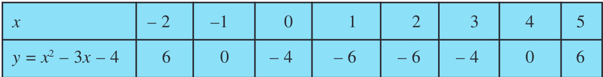

# POLYNOMIALS 

# 2.1 Introduction 

In Class IX, you have studied polynomials in one variable and their degrees. Recall that if \( p(x) \) is a polynomial in \( x \), the highest power of \( x \) in \( p(x) \) is called the degree of the polynomial \( p(x) \). For example, \( 4x+2 \) is a polynomial in the variable \( x \) of degree 1, \( 2y^2-3y+4 \) is a polynomial in the variable \( y \) of degree 2, \( 5x^3-4x^2+x-\sqrt{2} \) is a polynomial in the variable \( x \) of degree 3 and \( 7u^6-\frac{3}{2}u^4+4u^2+u-8 \) is a polynomial in the variable \( u \) of degree 6. Expressions like \( \frac{-1}{x-1} \), \( \sqrt{x}+2 \), \( \frac{1}{x^2+2x+3} \) etc., are not polynomials.

A polynomial of degree 1 is called a linear polynomial. For example, \( 2x-3 \), \( \sqrt{3}x+5 \), \( y+\sqrt{2} \), \( x-\frac{2}{11} \), \( 3z+4 \), \( \frac{2}{3}u+1 \), etc., are all linear polynomials. Polynomials such as \( 2x+5-x^2 \), \( x^3+1 \), etc., are not linear polynomials.

A polynomial of degree 2 is called a quadratic polynomial. The name "quadratic" has been derived from the word ‘quadrate', which means ‘square'. \( 2x^2+3x-\frac{2}{5} \), \( y^2-2 \), \( 2-x^2+\sqrt{3}x \), \( \frac{u}{3}-2u^2+5 \), \( \sqrt{5}v^2-\frac{2}{3}v \), \( 4z^2+\frac{1}{7} \) are some examples of quadratic polynomials (whose coefficients are real numbers). More generally, any quadratic polynomial in \( x \) is of the form \( ax^2+bx+c \), where \( a, b, c \) are real numbers and \( a \neq 0 \). A polynomial of degree 3 is called a cubic polynomial. Some examples of a cubic polynomial are \( 2-x^3 \), \( x^3 \), \( \sqrt{2}x^3 \), \( 3-x^2+x^3 \), \( 3x^3-2x^2+x-1 \). In fact, the most general form of a cubic polynomial is

$$
ax^3+bx^2+cx+d,
$$

where, \( a, b, c, d \) are real numbers and \( a \ne 0 \)

Now consider the polynomial \( p(x)=x^2-3x-4 \). Then, putting \( x=2 \) in the polynomial, we get \( p(2)=2^2-3 \times 2-4=-6 \). The value \( -6 \), obtained by replacing \( x \) by 2 in \( x^2-3x-4 \), is the value of \( x^2-3x-4 \) at \( x=2 \). Similarly, \( p(0) \) is the value of \( p(x) \) at \( x=0 \), which is -4.

If \( p(x) \) is a polynomial in \( x \), and if \( k \) is any real number, then the value obtained by replacing \( x \) by \( k \) in \( p(x) \), is called the value of \( p(x) \) at \( x=k \), and is denoted by \( p(k) \)

What is the value of \( p(x)=x^2-3x-4 \) at \( x=-1 \)? We have:

Also, note that

As \( p(-1)=0 \) and \( p(4)=0 \), \(-1 \) and 4 are called the zeroes of the quadratic polynomial \( x^2-3x-4 \). More generally, a real number \( k \) is said to be a zero of a polynomial \( p(x) \) if \( p(k)=0 \)

You have already studied in Class IX, how to find the zeroes of a linear polynomial. For example, if \( k \) is a zero of \( p(x)=2x+3 \), then \( p(k)=0 \) gives us \( 2k+3=0 \) \( k=-\frac{3}{2} \).

\( k \) \( p(x)=ax+b \) \( p(k)=ak+b=0 \) \( k=\frac{-b}{a} \) So, the zero of the linear polynomial \( ax+b \) is \( \frac{-b}{a}=\frac{-(\text{Constant term})}{\text{Coefficient of } x} \).

Thus, the zero of a linear polynomial is related to its coefficients. Does this happen in the case of other polynomials too? For example, are the zeroes of a quadratic polynomial also related to its coefficients?

In this chapter, we will try to answer these questions. We will also study the division algorithm for polynomials.

# 2.2 Geometrical Meaning of the Zeroes of a Polynomial

You know that a real number \( k \) is a zero of the polynomial \( p(x) \) if \( p(k)=0 \) But why are the zeroes of a polynomial so important? To answer this, first we will see the geometrical representations of linear and quadratic polynomials and the geometrical meaning of their zeroes.

Consider first a linear polynomial \( ax+b \), \( a \neq 0 \). You have studied in Class IX that the graph of \( y=ax+b \) is a straight line. For example, the graph of \( y=2x+3 \) is a straight line passing through the points \((-2,-1)\) and \( (2,7) \)

\( x \) \( y=2x+3 \) \( -1 \) From Fig. 2.1, you can see that the graph of \( y=2x+3 \) intersects the \( x \)-axis mid-way between \( x=-1 \) and \( \textsl{x}=\textsl{-2} \) that is, at the point \(\left(-\frac{3}{2},0\right)\). You also know that the zero of \( 2x+3 \) is \(-\frac{3}{2} \) Thus, the zero of the polynomial \( 2x+3 \) is the \( x \)-coordinate of the point where the graph of \( y=2x+3 \) intersects the \( x \)-axis.

In general, for a linear polynomial \( ax+b \), \( a \neq 0 \), the graph of \( y=ax+b \) is a straight line which intersects the \( x \)-axis at exactly one point, namely, \(\left(\frac{-b}{a},0\right)\). Therefore, the linear polynomial \( ax+b \) \( a \neq 0 \), has exactly one zero, namely, the \( x \)-coordinate of the point where the graph of \( y=ax+b \) intersects the \( x \)-axis.

Now, let us look for the geometrical meaning of a zero of a quadratic polynomial. Consider the quadratic polynomial \( x^2-3x-4 \). Let us see what the graph* of \( y=x^2-3x-4 \) looks like. Let us list a few values of \( y=x^2-3x-4 \) corresponding to a few values for \( x \) as given in Table 2.1.

# Table 2.1

If we locate the points listed above on a graph paper and draw the graph, it will actually look like the one given in Fig. 2.2.

In fact, for any quadratic polynomial \( ax^2+bx+c \) \( a \neq 0 \) the graph of the corresponding equation \( y=ax^2+bx+c \) has one of the two shapes either open upwards like \( \cup \) or open downwards like \( \frown \) depending on whether \( a>0 \) or \( a<0 \) (These curves are called parabolas.)

You can see from Table 2.1 that \( -1 \) and 4 are zeroes of the quadratic polynomial. Also note from Fig. 2.2 that \( -1 \) and 4 are the \( x \)-coordinates of the points where the graph of \( y=x^2-3x-4 \) intersects the \( x \)-axis. Thus, the zeroes of the quadratic polynomial \( x^2-3x-4 \) are \( x \)-coordinates of the points where
