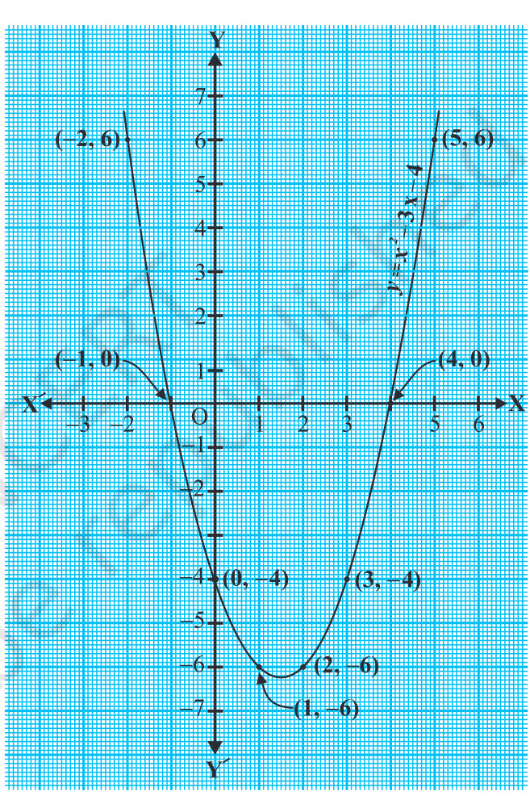

# POLYNOMIALS 

# 2.1 Introduction 

In Class IX, you have studied polynomials in one variable and their degrees. Recall that if \( p(x) \) is a polynomial in \( x \), the highest power of \( x \) in \( p(x) \) is called the degree of the polynomial \( p(x) \). For example, \( 4x+2 \) is a polynomial in the variable \( x \) of degree 1, \( 2y^2-3y+4 \) is a polynomial in the variable \( y \) of degree 2, \( 5x^3-4x^2+x-\sqrt{2} \) is a polynomial in the variable \( x \) of degree 3 and \( 7u^6-\frac{3}{2}u^4+4u^2+u-8 \) is a polynomial in the variable \( u \) of degree 6. Expressions like \( \frac{-1}{x-1} \), \( \sqrt{x}+2 \), \( \frac{1}{x^2+2x+3} \) etc., are not polynomials.

A polynomial of degree 1 is called a linear polynomial. For example, \( 2x-3 \), \( \sqrt{3}x+5 \), \( y+\sqrt{2} \), \( x-\frac{2}{11} \), \( 3z+4 \), \( \frac{2}{3}u+1 \), etc., are all linear polynomials. Polynomials such as \( 2x+5-x^2 \), \( x^3+1 \), etc., are not linear polynomials.

A polynomial of degree 2 is called a quadratic polynomial. The name "quadratic" has been derived from the word ‘quadrate', which means ‘square'. \( 2x^2+3x-\frac{2}{5} \), \( y^2-2 \), \( 2-x^2+\sqrt{3}x \), \( \frac{u}{3}-2u^2+5 \), \( \sqrt{5}v^2-\frac{2}{3}v \), \( 4z^2+\frac{1}{7} \) are some examples of quadratic polynomials (whose coefficients are real numbers). More generally, any quadratic polynomial in \( x \) is of the form \( ax^2+bx+c \), where \( a, b, c \) are real numbers and \( a \neq 0 \). A polynomial of degree 3 is called a cubic polynomial. Some examples of a cubic polynomial are \( 2-x^3 \), \( x^3 \), \( \sqrt{2}x^3 \), \( 3-x^2+x^3 \), \( 3x^3-2x^2+x-1 \). In fact, the most general form of a cubic polynomial is

$$
ax^3+bx^2+cx+d,
$$

where, \( a, b, c, d \) are real numbers and \( a \ne 0 \)

Now consider the polynomial \( p(x)=x^2-3x-4 \). Then, putting \( x=2 \) in the polynomial, we get \( p(2)=2^2-3 \times 2-4=-6 \). The value \( -6 \), obtained by replacing \( x \) by 2 in \( x^2-3x-4 \), is the value of \( x^2-3x-4 \) at \( x=2 \). Similarly, \( p(0) \) is the value of \( p(x) \) at \( x=0 \), which is -4.

If \( p(x) \) is a polynomial in \( x \), and if \( k \) is any real number, then the value obtained by replacing \( x \) by \( k \) in \( p(x) \), is called the value of \( p(x) \) at \( x=k \), and is denoted by \( p(k) \)

What is the value of \( p(x)=x^2-3x-4 \) at \( x=-1 \)? We have:

Also, note that

As \( p(-1)=0 \) and \( p(4)=0 \), \(-1 \) and 4 are called the zeroes of the quadratic polynomial \( x^2-3x-4 \). More generally, a real number \( k \) is said to be a zero of a polynomial \( p(x) \) if \( p(k)=0 \)

You have already studied in Class IX, how to find the zeroes of a linear polynomial. For example, if \( k \) is a zero of \( p(x)=2x+3 \), then \( p(k)=0 \) gives us \( 2k+3=0 \) \( k=-\frac{3}{2} \).

\( k \) \( p(x)=ax+b \) \( p(k)=ak+b=0 \) \( k=\frac{-b}{a} \) So, the zero of the linear polynomial \( ax+b \) is \( \frac{-b}{a}=\frac{-(\text{Constant term})}{\text{Coefficient of } x} \).

Thus, the zero of a linear polynomial is related to its coefficients. Does this happen in the case of other polynomials too? For example, are the zeroes of a quadratic polynomial also related to its coefficients?

In this chapter, we will try to answer these questions. We will also study the division algorithm for polynomials.

# 2.2 Geometrical Meaning of the Zeroes of a Polynomial

You know that a real number \( k \) is a zero of the polynomial \( p(x) \) if \( p(k)=0 \) But why are the zeroes of a polynomial so important? To answer this, first we will see the geometrical representations of linear and quadratic polynomials and the geometrical meaning of their zeroes.

Consider first a linear polynomial \( ax+b \), \( a \neq 0 \). You have studied in Class IX that the graph of \( y=ax+b \) is a straight line. For example, the graph of \( y=2x+3 \) is a straight line passing through the points \((-2,-1)\) and \( (2,7) \)

\( x \) \( y=2x+3 \) \( -1 \) From Fig. 2.1, you can see that the graph of \( y=2x+3 \) intersects the \( x \)-axis mid-way between \( x=-1 \) and \( \textsl{x}=\textsl{-2} \) that is, at the point \(\left(-\frac{3}{2},0\right)\). You also know that the zero of \( 2x+3 \) is \(-\frac{3}{2} \) Thus, the zero of the polynomial \( 2x+3 \) is the \( x \)-coordinate of the point where the graph of \( y=2x+3 \) intersects the \( x \)-axis.

In general, for a linear polynomial \( ax+b \), \( a \neq 0 \), the graph of \( y=ax+b \) is a straight line which intersects the \( x \)-axis at exactly one point, namely, \(\left(\frac{-b}{a},0\right)\). Therefore, the linear polynomial \( ax+b \) \( a \neq 0 \), has exactly one zero, namely, the \( x \)-coordinate of the point where the graph of \( y=ax+b \) intersects the \( x \)-axis.

Now, let us look for the geometrical meaning of a zero of a quadratic polynomial. Consider the quadratic polynomial \( x^2-3x-4 \). Let us see what the graph* of \( y=x^2-3x-4 \) looks like. Let us list a few values of \( y=x^2-3x-4 \) corresponding to a few values for \( x \) as given in Table 2.1.

# Table 2.1


If we locate the points listed above on a graph paper and draw the graph, it will actually look like the one given in Fig. 2.2.

In fact, for any quadratic polynomial \( ax^2+bx+c \) \( a \neq 0 \) the graph of the corresponding equation \( y=ax^2+bx+c \) has one of the two shapes either open upwards like \( \cup \) or open downwards like \( \frown \) depending on whether \( a>0 \) or \( a<0 \) (These curves are called parabolas.)

You can see from Table 2.1 that \( -1 \) and 4 are zeroes of the quadratic polynomial. Also note from Fig. 2.2 that \( -1 \) and 4 are the \( x \)-coordinates of the points where the graph of \( y=x^2-3x-4 \) intersects the \( x \)-axis. Thus, the zeroes of the quadratic polynomial \( x^2-3x-4 \) are \( x \)-coordinates of the points wherethe graph \( y=x^2-3x-4 \) intersects the \( x \)-axis.



This fact is true for any quadratic polynomial, i.e., the zeroes of a quadratic polynomial \( ax^2+bx+c \). \( a \neq 0 \), are precisely the \( x \)-coordinates of the points where the parabola representing \( y=ax^2+bx+c \) intersects the \( x \)-axis.

From our observation earlier about the shape of the graph of \( y=ax^2+bx+c \), the following three cases can happen:

Case (i) : Here, the graph cuts \( x \)-axis at two distinct points A and A'. 

The \( x \)-coordinates of A and \( \mathrm{A'} \) are the two zeroes of the quadratic polynomial \( ax^2+bx+c \) in this case (see Fig. 2.3).


Case (ii) : Here, the graph cuts the \( x \)-axis at exactly one point, i.e., at two coincident

  points. So, the two points A and \( \mathrm{A'} \) of Case (i) coincide here to become one point A

(see Fig. 2.4).


The \( x \)-coordinate of A is the only zero for the quadratic polynomial \( ax^2+bx+c \) in this case.

# POLYNOMIALS 

Case (ii) : Here, the graph is either completely above the \( x \)-axis or completely below the \( x \)-axis. So, it does not cut the \( x \)-axis at any point (see Fig. 2.5).


So, the quadratic polynomial \( ax^2+bx+c \) has no zero in this case.

So, you can see geometrically that a quadratic polynomial can have either two distinct zeroes or two equal zeroes (i.e., one zero), or no zero. This also means that a polynomial of degree 2 has at most two zeroes.

Now, what do you expect the geometrical meaning of the zeroes of a cubic polynomial to be? Let us find out. Consider the cubic polynomial \( x^3-4x \). To see what the graph of \( y=x^3-4x \) looks like, let us list a few values of \( y \) corresponding to a few values for \( x \) as shown in Table 2.2.

# Table 2.2


Locating the points of the table on a graph paper and drawing the graph, we see that the graph of \( y=x^3-4x \) actually looks like the one given in Fig. 2.6.

We see from the table above that - 2,0 and 2 are zeroes of the cubic polynomial \( x^3-4x \). Observe that -2, 0, and 2 are, in fact, the \( x \)-coordinates of the only points where the graph of \( y=x^3-4x \) intersects the \( x \)-axis. Since the curve meets the \( x \)-axis in only these 3 points, their \( x \)-coordinates are the only zeroes of the polynomial.

Let us take a few more examples. Consider the cubic polynomials \( x^3 \) and \( x^3-x^2 \). We draw the graphs of \( y=x^3 \) and \( y=x^3-x^2 \) in Fig. 2.7 and Fig. 2.8 respectively.


# POLYNOMIALS 

Note that O is the only zero of the polynomial \( x^3 \). Also, from Fig. 2.7, you can see that O is the \( x \)-coordinate of the only point where the graph of \( y=x^3 \) intersects the \( x \)-axis. Similarly, since \( x^3-x^2=x^2(x-1) \), O and 1 are the only zeroes of the polynomial \( x^3-x^2 \). Also, from Fig. 2.8, these values are the \( x \)-coordinates of the only points where the graph of \( y=x^3-x^2 \) intersects the \( x \)-axis.

From the examples above, we see that there are at most 3 zeroes for any cubic polynomial. In other words, any polynomial of degree 3 can have at most three zeroes. Remark: In general, given a polynomial \( p(x) \) of degree \( n \), the graph of \( y=p(x) \) intersects the \( x \)-axis at at most \( n \) points. Therefore, a polynomial \( p(x) \) of degree \( n \) has at most \( n \) zeroes.

Example 1: Look at the graphs in Fig. 2.9 given below. Each is the graph of \( y=p(x) \) where \( p(x) \) is a polynomial. For each of the graphs, find the number of zeroes of \( p(x) \)


# Solution

(i) The number of zeroes is 1 as the graph intersects the \( x \)-axis at one point only. (ii) The number of zeroes is 2 as the graph intersects the \( x \)-axis at two points. (ii) The number of zeroes is 3. (Why?)

(iv) The number of zeroes is 1. (Why?)

(v) The number of zeroes is 1. (Why?) (vi) The number of zeroes is 4. (Why?)

# EXERCISE 2.1

1. The graphs of \( y=p(x) \) are given in Fig. 2.10 below, for some polynomials \( p(x) \). Find the number of zeroes of \( p(x) \), in each case.


# 2.3 Relationship between Zeroes and Coefficients of a Polynomial

\( ax+b \) \(-\frac{b}{a}\). To answer the question raised in Section 2.1 regarding the relationship between zeroes and coefficients of a quadratic polynomial. For this, let us take a quadratic polynomial, say \( p(x)=2x^2-8x+6 \). In Class IX, you have learnt how to factorize quadratic polynomials by splitting the middle term. So, here we need to split the middle term \( \Phi_{-}^{\epsilon}8x' \) as a sum of two terms, whose product is \( 6 \times 2x^2=12x^2 \) So, we write

$$
\begin{array}{c}{2x^2-8x+6=2x^2-6x-2x+6=2x(x-3)-2(x-3)}\\ {(2x-2)(x-3)=2(x-1)(x-3)}\end{array}
$$

So, the value of \( p(x)=2x^2-8x+6 \) is zero when \( x-1=0 \) or \( x-3=0 \), i.e., when \( x=1 \) or \( x=3 \). So, the zeroes of \( 2x^2-8x+6 \) are 1 and 3. Observe that:

$$
\mathrm{Sum~of~its~zeroes}\qquad= 1+3=4=\frac{-(-8)}{2}=\frac{-(\mathrm{Coefficient~of~}x)}{\mathrm{Coefficient~of~}x^2}
$$
\( \mathrm{s}= 1 \times 3=3=\frac{6}{2},=\,\frac{\mathrm{Constant~term}}{\mathrm{Coefficient~Here's the Markdown representation of the JSON content provided, which includes formatted text and equations:

```markdown
# POLYNOMIALS

# 2.1 Introduction

In Class IX, you have studied polynomials in one variable and their degrees. Recall that if \( p(x) \) is a polynomial in \( x \), the highest power of \( x \) in \( p(x) \) is called the degree of the polynomial \( p(x) \). For example, \( 4x+2 \) is a polynomial in the variable \( x \) of degree 1, \( 2y^2-3y+4 \) is a polynomial in the variable \( y \) of degree 2, \( 5x^3-4x^2+x-\sqrt{2} \) is a polynomial in the variable \( x \) of degree 3 and \( 7u^6-\frac{3}{2}u^4+4u^2+u-8 \) is a polynomial in the variable \( u \) of degree 6. Expressions like \( \frac{-1}{x-1} \), \( \sqrt{x}+2 \), \( \frac{1}{x^2+2x+3} \) etc., are not polynomials.

A polynomial of degree 1 is called a linear polynomial. For example, \( 2x-3 \), \( \sqrt{3}x+5 \), \( y+\sqrt{2} \), \( x-\frac{2}{11} \), \( 3z+4 \), \( \frac{2}{3}u+1 \), etc., are all linear polynomials. Polynomials such as \( 2x+5-x^2 \), \( x^3+1 \), etc., are not linear polynomials.

A polynomial of degree 2 is called a quadratic polynomial. The name "quadratic" has been derived from the word ‘quadrate', which means ‘square'. \( 2x^2+3x-\frac{2}{5} \), \( y^2-2 \), \( 2-x^2+\sqrt{3}x \), \( \frac{u}{3}-2u^2+5 \), \( \sqrt{5}v^2-\frac{2}{3}v \), \( 4z^2+\frac{1}{7} \) are some examples of quadratic polynomials (whose coefficients are real numbers). More generally, any quadratic polynomial in \( x \) is of the form \( ax^2+bx+c \), where \( a, b, c \) are real numbers and \( a \neq 0 \). A polynomial of degree 3 is called a cubic polynomial. Some examples of a cubic polynomial are \( 2-x^3 \), \( x^3 \), \( \sqrt{2}x^3 \), \( 3-x^2+x^3 \), \( 3x^3-2x^2+x-1 \). In fact, the most general form of a cubic polynomial is:

$$
ax^3 + bx^2 + cx + d,
$$

where \( a, b, c, d \) are real numbers and \( a \neq 0 \).

Now consider the polynomial \( p(x) = x^2 - 3x - 4 \). Then, putting \( x = 2 \) in the polynomial, we get \( p(2) = 2^2 - 3 \times 2 - 4 = -6 \). The value \( -6 \), obtained by replacing \( x \) by 2 in \( x^2 - 3x - 4 \), is the value of \( x^2 - 3x - 4 \) at \( x = 2 \). Similarly, \( p(0) \) is the value of \( p(x) \) at \( x = 0 \), which is -4.

If \( p(x) \) is a polynomial in \( x \), and if \( k \) is any real number, then the value obtained by replacing \( x \) by \( k \) in \( p(x) \), is called the value of \( p(x) \) at \( x = k \), and is denoted by \( p(k) \).

What is the value of \( p(x) = x^2 - 3x - 4 \) at \( x = -1 \)? We have:

Also, note that as \( p(-1) = 0 \) and \( p(4) = 0 \), -1 and 4 are called the zeroes of the quadratic polynomial \( x^2 - 3x - 4 \). More generally, a real number \( k \) is said to be a zero of a polynomial \( p(x) \) if \( p(k) = 0 \).

You have already studied in Class IX how to find the zeroes of a linear polynomial. For example, if \( k \) is a zero of \( p(x) = 2x + 3 \), then \( p(k) = 0 \) gives us \( 2k + 3 = 0 \) \( k = -\frac{3}{2} \).

\( k \) \( p(x) = ax + b \) \( p(k) = ak + b = 0 \) \( k = \frac{-b}{a} \) So, the zero of the linear polynomial \( ax + b \) is \( \frac{-b}{a} = \frac{-(\text{Constant term})}{\text{Coefficient of } x} \).

Thus, the zero of a linear polynomial is related to its coefficients. Does this happen in the case of other polynomials too? For example, are the zeroes of a quadratic polynomial also related to its coefficients?

In this chapter, we will try to answer these questions. We will also study the division algorithm for polynomials.
